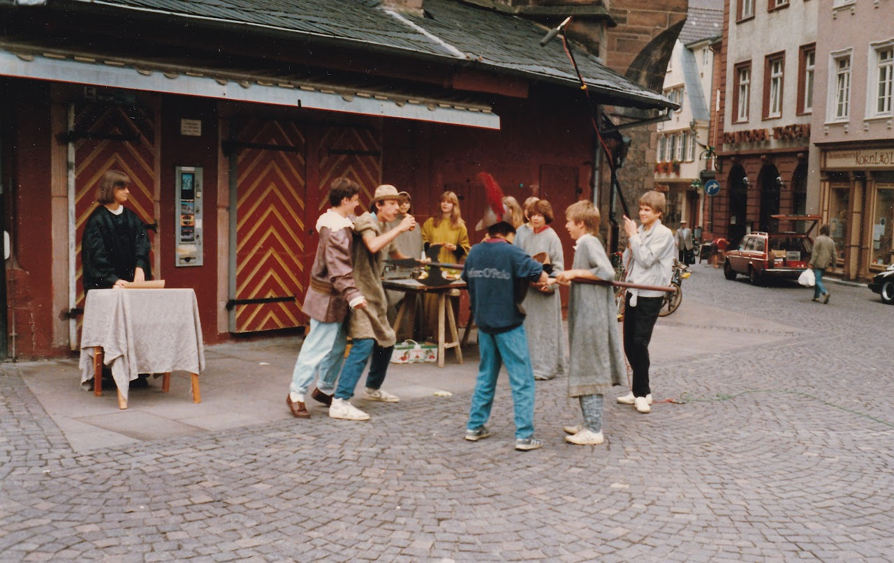
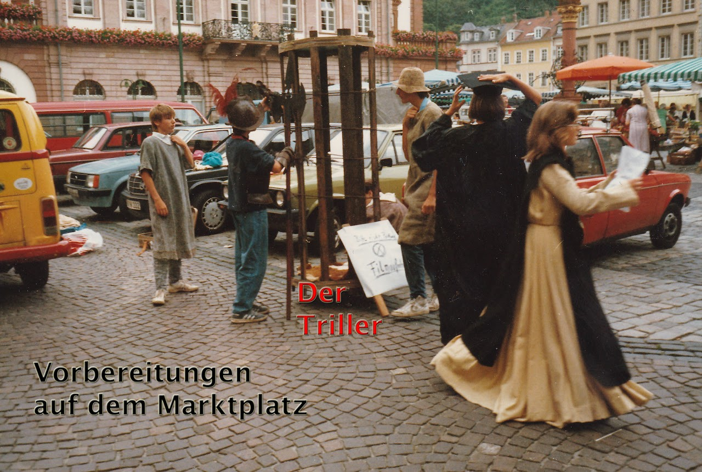
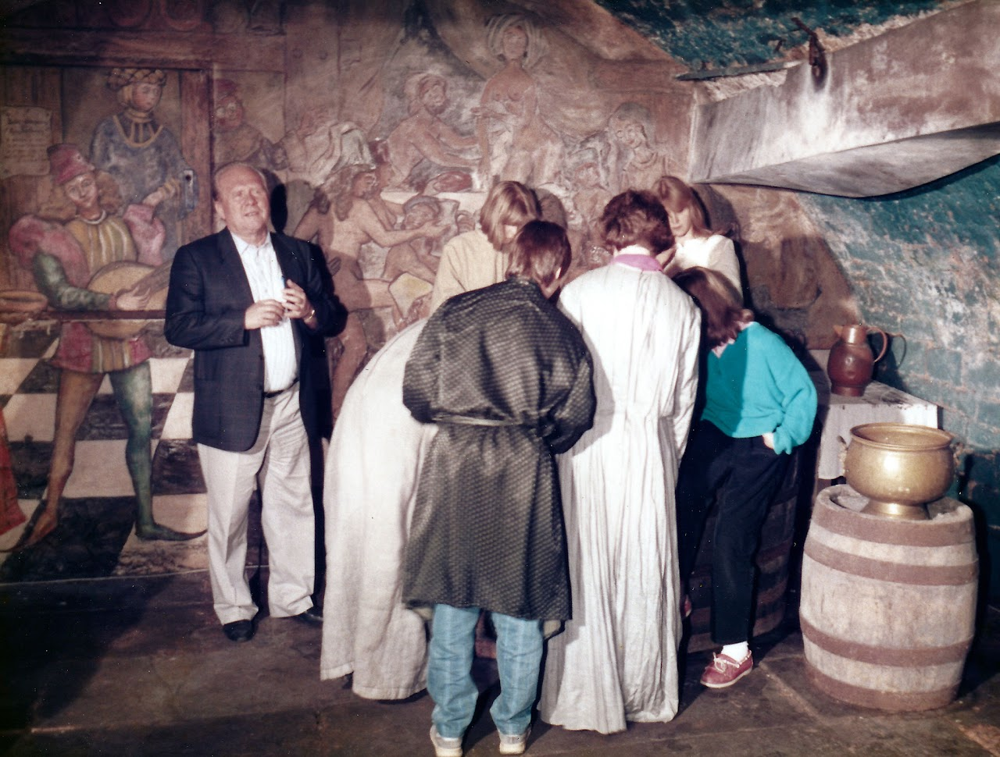
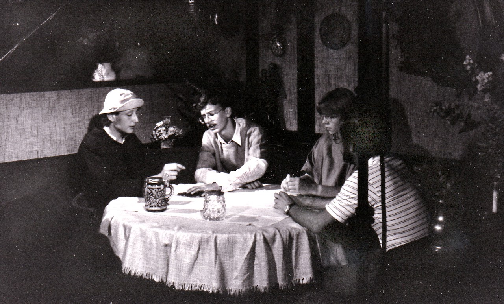
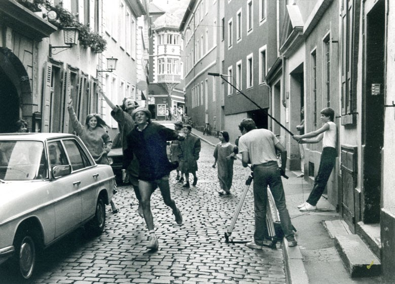
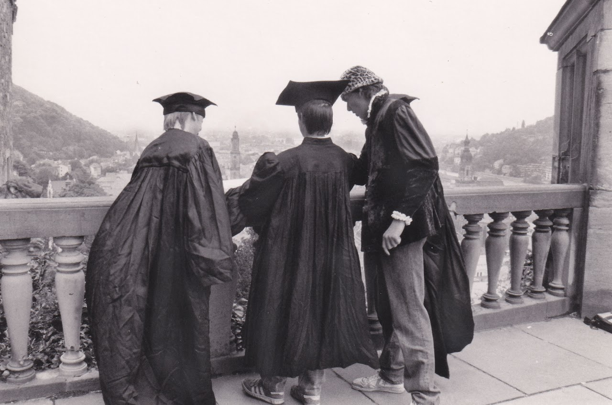
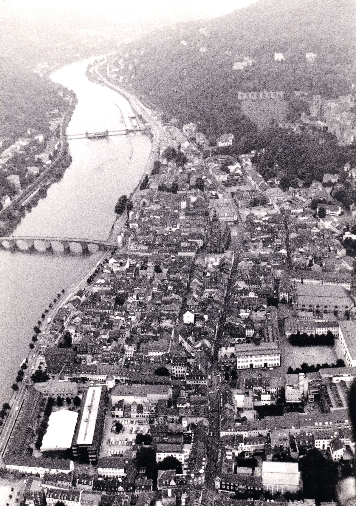

Search this site

Embedded Files

Skip to main content

Skip to navigation

[ZEILER .me - IT & Medien, Geschichte, Deutsch](../../../home.html)

-   [Startseite](../../../home.html)
    
-   [Detlef Zeiler](../../../detlef.html)
    
    -   [Deutsch](../../deutsch.html)
        
        -   [Erörterung](../../deutsch/errterung.html)
            
        -   [Essay-Themen](../../deutsch/essay-themen.html)
            
            -   [Essay](../../deutsch/essay-themen/essay.html)
                
            
        -   [Fremdenfeindlichkeit](../../deutsch/fremdenfeindlichkeit.html)
            
            -   [Armer und reicher Teufel](../../deutsch/fremdenfeindlichkeit/armer-und-reicher-teufel.html)
                
            
        -   [Homo Faber](../../deutsch/homo-faber.html)
            
        -   [Nayirah](../../deutsch/nayirah.html)
            
        -   [Needful Things - "In einer kleinen Stadt"](../../deutsch/needful-things---in-einer-kleinen-stadt.html)
            
            -   [In einer kleinen Stadt](../../deutsch/needful-things---in-einer-kleinen-stadt/in-einer-kleinen-stadt.html)
                
                -   [In einer kleinen Stadt](../../deutsch/needful-things---in-einer-kleinen-stadt/in-einer-kleinen-stadt/in-einer-kleinen-stadt.html)
                    
                
            
        -   [Texterörterung](../../deutsch/texterrterung.html)
            
        -   [Textinterpretation](../../deutsch/textinterpretation-1.html)
            
        -   [Textinterpretation (Beispiele)](../../deutsch/textinterpretation.html)
            
            -   [Das Eiserne Kreuz (Autor: Heiner Müller)](../../deutsch/textinterpretation/das-eiserne-kreuz.html)
                
            -   [Ein netter Kerl (Beispiel, Mittelstufe)](../../deutsch/textinterpretation/ein-netter-kerl.html)
                
            -   [Einige Beispiele](../../deutsch/textinterpretation/einige-beispiele.html)
                
                -   [Armer und reicher Teufel (Ernst Bloch)](../../deutsch/textinterpretation/einige-beispiele/armer-und-reicher-teufel-ernst-bloch.html)
                    
                -   [Wie ist der Mensch? (Michel de Montaigne)](../../deutsch/textinterpretation/einige-beispiele/wie-ist-der-mensch-michel-de-montaigne.html)
                    
                
            -   [Homo Faber](../../deutsch/textinterpretation/homo-faber.html)
                
            -   [Wie ist der Mensch (Michel de Montaigne)](../../deutsch/textinterpretation/wie-ist-der-mensch-michel-de-montaigne.html)
                
            
        -   [Versuch einer Beschreibung menschlicher Moral](../../deutsch/versuch-einer-beschreibung-menschlicher-moral.html)
            
        -   [Versuch einer kurzen Beschreibung einer menschlichen Moral](../../deutsch/versuch-einer-kurzen-beschreibung-einer-menschlichen-moral.html)
            
        -   [Vom Text zum Schaubild](../../deutsch/vom-text-zum-schaubild.html)
            
        
    -   [Geschichte](../../geschichte.html)
        
        -   [Alexander von Humboldts Südamerikareise](../../geschichte/alexander-von-humboldts-sdamerikareise.html)
            
        -   [Alexis de Tocqueville über die plötzliche Grausamkeit in einer unglücklichen Zeit](../../geschichte/ber-die-pltzliche-grausamkeit-in-einer-unglcklichen-zeit.html)
            
        -   [Berichte aus einer deutschen Diktatur](../../geschichte/berichte-aus-einer-deutschen-diktatur.html)
            
        -   [Berthold von Rohrbach](../../geschichte/berthold-von-rohrbach.html)
            
        -   [Besuch in Simferopol 2018](../../geschichte/besuch-in-simferopol-2018.html)
            
        -   [Ceausescu](../../geschichte/ceausescu.html)
            
            -   [Idylle und Realität unter Ceaucescu](../../geschichte/ceausescu/idylle-und-realitt-unter-ceaucescu.html)
                
            
        -   [Faschismus als Massenbewegung](../../geschichte/faschismus-als-massenbewegung.html)
            
            -   [Geräusch](../../geschichte/faschismus-als-massenbewegung/gerusch.html)
                
            
        -   [Faschismus im 21. Jahrhundert?](../../geschichte/faschismus-als-massenbewegung-2.html)
            
        -   [Geschichte des Neckars und des Philosophenwegs (Ludwig Merz/Otto Jäger)](../../geschichte/geschichte-des-neckars-und-des-philosophenwegs-ludwig-merzotto-jger.html)
            
        -   [Grenzen](../../geschichte/grenzen.html)
            
        -   [Grenzen II](../../geschichte/grenzen-ii.html)
            
        -   [Grenzen III](../../geschichte/grenzen-iii.html)
            
        -   [Hooligans - Angry Young Men](../../geschichte/hooligans---angry-young-men.html)
            
        -   [Künstliche Feindschaften](../../geschichte/knstliche-feindschaften.html)
            
        -   [Mein Großvater Rudolf Zeiler](../../geschichte/mein-grovater-rudolf-zeiler.html)
            
            -   [Rudolf Zeiler](../../geschichte/mein-grovater-rudolf-zeiler/rudolf-zeiler.html)
                
            
        -   [Nicht-tödliche Waffen](../../geschichte/nicht-tdliche-waffen.html)
            
        -   [Pavel Thalmann (1901 - 1980)](../../geschichte/thalmann.html)
            
        -   [Über die Grausamkeit](../../geschichte/ber-die-grausamkeit.html)
            
        -   [Zeit der Intrigen](../../geschichte/zeit-der-intrigen.html)
            
        -   [Integration](../../geschichte/integration.html)
            
        -   [Die "Mittelschicht" (Diskussionsthemen)](../../geschichte/die-mittelschicht-diskussionsthemen.html)
            
        -   [Jeremia](../../geschichte/jeremia.html)
            
        
    -   [Impressum](../../impressum.html)
        
    -   [Medien](../../medien.html)
        
        -   [Gerüchte – Rumores (Drehbuch und Storyboard)](../../medien/geruechte-rumores-drehbuch.html)
            
        -   [Medienerziehung](../../medien/medienerziehung.html)
            
            -   [Altersgemäße Schwerpunktsetzungen](../../medien/medienerziehung/altersgemaesse-schwerpunktsetzungen.html)
                
            -   [Aufgabenbereiche und Zielsetzungen](../../medien/medienerziehung/aufgabenbereiche-und-zielsetzungen.html)
                
            -   [Erlebnis- und Handlungsorientierung als Prinzipien](../../medien/medienerziehung/erlebnis-und-handlungsorientierung-als-prinzipien.html)
                
            -   [Gestaltung von audiovisuellen Medien](../../medien/medienerziehung/gestaltung-von-audiovisuellen-medien.html)
                
            -   [Leseerziehung und Hörerziehung](../../medien/medienerziehung/leseerziehung-und-hoererziehung.html)
                
            -   [Medienerziehung als gesamtgesellschaftliche Aufgabe](../../medien/medienerziehung/medienerziehung-als-gesamtgesellschaftliche-aufgabe.html)
                
            -   [Medienerziehung im Bereich von Computerspielen und interaktiven Medien](../../medien/medienerziehung/medienerziehung-im-bereich-von-computerspielen-und-interaktiven-medien.html)
                
            -   [Medienerziehung im Erziehungs- und Bildungszusammenhang](../../medien/medienerziehung/medienerziehung-im-erziehungs-und-bildungszusammenhang.html)
                
            -   [Medienkompetenz - Vorbemerkung](../../medien/medienerziehung/medienkompetenz-vorbemerkung.html)
                
            -   [Schülerzeitschriften](../../medien/medienerziehung/schuelerzeitschriften.html)
                
            -   [Spielfilme](../../medien/medienerziehung/spielfilme.html)
                
            -   [Verankerung in den Lehrplänen](../../medien/medienerziehung/verankerung-in-den-lehrplaenen.html)
                
            -   [Veränderung der Bildungs- und Erziehungssituation](../../medien/medienerziehung/veraenderung-der-bildungs-und-erziehungssituation.html)
                
            -   [Zukünftige Ansatzpunkte](../../medien/medienerziehung/zukuenftige-ansatzpunkte.html)
                
            -   [Zum Begriff Medienkultur](../../medien/medienerziehung/zum-begriff-medienkultur.html)
                
            
        
    -   [Projekte](../../projekte.html)
        
        -   [Der Heiligenberg bei Heidelberg](../heiligenberg.html)
            
            -   [Der unheimliche Berg](../heiligenberg/der-unheimliche-berg.html)
                
            -   [Die Geschichte des Heiligenbergs](../heiligenberg/geschichte.html)
                
            -   [MOPÄD - Mobile Pädagogen](../heiligenberg/mopaed.html)
                
            -   [Unser Projekt](../heiligenberg/projekt.html)
                
            
        -   [Die Elsenz und der Kraichgau](../die-elsenz-und-der-kraichgau.html)
            
            -   [Geographische Lage](../die-elsenz-und-der-kraichgau/geographische-lage.html)
                
                -   [Der Steinsberg](../die-elsenz-und-der-kraichgau/geographische-lage/der-steinsberg.html)
                    
                -   [Die Elsenz](../die-elsenz-und-der-kraichgau/geographische-lage/die-elsenz.html)
                    
                -   [Mühlen an der Elsenz](../die-elsenz-und-der-kraichgau/geographische-lage/mhlen-an-der-elsenz.html)
                    
                
            -   [Geschichte und Politik](../die-elsenz-und-der-kraichgau/geschichte-und-politik.html)
                
                -   [Bauernunruhen](../die-elsenz-und-der-kraichgau/geschichte-und-politik/bauernunruhen.html)
                    
                -   [Der Gaubegriff](../die-elsenz-und-der-kraichgau/geschichte-und-politik/der-gaubegriff.html)
                    
                -   [Der Kraichgau als militärisches Operationsgebiet](../die-elsenz-und-der-kraichgau/geschichte-und-politik/der-kraichgau-als-militaerisches-operationsgebiet.html)
                    
                -   [Die Burg Steinsberg](../die-elsenz-und-der-kraichgau/geschichte-und-politik/die-burg-steinsberg.html)
                    
                -   [Friedrich Hecker](../die-elsenz-und-der-kraichgau/geschichte-und-politik/friedrich-hecker.html)
                    
                -   [Joss Fritz und der Bundschuh](../die-elsenz-und-der-kraichgau/geschichte-und-politik/joss-fritz-und-der-bundschuh.html)
                    
                -   [Renaissance im Kraichgau](../die-elsenz-und-der-kraichgau/geschichte-und-politik/renaissance-im-kraichgau.html)
                    
                
            -   [Kultur / Religion](../die-elsenz-und-der-kraichgau/kultur-religion.html)
                
            
        -   [Dritte Gewalt - Strafvollzug](../dritte-gewalt-strafvollzug.html)
            
            -   [Anmerkungen](../dritte-gewalt-strafvollzug/anmerkungen.html)
                
            -   [Beispiel für ein Projekt](../dritte-gewalt-strafvollzug/beispiel-fuer-ein-projekt.html)
                
            -   [Gymnasium](../dritte-gewalt-strafvollzug/gymnasium.html)
                
            -   [Hauptschule](../dritte-gewalt-strafvollzug/hauptschule.html)
                
            -   [Medienforum Heidelberg e.V.](../dritte-gewalt-strafvollzug/medienforum-heidelberg-ev.html)
                
            -   [Realschule](../dritte-gewalt-strafvollzug/realschule.html)
                
            
        -   [Heidelberg im Mittelalter](../heidelberg-im-mittelalter.html)
            
            -   [Armenpflege und soziale Einrichtungen](armenpflege-und-soziale-einrichtungen.html)
                
            -   [Auszug aus der Sittenstrafordnung für Dirnen des Heidelberger Kurfürsten Ott-Heinrich des Jahres 1532](sittenstrafordnung-fuer-dirnen.html)
                
            -   [Das älteste Gewerbe im alten Heidelberg](das-aelteste-gewerbe.html)
                
            -   [Dr. Jochen Goetze](dr-jochen-goetze.html)
                
            -   [Freizeit im Mittelalter](freizeit.html)
                
            -   [Hexenglauben und Hexenprozesse](hexenglauben-und-hexenprozesse.html)
                
            -   [Juden im mittelalterlichen Heidelberg](juden.html)
                
                -   [Phase relativer Toleranz](juden/phase-relativer-toleranz.html)
                    
                -   [Spielball fremder Interessen](juden/spielball-fremder-interessen.html)
                    
                
            -   [Literaturverzeichnis](literaturverzeichnis.html)
                
            -   [MOPÄD - Mobile Pädagogen](mopaed.html)
                
            -   [Praktische Heimatkunde](praktische-heimatkunde.html)
                
            -   [Stadtgründung - Stadtentwicklung](stadtgruendung-stadtentwicklung.html)
                
                -   [Der Stadtaufbau von Heidelberg](stadtgruendung-stadtentwicklung/stadtaufbau.html)
                    
                -   [Heidelberg: Entstehung und Namensgebung](stadtgruendung-stadtentwicklung/entstehung-und-namensgebung.html)
                    
                -   [Stadtgründung - Stadtentwicklung Stadtverfassung](stadtgruendung-stadtentwicklung/stadtverfassung.html)
                    
                
            -   [Strafrecht und Strafvollzug](strafrecht-und-strafvollzug.html)
                
                -   [I. Strafe - der Triumph des Guten](strafrecht-und-strafvollzug/triumph-des-guten.html)
                    
                -   [II. Constitutio Criminalis Carolina](strafrecht-und-strafvollzug/constitutio-criminalis-carolina.html)
                    
                -   [III. Verbrechen und Strafen](strafrecht-und-strafvollzug/verbrechen-und-strafen.html)
                    
                -   [IV. Strafordnung im mittelalterlichen Heidelberg](strafrecht-und-strafvollzug/strafordnung.html)
                    
                -   [V. Richtstätten und Gefängnisse im alten Heidelberg](strafrecht-und-strafvollzug/richtstaetten-und-gefaengnisse.html)
                    
                -   [VI. Anmerkungen](strafrecht-und-strafvollzug/anmerkungen.html)
                    
                
            -   [Universität und Studenten im Heidelberger Mittelalter](universitaet-und-studenten.html)
                
                -   [Ausbau und Finanzierung der Universität](universitaet-und-studenten/ausbau-und-finanzierung.html)
                    
                -   [Motive für den Aufbau einer Universität](universitaet-und-studenten/motive-fuer-den-aufbau-einer-universitaet.html)
                    
                -   [Studentenunruhen im alten Heidelberg](universitaet-und-studenten/studentenunruhen.html)
                    
                -   [Universität und Studenten im Heidelberger Mittelalter: Einleitung](universitaet-und-studenten/einleitung.html)
                    
                -   [Ausbau der Universität und Rückschläge](universitaet-und-studenten/ausbau-der-universitaet-und-rueckschlaege.html)
                    
                -   [Die Anfänge: Stadt, Hof und Universität](universitaet-und-studenten/die-anfaenge-stadt-hof-und-universitaet.html)
                    
                -   [Die Universität zwischen Mittelalter und Neuzeit](universitaet-und-studenten/die-universitaet-zwischen-mittelalter-und-neuzeit.html)
                    
                -   [Konflikte mit Hofbediensteten, Bürgern und Juden](universitaet-und-studenten/konflikte-mit-hofbediensteten-buergern-und-juden.html)
                    
                
            
        -   [Heidelberger Schulgeschichten](../heidelberger-schulgeschichten.html)
            
            -   [Bürger und Bauern](../heidelberger-schulgeschichten/buerger-und-bauern.html)
                
            -   [Das 18. Jahrhundert](../heidelberger-schulgeschichten/das-18te-jahrhundert.html)
                
            -   [Das 19. Jahrhundert](../heidelberger-schulgeschichten/das-19te-jahrhundert.html)
                
            -   [Das 20. Jahrhundert](../heidelberger-schulgeschichten/das-20te-jahrhundert.html)
                
            -   [Die Anfänge](../heidelberger-schulgeschichten/anfaenge.html)
                
            -   [Die Lehrerschaft des Heidelberger Kurfürst-Friedrich-Gymnasiums in der Zeit des Nationalsozialismus](../heidelberger-schulgeschichten/lehrerschaft-kfg-3tes-reich.html)
                
            -   [Schülerunruhen am Kurfürst-Friedrich-Gymnasium im Jahre 1968](../heidelberger-schulgeschichten/schuelerunruhen-am-kfg.html)
                
            
        -   [Neuenheim ist halb Europa](../neuenheim.html)
            
            -   [Die Eingemeindung Neuenheims 1891](../neuenheim/eingemeindung.html)
                
            -   [Interview mit Herrn Krauch](../neuenheim/interview-krauch.html)
                
            -   [MOPÄD - Mobile Pädagogen](../neuenheim/mopaed.html)
                
            -   [Neuenheim wird Stadtteil von Heidelberg](../neuenheim/otto-jaeger-ludwig-merz.html)
                
            -   [Projekt](../neuenheim/projekt.html)
                
            -   [Und plötzlich war die Klasse "judenfrei"...](../neuenheim/judenfrei.html)
                
            -   [Überblick](../neuenheim/ueberblick.html)
                
            -   [„Neuenheim ist halb Europa“](../neuenheim/ist-halb-europa.html)
                
            
        -   [Old Providence - Die Insel Providencia](../old-providence-die-insel-providencia.html)
            
            -   [1817-1821 - Die Korsaren](../old-providence-die-insel-providencia/1817-1821-die-korsaren.html)
                
            -   [Aktuell - 1903-heute](../old-providence-die-insel-providencia/aktuell-1903-heute.html)
                
            -   [Jahr 1629](../old-providence-die-insel-providencia/jahr-1629.html)
                
            -   [Jahr 1641](../old-providence-die-insel-providencia/jahr-1641.html)
                
            -   [Jahr 1666 - Piraterie](../old-providence-die-insel-providencia/jahr-1666-piraterie.html)
                
            -   [Jahr 1666-1670](../old-providence-die-insel-providencia/jahr-1666-1670.html)
                
            -   [Jahr 1670](../old-providence-die-insel-providencia/jahr-1670.html)
                
            -   [Jahr 1670-1767](../old-providence-die-insel-providencia/jahr-1670-1767.html)
                
            -   [Jahr 1767](../old-providence-die-insel-providencia/jahr-1767.html)
                
            -   [Jahr 1790-1803](../old-providence-die-insel-providencia/jahr-1790-1803.html)
                
            -   [Jahr 1822 - Die Republik](../old-providence-die-insel-providencia/jahr-1822-die-republik.html)
                
            
        
    -   [Jeremia](../../jeremia.html)
        
    
-   [Julian Zeiler](../../../julian.html)
    
    -   [About me (old)](../../../julian/about-me.html)
        
    -   [Artikel](../../../julian/artikel.html)
        
        -   [Agile Methoden in der Softwareentwicklung](../../../julian/artikel/agile-methoden-in-der-softwareentwicklung.html)
            
        -   [Auswirkungen von Ideologien der Open Source Lizenzen](../../../julian/artikel/auswirkungen-von-ideologien-der-open-source-lizenzen.html)
            
        -   [Was ist das Web 2.0?](../../../julian/artikel/was-ist-das-web-20.html)
            
        
    -   [Contact / Impressum](../../../julian/contact.html)
        
    -   [Techzap](../../../julian/techzap.html)
        
        -   [Design](../../../julian/techzap/design.html)
            
            -   [Microsoft Paint](../../../julian/techzap/design/microsoft-paint.html)
                
                -   [favicon ico mit MS Paint und BMP2ICO erstellen](../../../julian/techzap/design/microsoft-paint/favicon-ico-mit-ms-paint-und-bmp2ico-erstellen.html)
                    
                
            
        -   [Programmierung](../../../julian/techzap/programmierung.html)
            
            -   [Einführung in das Programmieren (alt und unvollendet)](../../../julian/techzap/programmierung/einfuehrung-in-das-programmieren.html)
                
                -   [Einführung in die Programmierung - Kapitel 1: Die Grundlagen](../../../julian/techzap/programmierung/einfuehrung-in-das-programmieren/grundlagen-variablen-operatoren-funktionen.html)
                    
                
            -   [Perl](../../../julian/techzap/programmierung/perl.html)
                
                -   [Perl Einzeiler: Suchen und Ersetzen in Dateien](../../../julian/techzap/programmierung/perl/perl-einzeiler-suchen-und-ersetzen-in-dateien.html)
                    
                
            
        -   [Server](../../../julian/techzap/server.html)
            
            -   [Unix/Linux](../../../julian/techzap/server/unix-linux.html)
                
                -   [Mit grep Zeilen entfernen, die in zwei Dateien doppelt vorkommen](../../../julian/techzap/server/unix-linux/grep-in-zwei-dateien-vorkommende-zeilen-entfernen.html)
                    
                
            -   [Windows](../../../julian/techzap/server/windows.html)
                
                -   [IIS und Apache auf einem Server parallel betreiben](../../../julian/techzap/server/windows/iis-und-apache-auf-einem-server-parallel-betreiben.html)
                    
                -   [ListenOnlyList Registry Werte - IIS an IP binden](../../../julian/techzap/server/windows/listenonlylist-registry-werte-iis-an-ip-binden.html)
                    
                
            
        -   [Technik](../../../julian/techzap/technik.html)
            
            -   [VMware](../../../julian/techzap/technik/vmware.html)
                
                -   [Strg+Alt+F1 bzw Ctrl+Alt+F1 an VMware senden](../../../julian/techzap/technik/vmware/strg-alt-f1-bzw-ctrl-alt-f1-an-vmware-senden.html)
                    
                
            
        
    -   [Work (old)](../../../julian/work.html)
        
        -   [Projects](../../../julian/work/projects.html)
            
        -   [Selfmade](../../../julian/work/selfmade.html)
            
        
    

[ZEILER .me - IT & Medien, Geschichte, Deutsch](../../../home.html)

# Praktische Heimatkunde

Im Frühjahr 1986 haben wir, die Lehrer der Gruppe MOPÄD, den im Jahr zuvor fertiggestellten Schüler-Videofilm ("Zeitensprung") über die Geschichte des Heiligenbergs in mehreren Heidelberger Schulen vorgeführt. Eine achte Klasse im Bunsen-Gymnasium wollte daraufhin ebenfalls einen Film zu einem lokalgeschichtlichen Thema drehen. Vom Lehrplan her bot sich das Thema Mittelalter an. Die meisten Schüler setzten als Maßstab für ihre Filmpläne sofort eigene Film- und Fernseherlebnisse an und malten sich gruselige Henkerszenen über das ach so finstere Mittelalter aus. Und perfekt wie im Kino sollte alles werden. Wir mußten erst einmal gegensteuern, um die Erwartungen dann nicht zu enttäuschen.

Schon die ersten Einführungen in die Bedienung der Kamera und des Videorecorders an zwei Nachmittagen machten deutlich, daß wir kaum mit Vorerfahrungen rechnen konnten.

Die erste Phase unserer Arbeit bestand in der historischen Recherche. Dafür hatten wir die denkbar besten Voraussetzungen, da für den Herbst des Jahres 1986 die 600-Jahr-Feier der Universität angekündigt war und überall die Vorbereitungen auf Hochtouren liefen (große Teile der während des 30-jährigen Krieges entführten "Bibliotheca Palatina" sollten in die Stadt zurückkommen). Zudem war das Mittelalter über das Buchereignis "Der Name der Rose", das gerade verfilmt worden war, zu einem öffentlichen Gesprächsthema ersten Ranges geworden. Öffentliche Ereignisse erleichtern Medienprojekte in der Schule: Kaum ein Experte, der uns nicht gerne unterstützt hätte, das Stadtarchiv stand uns offen - und im Keller der Friedrich-Ebert-Schule fanden wir sogar ein Modell des mittelalterlichen Heidelberg, das der inzwischen verstorbene Schulleiter, Wolfgang Wanek, aus Lego-Teilen erbaut hat. Hier ließen sich die räumlichen Verhältnisse und der Aufbau der alten Stadt darstellen, und zusätzlich konnten die Schüler Kameraführung, Arbeit mit Bildausschnitten und dergleichen schon ein wenig einüben.

Wichtig für die Projektarbeit mit Schülern ist die richtige Aufteilung in Gruppen. Einige Schüler sind besser bei der Recherche, bei der Befragung der Experten und dem Sammeln von Informationen. Andere sind besser bei der technischen Arbeit: Filmen, begleitende Fotoaufnahmen, Tonaufnahmen. Wieder andere können besser Spielszenen inszenieren und umsetzen. Und genau hier liegt eine wichtige Aufgabe für Lehrer oder Medienpädagogen, die historische Unterrichtsprojekte leiten: Die eher fachlichen Arbeiten (,die natürlich schon durch das Verlassen der Lernwelt Schule reizvoll werden) müssen ergänzt werden durch unterhaltsame Passagen, die sich ins Fachliche einfügen lassen.

Wie schon beim Film zur Geschichte des Heiligenberges haben wir auch hier wieder Spielszenen gefunden, welche die Aussagen der Experten sowohl verstärken oder kontrastieren, als auch zur Auflockerung der Arbeit und des späteren Filmes dienen. Dabei mußte das Schulgebäude bisweilen verlassen werden, um in alten Hinterhöfen, in Kellergewölben, auf dem Marktplatz oder kleinen Seitengassen zu spielen und zu filmen.

Begonnen haben wir mit einer Szene auf dem Marktplatz, auf dem sich damals ein großer Teil des öffentlichen Lebens abspielte. Auch Bestrafungen bei kleineren Vergehen, für die ein städtisches Gericht zuständig war, wurden damals hier zur Abschreckung vorgenommen. Wir haben einige Originalinstrumente zur Drangsalierung der Verurteilten nachgebaut: Einen Drehkäfig ("Triller"), einen "Fußstock" und eine "Halsgeige" ("Zankgeige") - alles Gegenstände, die Herr Wanek, der ehemalige Leiter der Ebertschule, und einer unserer beratenden Experten in einem Modell nachgebaut hatten. Die öffentliche Vorführung der "Schandstrafen", die wir auf dem Marktplatz filmten, fand viele belustigte Zuschauer. Der "Pranger" scheint seinen Reiz zu haben. Die Schadenfreude der früheren Zuschauer konnten wir aber nur mit Mühe nachvollziehen. In einigen anderen Ländern, z.B. in den USA ("shaming punishments") oder etlichen "Entwicklungsländern" scheint es ähnliche Schandstrafen auch heute noch zu geben. Mit dem Blick zurück auf eine weit zurückliegende fremde Kultur in der eigenen Stadt sieht man eventuell auch genauer noch bestehende Unterschiede im Hinblick auf fremde Kulturen in unserer Zeit.

Die hohe Gerichtsbarkeit, für die ein kurfürstliches Gericht zuständig war, mussten wir deutlich von der teils drastischen, teils auch unterhaltsamen Art der mit "Schandstrafen" verbundenen niederen Gerichtsbarkeit absetzen.

Hinter der Neuen Universität, direkt beim Historischen Seminar, findet man einen alten Wachturm, der auch "Hexenturm" genannt wird. Hier wurden Diebe und "Hexen" ("Malefizverbrecher") festgehalten. (Die eigentliche Hexenverfolgung fand jedoch erst in der frühen Neuzeit statt.) Und wie bei allen öffentlichen Bestrafungsritualen gab es auch damals viele Voyeure und eine Menge Häme und Schadenfreude. Es wurden Vorurteile aufgegriffen und niedere Instinkte der Massen angesprochen, wenn man es für nützlich hielt. Wichtig für unsere Spielszenen war es zu zeigen, dass solche Vorgänge sich verfestigen konnten, wenn sie für einige Menschen zur Verdienstquelle wurden. (Das dürfte heute nicht anders sein...)

Geld spielte damals eine zunehmende Rolle, damit verbunden auch ein Streben nach Reichtum, Habgier - aber auch deren Anprangern durch Predigermönche. Wir haben einen Franziskaner aus dem Kloster auf dem heutigen Karlsplatz mitten auf dem Marktplatz auftreten lassen. Er wettert dort gegen die Auswüchse der Gier...

In der Nähe des Klosters gab (und gibt) es die "Badgassen". Dort waren im Mittelalter Bäder, in denen Frauen und Männer ohne Hüllen ihr Vergnügen fanden - und der Bader auch ärztliche Funktionen übernahm, Blutegel bei höherem Blutdruck ansetzte und vieles mehr. Für die Badeszene stand uns - wie auch beim Hexenverhör - der atmosphärisch ideale Keller des Restaurants "Zum Güldenen Schaf" in der Hauptstraße zur Verfügung.

Karl-Heinz Kischka, der Besitzer des Restaurants, nutzte diesen Keller damals selbst für historische Darstellungen aus dem Heidelberger Mittelalter. Mit seiner Familie spielte er vor der mittelalterlichen Kulisse eindrucksvoll musikalische Stücke aus der damaligen Zeit, die wir auch in unseren Film einsetzen durften.

Unterhaltung war damals vielleicht etwas simpler und derber als in der heutigen Zeit, aber ebenso wirkungsvoll.

Wir haben in der "Backmulde", einem Gasthaus in der Schiffsgasse, Würfel- und Glücksspiele nachgestellt und drei unterschiedliche soziale Gruppen an drei Tischen nebeneinander postiert: Einfache Bürger, Adlige und Studenten.

Die Studenten und die Adligen vom Schloss bekommen Streit. Die Adligen verfolgen die Studenten aus dem Gasthaus heraus in die Schiffsgasse - und die Bürger schließen sich als aufgeheizter Mob den Adligen an. Eine sehr lebhafte Szene, bei der uns ein ZDF-Team beobachtete. Die ZDF-Leute waren hauptsächlich an der Action interessiert. Ihnen zuliebe haben wir einige Szenen umgestellt, was natürlich Zeit kostete. Wer Rücksicht auf Schüler und deren Lernprozesse nehmen muss, der arbeitet anders als die TV-Profis, braucht mehr Zeit, wenn er spontane Schülerideen einbauen will. Zudem müssen die Spielideen und deren Umsetzung immer wieder mit der historischen Darstellung der Wissenschaftler in Zusammenhang gebracht werden. Also die Erläuterung der weit zurückliegenden Verhältnisse muss für alle Beteiligten erkennbar sein.

Nach der Einführung der Welt der Studenten über die Backmulden-Szene und der Erläuterung der geschichtlichen Rolle der Universität durch Herrn Dr. J. Goetze aus dem Historischen Seminar haben wir oben auf dem Schloss eine Besonderheit der damaligen Universität gezeigt: Die Zuarbeit der Universitätsjuristen für den Kurfürsten, der sein Herrschaftsgebiet arrondieren will.

Das ließ sich mit dem Blick hinunter vom Schlossaltan auf die Altstadt und weiter hinaus in die westlich gelegene Ebene gut zeigen.

Zurück runter in die Stadt: Hier schauen wir auf die Handwerker, auf Schmiede und Bauleute, deren Symbole noch über den Türen der Häuser in der Kleinen Mantelgasse zu finden sind. Schon 1985 konnten wir in Vorbereitung auf unseren Film auf dem "Heidelberger Herbst", dem großen Jahrmarkt in der Altstadt, viele mittelalterlich gekleidete Handwerker filmen ("Kramerey und Kurzweil").

Den Abschluss unseres Filmes bildet ein Handwerkerfest in dem wunderschönen Hinterhof von Schreiner Hornung in der Unteren Neckarstraße. Feste und Feiertage spielten damals eine große Rolle für die nach Auftrag arbeitende Handwerkerschaft. Nach A. Burghardt (Lehrbuch der allgemeinen Sozialpolitik, Berlin 1966, S. 355) waren im vorindustriellen Europa 40% des Kalenderjahres arbeitsfrei. Nach E. Heimann (Soziale Theorie des Kapitalismus, Tübingen 1929, S. 173) verringerte sich die Zahl der Feiertage in der Frühphase der Industrialisierung um mehr als 100 im Jahr. Erst durch die Sozialpolitik des 20. Jahrhunderts ändert sich dies wieder, allerdings unter weltlichen Vorzeichen.

Der Blick zurück ins Mittelalter hat nicht nur den Schülern viele neuen Erkenntnisse gebracht, sondern auch uns selbst und den beteiligten Experten. Viele Absprachen, vorbereitende Recherchen und Terminplanungen waren nötig. Von den Luftaufnahmen in einem alten Militärflugzeug über der Stadt am Fluß bis zu den Spielszenen in alten Kellern und auf dem Schloss.

(Detlef Zeiler)

Copyright © 1996 - 2020 Detlef und Julian Zeiler

Google Sites

Report abuse

Page details

Page updated

Google Sites

Report abuse
