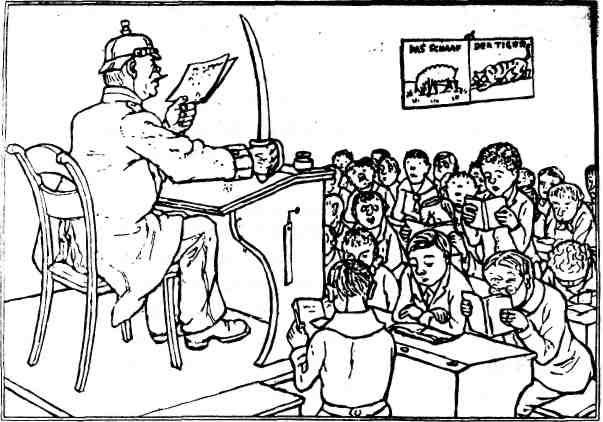

Search this site

Embedded Files

Skip to main content

Skip to navigation

[ZEILER .me - IT & Medien, Geschichte, Deutsch](../../../home.html)

-   [Startseite](../../../home.html)
    
-   [Detlef Zeiler](../../../detlef.html)
    
    -   [Deutsch](../../deutsch.html)
        
        -   [Erörterung](../../deutsch/errterung.html)
            
        -   [Essay-Themen](../../deutsch/essay-themen.html)
            
            -   [Essay](../../deutsch/essay-themen/essay.html)
                
            
        -   [Fremdenfeindlichkeit](../../deutsch/fremdenfeindlichkeit.html)
            
            -   [Armer und reicher Teufel](../../deutsch/fremdenfeindlichkeit/armer-und-reicher-teufel.html)
                
            
        -   [Homo Faber](../../deutsch/homo-faber.html)
            
        -   [Nayirah](../../deutsch/nayirah.html)
            
        -   [Needful Things - "In einer kleinen Stadt"](../../deutsch/needful-things---in-einer-kleinen-stadt.html)
            
            -   [In einer kleinen Stadt](../../deutsch/needful-things---in-einer-kleinen-stadt/in-einer-kleinen-stadt.html)
                
                -   [In einer kleinen Stadt](../../deutsch/needful-things---in-einer-kleinen-stadt/in-einer-kleinen-stadt/in-einer-kleinen-stadt.html)
                    
                
            
        -   [Texterörterung](../../deutsch/texterrterung.html)
            
        -   [Textinterpretation](../../deutsch/textinterpretation-1.html)
            
        -   [Textinterpretation (Beispiele)](../../deutsch/textinterpretation.html)
            
            -   [Das Eiserne Kreuz (Autor: Heiner Müller)](../../deutsch/textinterpretation/das-eiserne-kreuz.html)
                
            -   [Ein netter Kerl (Beispiel, Mittelstufe)](../../deutsch/textinterpretation/ein-netter-kerl.html)
                
            -   [Einige Beispiele](../../deutsch/textinterpretation/einige-beispiele.html)
                
                -   [Armer und reicher Teufel (Ernst Bloch)](../../deutsch/textinterpretation/einige-beispiele/armer-und-reicher-teufel-ernst-bloch.html)
                    
                -   [Wie ist der Mensch? (Michel de Montaigne)](../../deutsch/textinterpretation/einige-beispiele/wie-ist-der-mensch-michel-de-montaigne.html)
                    
                
            -   [Homo Faber](../../deutsch/textinterpretation/homo-faber.html)
                
            -   [Wie ist der Mensch (Michel de Montaigne)](../../deutsch/textinterpretation/wie-ist-der-mensch-michel-de-montaigne.html)
                
            
        -   [Versuch einer Beschreibung menschlicher Moral](../../deutsch/versuch-einer-beschreibung-menschlicher-moral.html)
            
        -   [Versuch einer kurzen Beschreibung einer menschlichen Moral](../../deutsch/versuch-einer-kurzen-beschreibung-einer-menschlichen-moral.html)
            
        -   [Vom Text zum Schaubild](../../deutsch/vom-text-zum-schaubild.html)
            
        
    -   [Geschichte](../../geschichte.html)
        
        -   [Alexander von Humboldts Südamerikareise](../../geschichte/alexander-von-humboldts-sdamerikareise.html)
            
        -   [Alexis de Tocqueville über die plötzliche Grausamkeit in einer unglücklichen Zeit](../../geschichte/ber-die-pltzliche-grausamkeit-in-einer-unglcklichen-zeit.html)
            
        -   [Berichte aus einer deutschen Diktatur](../../geschichte/berichte-aus-einer-deutschen-diktatur.html)
            
        -   [Berthold von Rohrbach](../../geschichte/berthold-von-rohrbach.html)
            
        -   [Besuch in Simferopol 2018](../../geschichte/besuch-in-simferopol-2018.html)
            
        -   [Ceausescu](../../geschichte/ceausescu.html)
            
            -   [Idylle und Realität unter Ceaucescu](../../geschichte/ceausescu/idylle-und-realitt-unter-ceaucescu.html)
                
            
        -   [Faschismus als Massenbewegung](../../geschichte/faschismus-als-massenbewegung.html)
            
            -   [Geräusch](../../geschichte/faschismus-als-massenbewegung/gerusch.html)
                
            
        -   [Faschismus im 21. Jahrhundert?](../../geschichte/faschismus-als-massenbewegung-2.html)
            
        -   [Geschichte des Neckars und des Philosophenwegs (Ludwig Merz/Otto Jäger)](../../geschichte/geschichte-des-neckars-und-des-philosophenwegs-ludwig-merzotto-jger.html)
            
        -   [Grenzen](../../geschichte/grenzen.html)
            
        -   [Grenzen II](../../geschichte/grenzen-ii.html)
            
        -   [Grenzen III](../../geschichte/grenzen-iii.html)
            
        -   [Hooligans - Angry Young Men](../../geschichte/hooligans---angry-young-men.html)
            
        -   [Künstliche Feindschaften](../../geschichte/knstliche-feindschaften.html)
            
        -   [Mein Großvater Rudolf Zeiler](../../geschichte/mein-grovater-rudolf-zeiler.html)
            
            -   [Rudolf Zeiler](../../geschichte/mein-grovater-rudolf-zeiler/rudolf-zeiler.html)
                
            
        -   [Nicht-tödliche Waffen](../../geschichte/nicht-tdliche-waffen.html)
            
        -   [Pavel Thalmann (1901 - 1980)](../../geschichte/thalmann.html)
            
        -   [Über die Grausamkeit](../../geschichte/ber-die-grausamkeit.html)
            
        -   [Zeit der Intrigen](../../geschichte/zeit-der-intrigen.html)
            
        -   [Integration](../../geschichte/integration.html)
            
        -   [Die "Mittelschicht" (Diskussionsthemen)](../../geschichte/die-mittelschicht-diskussionsthemen.html)
            
        -   [Jeremia](../../geschichte/jeremia.html)
            
        
    -   [Impressum](../../impressum.html)
        
    -   [Medien](../../medien.html)
        
        -   [Gerüchte – Rumores (Drehbuch und Storyboard)](../../medien/geruechte-rumores-drehbuch.html)
            
        -   [Medienerziehung](../../medien/medienerziehung.html)
            
            -   [Altersgemäße Schwerpunktsetzungen](../../medien/medienerziehung/altersgemaesse-schwerpunktsetzungen.html)
                
            -   [Aufgabenbereiche und Zielsetzungen](../../medien/medienerziehung/aufgabenbereiche-und-zielsetzungen.html)
                
            -   [Erlebnis- und Handlungsorientierung als Prinzipien](../../medien/medienerziehung/erlebnis-und-handlungsorientierung-als-prinzipien.html)
                
            -   [Gestaltung von audiovisuellen Medien](../../medien/medienerziehung/gestaltung-von-audiovisuellen-medien.html)
                
            -   [Leseerziehung und Hörerziehung](../../medien/medienerziehung/leseerziehung-und-hoererziehung.html)
                
            -   [Medienerziehung als gesamtgesellschaftliche Aufgabe](../../medien/medienerziehung/medienerziehung-als-gesamtgesellschaftliche-aufgabe.html)
                
            -   [Medienerziehung im Bereich von Computerspielen und interaktiven Medien](../../medien/medienerziehung/medienerziehung-im-bereich-von-computerspielen-und-interaktiven-medien.html)
                
            -   [Medienerziehung im Erziehungs- und Bildungszusammenhang](../../medien/medienerziehung/medienerziehung-im-erziehungs-und-bildungszusammenhang.html)
                
            -   [Medienkompetenz - Vorbemerkung](../../medien/medienerziehung/medienkompetenz-vorbemerkung.html)
                
            -   [Schülerzeitschriften](../../medien/medienerziehung/schuelerzeitschriften.html)
                
            -   [Spielfilme](../../medien/medienerziehung/spielfilme.html)
                
            -   [Verankerung in den Lehrplänen](../../medien/medienerziehung/verankerung-in-den-lehrplaenen.html)
                
            -   [Veränderung der Bildungs- und Erziehungssituation](../../medien/medienerziehung/veraenderung-der-bildungs-und-erziehungssituation.html)
                
            -   [Zukünftige Ansatzpunkte](../../medien/medienerziehung/zukuenftige-ansatzpunkte.html)
                
            -   [Zum Begriff Medienkultur](../../medien/medienerziehung/zum-begriff-medienkultur.html)
                
            
        
    -   [Projekte](../../projekte.html)
        
        -   [Der Heiligenberg bei Heidelberg](../heiligenberg.html)
            
            -   [Der unheimliche Berg](../heiligenberg/der-unheimliche-berg.html)
                
            -   [Die Geschichte des Heiligenbergs](../heiligenberg/geschichte.html)
                
            -   [MOPÄD - Mobile Pädagogen](../heiligenberg/mopaed.html)
                
            -   [Unser Projekt](../heiligenberg/projekt.html)
                
            
        -   [Die Elsenz und der Kraichgau](../die-elsenz-und-der-kraichgau.html)
            
            -   [Geographische Lage](../die-elsenz-und-der-kraichgau/geographische-lage.html)
                
                -   [Der Steinsberg](../die-elsenz-und-der-kraichgau/geographische-lage/der-steinsberg.html)
                    
                -   [Die Elsenz](../die-elsenz-und-der-kraichgau/geographische-lage/die-elsenz.html)
                    
                -   [Mühlen an der Elsenz](../die-elsenz-und-der-kraichgau/geographische-lage/mhlen-an-der-elsenz.html)
                    
                
            -   [Geschichte und Politik](../die-elsenz-und-der-kraichgau/geschichte-und-politik.html)
                
                -   [Bauernunruhen](../die-elsenz-und-der-kraichgau/geschichte-und-politik/bauernunruhen.html)
                    
                -   [Der Gaubegriff](../die-elsenz-und-der-kraichgau/geschichte-und-politik/der-gaubegriff.html)
                    
                -   [Der Kraichgau als militärisches Operationsgebiet](../die-elsenz-und-der-kraichgau/geschichte-und-politik/der-kraichgau-als-militaerisches-operationsgebiet.html)
                    
                -   [Die Burg Steinsberg](../die-elsenz-und-der-kraichgau/geschichte-und-politik/die-burg-steinsberg.html)
                    
                -   [Friedrich Hecker](../die-elsenz-und-der-kraichgau/geschichte-und-politik/friedrich-hecker.html)
                    
                -   [Joss Fritz und der Bundschuh](../die-elsenz-und-der-kraichgau/geschichte-und-politik/joss-fritz-und-der-bundschuh.html)
                    
                -   [Renaissance im Kraichgau](../die-elsenz-und-der-kraichgau/geschichte-und-politik/renaissance-im-kraichgau.html)
                    
                
            -   [Kultur / Religion](../die-elsenz-und-der-kraichgau/kultur-religion.html)
                
            
        -   [Dritte Gewalt - Strafvollzug](../dritte-gewalt-strafvollzug.html)
            
            -   [Anmerkungen](../dritte-gewalt-strafvollzug/anmerkungen.html)
                
            -   [Beispiel für ein Projekt](../dritte-gewalt-strafvollzug/beispiel-fuer-ein-projekt.html)
                
            -   [Gymnasium](../dritte-gewalt-strafvollzug/gymnasium.html)
                
            -   [Hauptschule](../dritte-gewalt-strafvollzug/hauptschule.html)
                
            -   [Medienforum Heidelberg e.V.](../dritte-gewalt-strafvollzug/medienforum-heidelberg-ev.html)
                
            -   [Realschule](../dritte-gewalt-strafvollzug/realschule.html)
                
            
        -   [Heidelberg im Mittelalter](../heidelberg-im-mittelalter.html)
            
            -   [Armenpflege und soziale Einrichtungen](../heidelberg-im-mittelalter/armenpflege-und-soziale-einrichtungen.html)
                
            -   [Auszug aus der Sittenstrafordnung für Dirnen des Heidelberger Kurfürsten Ott-Heinrich des Jahres 1532](../heidelberg-im-mittelalter/sittenstrafordnung-fuer-dirnen.html)
                
            -   [Das älteste Gewerbe im alten Heidelberg](../heidelberg-im-mittelalter/das-aelteste-gewerbe.html)
                
            -   [Dr. Jochen Goetze](../heidelberg-im-mittelalter/dr-jochen-goetze.html)
                
            -   [Freizeit im Mittelalter](../heidelberg-im-mittelalter/freizeit.html)
                
            -   [Hexenglauben und Hexenprozesse](../heidelberg-im-mittelalter/hexenglauben-und-hexenprozesse.html)
                
            -   [Juden im mittelalterlichen Heidelberg](../heidelberg-im-mittelalter/juden.html)
                
                -   [Phase relativer Toleranz](../heidelberg-im-mittelalter/juden/phase-relativer-toleranz.html)
                    
                -   [Spielball fremder Interessen](../heidelberg-im-mittelalter/juden/spielball-fremder-interessen.html)
                    
                
            -   [Literaturverzeichnis](../heidelberg-im-mittelalter/literaturverzeichnis.html)
                
            -   [MOPÄD - Mobile Pädagogen](../heidelberg-im-mittelalter/mopaed.html)
                
            -   [Praktische Heimatkunde](../heidelberg-im-mittelalter/praktische-heimatkunde.html)
                
            -   [Stadtgründung - Stadtentwicklung](../heidelberg-im-mittelalter/stadtgruendung-stadtentwicklung.html)
                
                -   [Der Stadtaufbau von Heidelberg](../heidelberg-im-mittelalter/stadtgruendung-stadtentwicklung/stadtaufbau.html)
                    
                -   [Heidelberg: Entstehung und Namensgebung](../heidelberg-im-mittelalter/stadtgruendung-stadtentwicklung/entstehung-und-namensgebung.html)
                    
                -   [Stadtgründung - Stadtentwicklung Stadtverfassung](../heidelberg-im-mittelalter/stadtgruendung-stadtentwicklung/stadtverfassung.html)
                    
                
            -   [Strafrecht und Strafvollzug](../heidelberg-im-mittelalter/strafrecht-und-strafvollzug.html)
                
                -   [I. Strafe - der Triumph des Guten](../heidelberg-im-mittelalter/strafrecht-und-strafvollzug/triumph-des-guten.html)
                    
                -   [II. Constitutio Criminalis Carolina](../heidelberg-im-mittelalter/strafrecht-und-strafvollzug/constitutio-criminalis-carolina.html)
                    
                -   [III. Verbrechen und Strafen](../heidelberg-im-mittelalter/strafrecht-und-strafvollzug/verbrechen-und-strafen.html)
                    
                -   [IV. Strafordnung im mittelalterlichen Heidelberg](../heidelberg-im-mittelalter/strafrecht-und-strafvollzug/strafordnung.html)
                    
                -   [V. Richtstätten und Gefängnisse im alten Heidelberg](../heidelberg-im-mittelalter/strafrecht-und-strafvollzug/richtstaetten-und-gefaengnisse.html)
                    
                -   [VI. Anmerkungen](../heidelberg-im-mittelalter/strafrecht-und-strafvollzug/anmerkungen.html)
                    
                
            -   [Universität und Studenten im Heidelberger Mittelalter](../heidelberg-im-mittelalter/universitaet-und-studenten.html)
                
                -   [Ausbau und Finanzierung der Universität](../heidelberg-im-mittelalter/universitaet-und-studenten/ausbau-und-finanzierung.html)
                    
                -   [Motive für den Aufbau einer Universität](../heidelberg-im-mittelalter/universitaet-und-studenten/motive-fuer-den-aufbau-einer-universitaet.html)
                    
                -   [Studentenunruhen im alten Heidelberg](../heidelberg-im-mittelalter/universitaet-und-studenten/studentenunruhen.html)
                    
                -   [Universität und Studenten im Heidelberger Mittelalter: Einleitung](../heidelberg-im-mittelalter/universitaet-und-studenten/einleitung.html)
                    
                -   [Ausbau der Universität und Rückschläge](../heidelberg-im-mittelalter/universitaet-und-studenten/ausbau-der-universitaet-und-rueckschlaege.html)
                    
                -   [Die Anfänge: Stadt, Hof und Universität](../heidelberg-im-mittelalter/universitaet-und-studenten/die-anfaenge-stadt-hof-und-universitaet.html)
                    
                -   [Die Universität zwischen Mittelalter und Neuzeit](../heidelberg-im-mittelalter/universitaet-und-studenten/die-universitaet-zwischen-mittelalter-und-neuzeit.html)
                    
                -   [Konflikte mit Hofbediensteten, Bürgern und Juden](../heidelberg-im-mittelalter/universitaet-und-studenten/konflikte-mit-hofbediensteten-buergern-und-juden.html)
                    
                
            
        -   [Heidelberger Schulgeschichten](../heidelberger-schulgeschichten.html)
            
            -   [Bürger und Bauern](buerger-und-bauern.html)
                
            -   [Das 18. Jahrhundert](das-18te-jahrhundert.html)
                
            -   [Das 19. Jahrhundert](das-19te-jahrhundert.html)
                
            -   [Das 20. Jahrhundert](das-20te-jahrhundert.html)
                
            -   [Die Anfänge](anfaenge.html)
                
            -   [Die Lehrerschaft des Heidelberger Kurfürst-Friedrich-Gymnasiums in der Zeit des Nationalsozialismus](lehrerschaft-kfg-3tes-reich.html)
                
            -   [Schülerunruhen am Kurfürst-Friedrich-Gymnasium im Jahre 1968](schuelerunruhen-am-kfg.html)
                
            
        -   [Neuenheim ist halb Europa](../neuenheim.html)
            
            -   [Die Eingemeindung Neuenheims 1891](../neuenheim/eingemeindung.html)
                
            -   [Interview mit Herrn Krauch](../neuenheim/interview-krauch.html)
                
            -   [MOPÄD - Mobile Pädagogen](../neuenheim/mopaed.html)
                
            -   [Neuenheim wird Stadtteil von Heidelberg](../neuenheim/otto-jaeger-ludwig-merz.html)
                
            -   [Projekt](../neuenheim/projekt.html)
                
            -   [Und plötzlich war die Klasse "judenfrei"...](../neuenheim/judenfrei.html)
                
            -   [Überblick](../neuenheim/ueberblick.html)
                
            -   [„Neuenheim ist halb Europa“](../neuenheim/ist-halb-europa.html)
                
            
        -   [Old Providence - Die Insel Providencia](../old-providence-die-insel-providencia.html)
            
            -   [1817-1821 - Die Korsaren](../old-providence-die-insel-providencia/1817-1821-die-korsaren.html)
                
            -   [Aktuell - 1903-heute](../old-providence-die-insel-providencia/aktuell-1903-heute.html)
                
            -   [Jahr 1629](../old-providence-die-insel-providencia/jahr-1629.html)
                
            -   [Jahr 1641](../old-providence-die-insel-providencia/jahr-1641.html)
                
            -   [Jahr 1666 - Piraterie](../old-providence-die-insel-providencia/jahr-1666-piraterie.html)
                
            -   [Jahr 1666-1670](../old-providence-die-insel-providencia/jahr-1666-1670.html)
                
            -   [Jahr 1670](../old-providence-die-insel-providencia/jahr-1670.html)
                
            -   [Jahr 1670-1767](../old-providence-die-insel-providencia/jahr-1670-1767.html)
                
            -   [Jahr 1767](../old-providence-die-insel-providencia/jahr-1767.html)
                
            -   [Jahr 1790-1803](../old-providence-die-insel-providencia/jahr-1790-1803.html)
                
            -   [Jahr 1822 - Die Republik](../old-providence-die-insel-providencia/jahr-1822-die-republik.html)
                
            
        
    -   [Jeremia](../../jeremia.html)
        
    
-   [Julian Zeiler](../../../julian.html)
    
    -   [About me (old)](../../../julian/about-me.html)
        
    -   [Artikel](../../../julian/artikel.html)
        
        -   [Agile Methoden in der Softwareentwicklung](../../../julian/artikel/agile-methoden-in-der-softwareentwicklung.html)
            
        -   [Auswirkungen von Ideologien der Open Source Lizenzen](../../../julian/artikel/auswirkungen-von-ideologien-der-open-source-lizenzen.html)
            
        -   [Was ist das Web 2.0?](../../../julian/artikel/was-ist-das-web-20.html)
            
        
    -   [Contact / Impressum](../../../julian/contact.html)
        
    -   [Techzap](../../../julian/techzap.html)
        
        -   [Design](../../../julian/techzap/design.html)
            
            -   [Microsoft Paint](../../../julian/techzap/design/microsoft-paint.html)
                
                -   [favicon ico mit MS Paint und BMP2ICO erstellen](../../../julian/techzap/design/microsoft-paint/favicon-ico-mit-ms-paint-und-bmp2ico-erstellen.html)
                    
                
            
        -   [Programmierung](../../../julian/techzap/programmierung.html)
            
            -   [Einführung in das Programmieren (alt und unvollendet)](../../../julian/techzap/programmierung/einfuehrung-in-das-programmieren.html)
                
                -   [Einführung in die Programmierung - Kapitel 1: Die Grundlagen](../../../julian/techzap/programmierung/einfuehrung-in-das-programmieren/grundlagen-variablen-operatoren-funktionen.html)
                    
                
            -   [Perl](../../../julian/techzap/programmierung/perl.html)
                
                -   [Perl Einzeiler: Suchen und Ersetzen in Dateien](../../../julian/techzap/programmierung/perl/perl-einzeiler-suchen-und-ersetzen-in-dateien.html)
                    
                
            
        -   [Server](../../../julian/techzap/server.html)
            
            -   [Unix/Linux](../../../julian/techzap/server/unix-linux.html)
                
                -   [Mit grep Zeilen entfernen, die in zwei Dateien doppelt vorkommen](../../../julian/techzap/server/unix-linux/grep-in-zwei-dateien-vorkommende-zeilen-entfernen.html)
                    
                
            -   [Windows](../../../julian/techzap/server/windows.html)
                
                -   [IIS und Apache auf einem Server parallel betreiben](../../../julian/techzap/server/windows/iis-und-apache-auf-einem-server-parallel-betreiben.html)
                    
                -   [ListenOnlyList Registry Werte - IIS an IP binden](../../../julian/techzap/server/windows/listenonlylist-registry-werte-iis-an-ip-binden.html)
                    
                
            
        -   [Technik](../../../julian/techzap/technik.html)
            
            -   [VMware](../../../julian/techzap/technik/vmware.html)
                
                -   [Strg+Alt+F1 bzw Ctrl+Alt+F1 an VMware senden](../../../julian/techzap/technik/vmware/strg-alt-f1-bzw-ctrl-alt-f1-an-vmware-senden.html)
                    
                
            
        
    -   [Work (old)](../../../julian/work.html)
        
        -   [Projects](../../../julian/work/projects.html)
            
        -   [Selfmade](../../../julian/work/selfmade.html)
            
        
    

[ZEILER .me - IT & Medien, Geschichte, Deutsch](../../../home.html)

# Das 20. Jahrhundert

Am Beginn und in der Mitte unseres Jahrhunderts stehen zwei Ereignis­se, die auch in der pädagogischen Diskussion eine Rolle spielen: Der Erste und der Zweite Weltkrieg. Sowohl die Kriegsjahre von 1914 bis 1918, als auch die von 1939 bis 1945 hatten Folgen für die Schulentwicklung.

Rein äußerlich gesehen gab es schon zu Beginn des 20. Jahrhunderts auf schulischem Gebiet mehrere Etappen rapider Verbesserungen. Die Real­schulen hatten ihre Anerkennung als höhere Schulen gegen den Wider­stand des 1890 gegründeten "Gymnasialvereins" durchgesetzt. 1905 wurde die Gleichstellung aller neunklassigen Schulen in Baden erreicht (63).

Neue, lebensnähere Methoden im sprach- und naturwissenschaftlichen Unterricht, Koedukation und verbesserter Sportunterricht (die Volks­schule an der Plöck erhielt 1903 eine eigene Turnhalle) setzten sich z.B. in Heidelberg durch. 1907/1911 wurde die Seminarausbildung der Lehrer verbessert und das "Großherzogliche Seminar" in der Keplerstraße eröffnet.

Hinter den Schulmauern steckte aber weiterhin ein streng autoritäts­gläubiger Geist. Die "Elite" blickte arrogant "nach unten", die Unterlehrer blickten sehnsüchtig "nach oben", - nicht nur in der Hoffnung auf Gehaltsangleichung. Jugendlicher Wandervogelgeist stand dem häufig nicht entgegen. Im Gegenteil, der Marsch zurück in die Natur brachte zackige Lieder und militärisch-folkloristische Führer zum Vorschein. Dem Industrialismus begegnete man rückwärtsgewandt-männerbündisch. "Bei Beginn des ersten Weltkriegs meldeten sich fast alle Seminaristen der oberen Kurse freiwillig zum Kriegsdienst."(64) Auch die Heidelber­ger Junglehrer zog es begeistert an die Front.

Und auch nach dem Krieg hatten die meisten wenig dazugelernt. Die neue Republik war Unter- wie Oberlehrern gleichermaßen suspekt. Sicher waren es nicht die Lehrer allein, die gegen die Republik waren, aber gerade sie hatten einigen Einfluss auf die Kinder - und hätten wissen können, dass die Geschichte vom "Dolchstoß" in der Heimat gegen die erfolgreichen Frontsoldaten blanker Unsinn war, dass der "Versailler Vertrag" auch eine Reaktion auf die brutale Härte war, mit der die Deutschen noch am 3.3.1918 beim Friedensschluss von Brest-Litowsk mit Russland gezeigt hatten, wie sie mit Verlierern umgehen würden. Statt­dessen wurde alles Übel ausgerechnet der neuen Republik zugeschoben, und die wirklichen Kriegstreiber konnten sich öffentlich viel besser präsentieren, als sie es verdient hätten.

Hart und bitter war die Enttäuschung vor allem der Linken über den Lehrerstand, dem doch seine Anhänglichkeit an die konservativen Kräfte kaum gedankt wurde: "...wir sprechen vom 'Volksschullehrerstand'-, der zwar nach Herkunft, Bildung, Rang und Einkommen noch nicht zur herr­schenden Klasse gehörte, dem die Gleichstellung mit dem akademisch gebildeten 'Oberlehrer' daher immer als hohes Ideal vorschwebte, der aber gleichzeitig weit genug vom Proletariat abgetrennt war, um sich für etwas besseres zu halten... als gar im Kriege Tausende Junglehrer Eintritt ins Offizierskasino fanden, da war es um diese Lehrer getan. Sie, die traditionell von jeher die treuesten Stützen von "Thron und Altar' gewesen waren - trotz aller Fußtritte! -, wurden jetzt begei­sterte Vorkämpfer jenes Geistes, der im preußischen Offizierskorps herrschte... Das alte wilhelminische System in Deutschland hat es ver­mocht, die Masse der Volksschullehrerschaft in so raffinierter Weise gleichzeitig zu ködern und zu unterdrücken, dass sie heute noch teils absolut 'unpolitisch' den vorgeschriebenen, d.h. reaktionären Trab trotten, teils ausgesprochene und erbitterte Reaktionäre sind."(65) Die Enttäuschung vieler Verfechter des Einheitsschulgedankens nach dem "Weimarer Schulkompromiß" von 1919 (66) führte sicher zu einer recht pessimistischen Sicht: Die gemeinsame Volksbildung unter direkter Staatsaufsicht wurde auf die ersten vier Grundschuljahre beschränkt.

_Fortschritt im Schulwesen_

_In den preußischen Schulen soll jetzt als neues Unterrichtsfach Staatsbürgerkunde eingeführt werden. Es ist wohl selbstverständlich, daß der Unterricht von Schutzleuten erteilt wird._

Die Organisation des mittleren und höheren Bildungswesens sowie die Lehrerausbildung blieben in Länderhoheit. Das private Vorschulwesen be­kam so großzügige Übergangsbestimmungen, dass es häufig bis 1933 (!) fortbestand. Die obligatorische Volksschule galt vielen begüterten Familien als "unfein", als "Armeleuteschule", andere standen ihr offen ablehnend gegenüber, weil sie darin ein "Produkt der Revolution", ein "Machwerk der Novemberverbrecher" sahen. Konservativ eingestellte El­tern boykottierten die Schulveränderung, wo immer es ging, ließen ihren Kindern vom Hausarzt Atteste schreiben, dass der Grundschulbesuch nicht möglich sei, bezahlten Hauslehrer oder richteten regelrechte Fa­milienschulen ein. Ab 1925 (bis 1933!) kam mit dem "kleinen Grund­schulgesetz" sogar noch die Möglichkeit hinzu, die Grundschule bereits nach drei Jahren wieder zu verlassen.

Trotz allem gab es viele Verbesserungen. Gerade die ab 1926 auf den neugeschaffenen Pädagogischen Akademien ausgebildeten Lehrer versuchten, Elemente der Reformpädagogik nicht nur auf privaten Schulinseln, sondern in der öffentlichen Schule durchzusetzen. Immer häufiger zeigte sich der Stil der Erlebnis- und Arbeitsschule auf Initiative einzelner Lehrer hin auch im Alltag der Schule (68). Auch aus Heidel­berg sind uns Beispiele einzelner Lehrer bekannt, die, nachdem 1926 das Eingangsniveau der Lehrerbildungsanstalten auf die Reifeprüfung angehoben worden war, ihren Beruf ernst nahmen und energisch für eine "Pädagogik vom Kinde aus" eintraten.

Neugeschaffene Elternbeiräte konnten nach 1919 offen gegen die immer noch praktizierte Prügelstrafe auftreten oder gegen Schikanen an Kindern, die nicht am Religionsunterricht teilnahmen. Dass dies alles nicht genügte, dass die Trägheit der Institution Schule und die äußere politische Entwicklung zentrale Faktoren waren, zeigte sich rasch nach 1933.

In vielen pädagogischen Werken nach 1945 ist die Zeit des Nationalso­zialismus nur floskelhaft zusammengefasst: "In der Zeit der Schreckens­herrschaft..." In den letzten Jahren hat sich dies geändert, und man kann heute tatsächlich erfahren, was den Schrecken ausmachte und wie viele, die später über kleine Demonstrationen von Jugendlichen ent­rüstet waren, bei der Zerstörung Europas bis 1945 beteiligt waren und millionenfachen Tod ins Land gebracht hatten. Ärzte, Juristen, alle waren sie nach 1933 (viel mehr noch als die Arbeitslosen) begeistert dabei gewesen. Aber auch die Lehrer, vor allem die "unteren" Ränge hatten sich Verbesserungen erhofft. In der Gegend um Heidelberg wurden sie "Kirchturmsgockel" genannt, weil sie sich so rasch nach dem "Wind" richteten. Heidelbergs Kreisleiter Wilhelm Seiler war Volks­schullehrer. Nach einer Erhebung von 1936 (69) waren im Reich 97 % (!) aller Erzieher Mitglied im NSLB (Nationalsozialistischer Lehrerbund), davon 32% Parteigenossen. Unzählige Lehrer bekleideten hohe bis sehr hohe Parteiämter, und 62% aller männlichen Parteigenossen im NSLB waren politische Leiter. Nicht genug damit: 32% der männlichen Mit­glieder und 52% der männlichen Parteigenossen waren in SS, SA, NSKK, NSFK oder NS-Marinebund organisiert, über 10 000 Lehrer organisierten die HJ oder das Jungvolk, 27 000 Lehrerinnen gehörten der NS-Frauenschaft an. Selbst wenn viele nur "mitliefen", war das ein ungeheures Ideologiepotential, das die Ideale eines größenwahnsinnig gewordenen Spießertums weitergab. Elternbeiräte wurden aufgelöst, Lehrerkonferen­zen verloren an Bedeutung, alles und jedes wurde einem "Führer" unter­stellt und straff von oben nach unten gegliedert. (Dies hat sicherlich dazu beigetragen, dass der Begriff "Führer" heute so absolut negativ besetzt ist - im Gegensatz beispielsweise zu dem englischen Wort "leader".)

Bezeichnend dennoch, wie wenig Achtung das zu-Kreuze-kriechen den Lehrern einbrachte. Von einem "Tischgespräch" am 12. April 1942 ist die Aussage Adolf Hitlers überliefert: "Lehrer werde leider nur ein bestimmter Typ von Mensch, der sich für den Kampf in freien Lebensbe­rufen nicht eigne. Menschen, die das Zeug in sich fühlten, aus eigener Kraft etwas zu leisten und zu gestalten, werden nicht Lehrer, zumin­dest nicht Volksschullehrer."(70)

Wie es nach dem Kriege weiterging, wissen heute noch viele aus eigener Erfahrung oder über ihre Eltern. Nationalsozialisten gab es plötzlich keine mehr, die waren auf einmal vom Erdboden verschwunden. Dennoch bestand in Heidelberg für einige Zeit Lehrernot, da von den 251 Lehr­kräften im Jahre 1939 144 durch die Militärregierung ihres Amtes ent­hoben waren und nur 50 direkt in den Schuldienst kamen. Trotz der 25 zugezogenen Lehrkräfte und einiger verheirateter ehemaliger Lehrerin­nen waren die Klassen lange Zeit überfüllt. Dazu trugen allerdings auch die vielen Flüchtlingskinder bei, die in das unzerstörte Heidel­berg gekommen waren. Kohlemangel im Winter brachte Unterrichtsausfall, und Unterrichtsmittel waren lange noch knapp. Aber schon 1948 war das Schlimmste überwunden. In Heidelberg zogen die damals immer noch neuen Medien: Film, Dia, Magnetton über die neueingerichtete Stadtbildstelle ein, die alle Schulabteilungen mit Apparaten und Lehrfilmen versorgte. Die Schülerspeisung (Hooverspeisung) verbesserte den Gesundheitszu­stand der Schüler und das Ende der "Entnazifizierung" brachte neue Lehrkräfte, über "Reeducation"-Programme versuchten vor allem die Ame­rikaner, den Deutschen demokratische Werte zu vermitteln. Man mag über die Amerikanisierung unserer Kultur nach 1945 sagen, was man will, sie war auf jeden Fall ein Schutzschild für die jüngere Generation gegen die Vermischungen, in denen die braune Ideologie noch immer in so vielen Bereichen unserer deutschen Kultur - auch in der Schule -weiterlebte.

Die äußere Entwicklung der Schulen nach 1945 ist allgemein gut doku­mentiert. Beinahe jede Schule hat heute ihre Chronik. Die innere Ent­wicklung zu beschreiben, dazu wäre es jetzt bald an der Zeit. Die Ausweitung des Schulwesens und die Demokratisierung der Zugangsmög­lichkeiten nach dem "Sputnikschock" Ende der 50er Jahre waren keine nur äußerliche Angelegenheit. Hier gab es ein vorübergehendes Bündnis zwischen technischer und geisteswissenschaftlicher Intelligenz, das spätestens Anfang der 70er Jahre wieder zerfallen ist. Bildung und Wissen als "human capital" in der internationalen Konkurrenz war mit Sicherheit ein gemeinsames Motiv. Daneben aber auch der endlich fälli­ge Generationenbruch, bei dem eine neue Generation versuchte, demokra­tische Postulate auch in der Realität einzufordern. Und dann 1968: Der internationale Aufbruch der Jugend und der kritischen Intelligenz. Nicht nur in der Bundesrepublik, auch in Frankreich, den USA und eini­gen Ostblockstaaten (CSSR) versuchte man, Reformen einzufordern, Eine neue Generation hat 1968 auch im Schulbereich Veränderungen eingeklagt, alte Tabus aufgebrochen und den Anschluss an die reformpädagogi­sche Diskussion vor 1933 geschafft. Das Modell einer Gesamtschule aus dem Jahre 1970 ist sicher Ausdruck davon.

Die Reformgeneration ist inzwischen selbst älter geworden und kann via "oral-History" über ihre Zeit befragt werden - so wie wir das in unse­rem Film vorgeführt haben. Wir möchten den Übergang in die Gegenwart -und damit den Schluss dieser Abhandlung offen lassen. Einige Daten aus der neueren Sozialforschung mögen allerdings Denkanstöße geben...

_(71)Abbildung: Relativer Schulbesuch der 13jährigen an Realschulen und Gymnasien nach dem Geschlecht 1952 bis 1978._

Copyright © 1996 - 2020 Detlef und Julian Zeiler

Google Sites

Report abuse

Page details

Page updated

Google Sites

Report abuse
