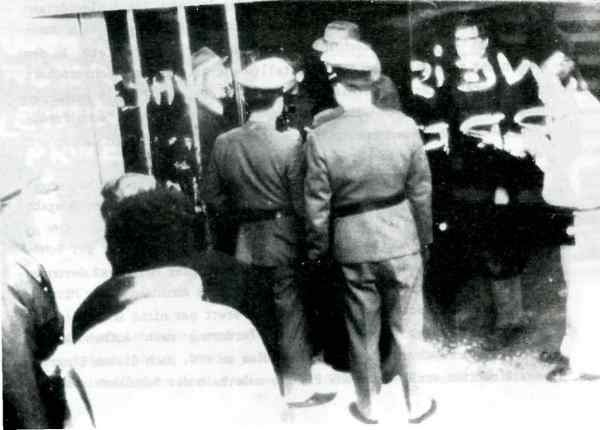
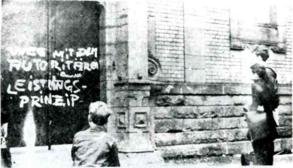
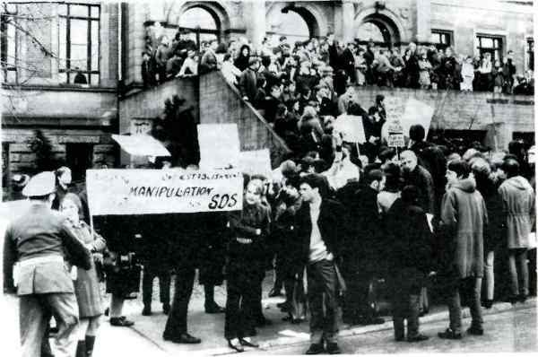

Search this site

Embedded Files

Skip to main content

Skip to navigation

[ZEILER .me - IT & Medien, Geschichte, Deutsch](../../../home.html)

-   [Startseite](../../../home.html)
    
-   [Detlef Zeiler](../../../detlef.html)
    
    -   [Deutsch](../../deutsch.html)
        
        -   [Erörterung](../../deutsch/errterung.html)
            
        -   [Essay-Themen](../../deutsch/essay-themen.html)
            
            -   [Essay](../../deutsch/essay-themen/essay.html)
                
            
        -   [Fremdenfeindlichkeit](../../deutsch/fremdenfeindlichkeit.html)
            
            -   [Armer und reicher Teufel](../../deutsch/fremdenfeindlichkeit/armer-und-reicher-teufel.html)
                
            
        -   [Homo Faber](../../deutsch/homo-faber.html)
            
        -   [Nayirah](../../deutsch/nayirah.html)
            
        -   [Needful Things - "In einer kleinen Stadt"](../../deutsch/needful-things---in-einer-kleinen-stadt.html)
            
            -   [In einer kleinen Stadt](../../deutsch/needful-things---in-einer-kleinen-stadt/in-einer-kleinen-stadt.html)
                
                -   [In einer kleinen Stadt](../../deutsch/needful-things---in-einer-kleinen-stadt/in-einer-kleinen-stadt/in-einer-kleinen-stadt.html)
                    
                
            
        -   [Texterörterung](../../deutsch/texterrterung.html)
            
        -   [Textinterpretation](../../deutsch/textinterpretation-1.html)
            
        -   [Textinterpretation (Beispiele)](../../deutsch/textinterpretation.html)
            
            -   [Das Eiserne Kreuz (Autor: Heiner Müller)](../../deutsch/textinterpretation/das-eiserne-kreuz.html)
                
            -   [Ein netter Kerl (Beispiel, Mittelstufe)](../../deutsch/textinterpretation/ein-netter-kerl.html)
                
            -   [Einige Beispiele](../../deutsch/textinterpretation/einige-beispiele.html)
                
                -   [Armer und reicher Teufel (Ernst Bloch)](../../deutsch/textinterpretation/einige-beispiele/armer-und-reicher-teufel-ernst-bloch.html)
                    
                -   [Wie ist der Mensch? (Michel de Montaigne)](../../deutsch/textinterpretation/einige-beispiele/wie-ist-der-mensch-michel-de-montaigne.html)
                    
                
            -   [Homo Faber](../../deutsch/textinterpretation/homo-faber.html)
                
            -   [Wie ist der Mensch (Michel de Montaigne)](../../deutsch/textinterpretation/wie-ist-der-mensch-michel-de-montaigne.html)
                
            
        -   [Versuch einer Beschreibung menschlicher Moral](../../deutsch/versuch-einer-beschreibung-menschlicher-moral.html)
            
        -   [Versuch einer kurzen Beschreibung einer menschlichen Moral](../../deutsch/versuch-einer-kurzen-beschreibung-einer-menschlichen-moral.html)
            
        -   [Vom Text zum Schaubild](../../deutsch/vom-text-zum-schaubild.html)
            
        
    -   [Geschichte](../../geschichte.html)
        
        -   [Alexander von Humboldts Südamerikareise](../../geschichte/alexander-von-humboldts-sdamerikareise.html)
            
        -   [Alexis de Tocqueville über die plötzliche Grausamkeit in einer unglücklichen Zeit](../../geschichte/ber-die-pltzliche-grausamkeit-in-einer-unglcklichen-zeit.html)
            
        -   [Berichte aus einer deutschen Diktatur](../../geschichte/berichte-aus-einer-deutschen-diktatur.html)
            
        -   [Berthold von Rohrbach](../../geschichte/berthold-von-rohrbach.html)
            
        -   [Besuch in Simferopol 2018](../../geschichte/besuch-in-simferopol-2018.html)
            
        -   [Ceausescu](../../geschichte/ceausescu.html)
            
            -   [Idylle und Realität unter Ceaucescu](../../geschichte/ceausescu/idylle-und-realitt-unter-ceaucescu.html)
                
            
        -   [Faschismus als Massenbewegung](../../geschichte/faschismus-als-massenbewegung.html)
            
            -   [Geräusch](../../geschichte/faschismus-als-massenbewegung/gerusch.html)
                
            
        -   [Faschismus im 21. Jahrhundert?](../../geschichte/faschismus-als-massenbewegung-2.html)
            
        -   [Geschichte des Neckars und des Philosophenwegs (Ludwig Merz/Otto Jäger)](../../geschichte/geschichte-des-neckars-und-des-philosophenwegs-ludwig-merzotto-jger.html)
            
        -   [Grenzen](../../geschichte/grenzen.html)
            
        -   [Grenzen II](../../geschichte/grenzen-ii.html)
            
        -   [Grenzen III](../../geschichte/grenzen-iii.html)
            
        -   [Hooligans - Angry Young Men](../../geschichte/hooligans---angry-young-men.html)
            
        -   [Künstliche Feindschaften](../../geschichte/knstliche-feindschaften.html)
            
        -   [Mein Großvater Rudolf Zeiler](../../geschichte/mein-grovater-rudolf-zeiler.html)
            
            -   [Rudolf Zeiler](../../geschichte/mein-grovater-rudolf-zeiler/rudolf-zeiler.html)
                
            
        -   [Nicht-tödliche Waffen](../../geschichte/nicht-tdliche-waffen.html)
            
        -   [Pavel Thalmann (1901 - 1980)](../../geschichte/thalmann.html)
            
        -   [Über die Grausamkeit](../../geschichte/ber-die-grausamkeit.html)
            
        -   [Zeit der Intrigen](../../geschichte/zeit-der-intrigen.html)
            
        -   [Integration](../../geschichte/integration.html)
            
        -   [Die "Mittelschicht" (Diskussionsthemen)](../../geschichte/die-mittelschicht-diskussionsthemen.html)
            
        -   [Jeremia](../../geschichte/jeremia.html)
            
        
    -   [Impressum](../../impressum.html)
        
    -   [Medien](../../medien.html)
        
        -   [Gerüchte – Rumores (Drehbuch und Storyboard)](../../medien/geruechte-rumores-drehbuch.html)
            
        -   [Medienerziehung](../../medien/medienerziehung.html)
            
            -   [Altersgemäße Schwerpunktsetzungen](../../medien/medienerziehung/altersgemaesse-schwerpunktsetzungen.html)
                
            -   [Aufgabenbereiche und Zielsetzungen](../../medien/medienerziehung/aufgabenbereiche-und-zielsetzungen.html)
                
            -   [Erlebnis- und Handlungsorientierung als Prinzipien](../../medien/medienerziehung/erlebnis-und-handlungsorientierung-als-prinzipien.html)
                
            -   [Gestaltung von audiovisuellen Medien](../../medien/medienerziehung/gestaltung-von-audiovisuellen-medien.html)
                
            -   [Leseerziehung und Hörerziehung](../../medien/medienerziehung/leseerziehung-und-hoererziehung.html)
                
            -   [Medienerziehung als gesamtgesellschaftliche Aufgabe](../../medien/medienerziehung/medienerziehung-als-gesamtgesellschaftliche-aufgabe.html)
                
            -   [Medienerziehung im Bereich von Computerspielen und interaktiven Medien](../../medien/medienerziehung/medienerziehung-im-bereich-von-computerspielen-und-interaktiven-medien.html)
                
            -   [Medienerziehung im Erziehungs- und Bildungszusammenhang](../../medien/medienerziehung/medienerziehung-im-erziehungs-und-bildungszusammenhang.html)
                
            -   [Medienkompetenz - Vorbemerkung](../../medien/medienerziehung/medienkompetenz-vorbemerkung.html)
                
            -   [Schülerzeitschriften](../../medien/medienerziehung/schuelerzeitschriften.html)
                
            -   [Spielfilme](../../medien/medienerziehung/spielfilme.html)
                
            -   [Verankerung in den Lehrplänen](../../medien/medienerziehung/verankerung-in-den-lehrplaenen.html)
                
            -   [Veränderung der Bildungs- und Erziehungssituation](../../medien/medienerziehung/veraenderung-der-bildungs-und-erziehungssituation.html)
                
            -   [Zukünftige Ansatzpunkte](../../medien/medienerziehung/zukuenftige-ansatzpunkte.html)
                
            -   [Zum Begriff Medienkultur](../../medien/medienerziehung/zum-begriff-medienkultur.html)
                
            
        
    -   [Projekte](../../projekte.html)
        
        -   [Der Heiligenberg bei Heidelberg](../heiligenberg.html)
            
            -   [Der unheimliche Berg](../heiligenberg/der-unheimliche-berg.html)
                
            -   [Die Geschichte des Heiligenbergs](../heiligenberg/geschichte.html)
                
            -   [MOPÄD - Mobile Pädagogen](../heiligenberg/mopaed.html)
                
            -   [Unser Projekt](../heiligenberg/projekt.html)
                
            
        -   [Die Elsenz und der Kraichgau](../die-elsenz-und-der-kraichgau.html)
            
            -   [Geographische Lage](../die-elsenz-und-der-kraichgau/geographische-lage.html)
                
                -   [Der Steinsberg](../die-elsenz-und-der-kraichgau/geographische-lage/der-steinsberg.html)
                    
                -   [Die Elsenz](../die-elsenz-und-der-kraichgau/geographische-lage/die-elsenz.html)
                    
                -   [Mühlen an der Elsenz](../die-elsenz-und-der-kraichgau/geographische-lage/mhlen-an-der-elsenz.html)
                    
                
            -   [Geschichte und Politik](../die-elsenz-und-der-kraichgau/geschichte-und-politik.html)
                
                -   [Bauernunruhen](../die-elsenz-und-der-kraichgau/geschichte-und-politik/bauernunruhen.html)
                    
                -   [Der Gaubegriff](../die-elsenz-und-der-kraichgau/geschichte-und-politik/der-gaubegriff.html)
                    
                -   [Der Kraichgau als militärisches Operationsgebiet](../die-elsenz-und-der-kraichgau/geschichte-und-politik/der-kraichgau-als-militaerisches-operationsgebiet.html)
                    
                -   [Die Burg Steinsberg](../die-elsenz-und-der-kraichgau/geschichte-und-politik/die-burg-steinsberg.html)
                    
                -   [Friedrich Hecker](../die-elsenz-und-der-kraichgau/geschichte-und-politik/friedrich-hecker.html)
                    
                -   [Joss Fritz und der Bundschuh](../die-elsenz-und-der-kraichgau/geschichte-und-politik/joss-fritz-und-der-bundschuh.html)
                    
                -   [Renaissance im Kraichgau](../die-elsenz-und-der-kraichgau/geschichte-und-politik/renaissance-im-kraichgau.html)
                    
                
            -   [Kultur / Religion](../die-elsenz-und-der-kraichgau/kultur-religion.html)
                
            
        -   [Dritte Gewalt - Strafvollzug](../dritte-gewalt-strafvollzug.html)
            
            -   [Anmerkungen](../dritte-gewalt-strafvollzug/anmerkungen.html)
                
            -   [Beispiel für ein Projekt](../dritte-gewalt-strafvollzug/beispiel-fuer-ein-projekt.html)
                
            -   [Gymnasium](../dritte-gewalt-strafvollzug/gymnasium.html)
                
            -   [Hauptschule](../dritte-gewalt-strafvollzug/hauptschule.html)
                
            -   [Medienforum Heidelberg e.V.](../dritte-gewalt-strafvollzug/medienforum-heidelberg-ev.html)
                
            -   [Realschule](../dritte-gewalt-strafvollzug/realschule.html)
                
            
        -   [Heidelberg im Mittelalter](../heidelberg-im-mittelalter.html)
            
            -   [Armenpflege und soziale Einrichtungen](../heidelberg-im-mittelalter/armenpflege-und-soziale-einrichtungen.html)
                
            -   [Auszug aus der Sittenstrafordnung für Dirnen des Heidelberger Kurfürsten Ott-Heinrich des Jahres 1532](../heidelberg-im-mittelalter/sittenstrafordnung-fuer-dirnen.html)
                
            -   [Das älteste Gewerbe im alten Heidelberg](../heidelberg-im-mittelalter/das-aelteste-gewerbe.html)
                
            -   [Dr. Jochen Goetze](../heidelberg-im-mittelalter/dr-jochen-goetze.html)
                
            -   [Freizeit im Mittelalter](../heidelberg-im-mittelalter/freizeit.html)
                
            -   [Hexenglauben und Hexenprozesse](../heidelberg-im-mittelalter/hexenglauben-und-hexenprozesse.html)
                
            -   [Juden im mittelalterlichen Heidelberg](../heidelberg-im-mittelalter/juden.html)
                
                -   [Phase relativer Toleranz](../heidelberg-im-mittelalter/juden/phase-relativer-toleranz.html)
                    
                -   [Spielball fremder Interessen](../heidelberg-im-mittelalter/juden/spielball-fremder-interessen.html)
                    
                
            -   [Literaturverzeichnis](../heidelberg-im-mittelalter/literaturverzeichnis.html)
                
            -   [MOPÄD - Mobile Pädagogen](../heidelberg-im-mittelalter/mopaed.html)
                
            -   [Praktische Heimatkunde](../heidelberg-im-mittelalter/praktische-heimatkunde.html)
                
            -   [Stadtgründung - Stadtentwicklung](../heidelberg-im-mittelalter/stadtgruendung-stadtentwicklung.html)
                
                -   [Der Stadtaufbau von Heidelberg](../heidelberg-im-mittelalter/stadtgruendung-stadtentwicklung/stadtaufbau.html)
                    
                -   [Heidelberg: Entstehung und Namensgebung](../heidelberg-im-mittelalter/stadtgruendung-stadtentwicklung/entstehung-und-namensgebung.html)
                    
                -   [Stadtgründung - Stadtentwicklung Stadtverfassung](../heidelberg-im-mittelalter/stadtgruendung-stadtentwicklung/stadtverfassung.html)
                    
                
            -   [Strafrecht und Strafvollzug](../heidelberg-im-mittelalter/strafrecht-und-strafvollzug.html)
                
                -   [I. Strafe - der Triumph des Guten](../heidelberg-im-mittelalter/strafrecht-und-strafvollzug/triumph-des-guten.html)
                    
                -   [II. Constitutio Criminalis Carolina](../heidelberg-im-mittelalter/strafrecht-und-strafvollzug/constitutio-criminalis-carolina.html)
                    
                -   [III. Verbrechen und Strafen](../heidelberg-im-mittelalter/strafrecht-und-strafvollzug/verbrechen-und-strafen.html)
                    
                -   [IV. Strafordnung im mittelalterlichen Heidelberg](../heidelberg-im-mittelalter/strafrecht-und-strafvollzug/strafordnung.html)
                    
                -   [V. Richtstätten und Gefängnisse im alten Heidelberg](../heidelberg-im-mittelalter/strafrecht-und-strafvollzug/richtstaetten-und-gefaengnisse.html)
                    
                -   [VI. Anmerkungen](../heidelberg-im-mittelalter/strafrecht-und-strafvollzug/anmerkungen.html)
                    
                
            -   [Universität und Studenten im Heidelberger Mittelalter](../heidelberg-im-mittelalter/universitaet-und-studenten.html)
                
                -   [Ausbau und Finanzierung der Universität](../heidelberg-im-mittelalter/universitaet-und-studenten/ausbau-und-finanzierung.html)
                    
                -   [Motive für den Aufbau einer Universität](../heidelberg-im-mittelalter/universitaet-und-studenten/motive-fuer-den-aufbau-einer-universitaet.html)
                    
                -   [Studentenunruhen im alten Heidelberg](../heidelberg-im-mittelalter/universitaet-und-studenten/studentenunruhen.html)
                    
                -   [Universität und Studenten im Heidelberger Mittelalter: Einleitung](../heidelberg-im-mittelalter/universitaet-und-studenten/einleitung.html)
                    
                -   [Ausbau der Universität und Rückschläge](../heidelberg-im-mittelalter/universitaet-und-studenten/ausbau-der-universitaet-und-rueckschlaege.html)
                    
                -   [Die Anfänge: Stadt, Hof und Universität](../heidelberg-im-mittelalter/universitaet-und-studenten/die-anfaenge-stadt-hof-und-universitaet.html)
                    
                -   [Die Universität zwischen Mittelalter und Neuzeit](../heidelberg-im-mittelalter/universitaet-und-studenten/die-universitaet-zwischen-mittelalter-und-neuzeit.html)
                    
                -   [Konflikte mit Hofbediensteten, Bürgern und Juden](../heidelberg-im-mittelalter/universitaet-und-studenten/konflikte-mit-hofbediensteten-buergern-und-juden.html)
                    
                
            
        -   [Heidelberger Schulgeschichten](../heidelberger-schulgeschichten.html)
            
            -   [Bürger und Bauern](buerger-und-bauern.html)
                
            -   [Das 18. Jahrhundert](das-18te-jahrhundert.html)
                
            -   [Das 19. Jahrhundert](das-19te-jahrhundert.html)
                
            -   [Das 20. Jahrhundert](das-20te-jahrhundert.html)
                
            -   [Die Anfänge](anfaenge.html)
                
            -   [Die Lehrerschaft des Heidelberger Kurfürst-Friedrich-Gymnasiums in der Zeit des Nationalsozialismus](lehrerschaft-kfg-3tes-reich.html)
                
            -   [Schülerunruhen am Kurfürst-Friedrich-Gymnasium im Jahre 1968](schuelerunruhen-am-kfg.html)
                
            
        -   [Neuenheim ist halb Europa](../neuenheim.html)
            
            -   [Die Eingemeindung Neuenheims 1891](../neuenheim/eingemeindung.html)
                
            -   [Interview mit Herrn Krauch](../neuenheim/interview-krauch.html)
                
            -   [MOPÄD - Mobile Pädagogen](../neuenheim/mopaed.html)
                
            -   [Neuenheim wird Stadtteil von Heidelberg](../neuenheim/otto-jaeger-ludwig-merz.html)
                
            -   [Projekt](../neuenheim/projekt.html)
                
            -   [Und plötzlich war die Klasse "judenfrei"...](../neuenheim/judenfrei.html)
                
            -   [Überblick](../neuenheim/ueberblick.html)
                
            -   [„Neuenheim ist halb Europa“](../neuenheim/ist-halb-europa.html)
                
            
        -   [Old Providence - Die Insel Providencia](../old-providence-die-insel-providencia.html)
            
            -   [1817-1821 - Die Korsaren](../old-providence-die-insel-providencia/1817-1821-die-korsaren.html)
                
            -   [Aktuell - 1903-heute](../old-providence-die-insel-providencia/aktuell-1903-heute.html)
                
            -   [Jahr 1629](../old-providence-die-insel-providencia/jahr-1629.html)
                
            -   [Jahr 1641](../old-providence-die-insel-providencia/jahr-1641.html)
                
            -   [Jahr 1666 - Piraterie](../old-providence-die-insel-providencia/jahr-1666-piraterie.html)
                
            -   [Jahr 1666-1670](../old-providence-die-insel-providencia/jahr-1666-1670.html)
                
            -   [Jahr 1670](../old-providence-die-insel-providencia/jahr-1670.html)
                
            -   [Jahr 1670-1767](../old-providence-die-insel-providencia/jahr-1670-1767.html)
                
            -   [Jahr 1767](../old-providence-die-insel-providencia/jahr-1767.html)
                
            -   [Jahr 1790-1803](../old-providence-die-insel-providencia/jahr-1790-1803.html)
                
            -   [Jahr 1822 - Die Republik](../old-providence-die-insel-providencia/jahr-1822-die-republik.html)
                
            
        
    -   [Jeremia](../../jeremia.html)
        
    
-   [Julian Zeiler](../../../julian.html)
    
    -   [About me (old)](../../../julian/about-me.html)
        
    -   [Artikel](../../../julian/artikel.html)
        
        -   [Agile Methoden in der Softwareentwicklung](../../../julian/artikel/agile-methoden-in-der-softwareentwicklung.html)
            
        -   [Auswirkungen von Ideologien der Open Source Lizenzen](../../../julian/artikel/auswirkungen-von-ideologien-der-open-source-lizenzen.html)
            
        -   [Was ist das Web 2.0?](../../../julian/artikel/was-ist-das-web-20.html)
            
        
    -   [Contact / Impressum](../../../julian/contact.html)
        
    -   [Techzap](../../../julian/techzap.html)
        
        -   [Design](../../../julian/techzap/design.html)
            
            -   [Microsoft Paint](../../../julian/techzap/design/microsoft-paint.html)
                
                -   [favicon ico mit MS Paint und BMP2ICO erstellen](../../../julian/techzap/design/microsoft-paint/favicon-ico-mit-ms-paint-und-bmp2ico-erstellen.html)
                    
                
            
        -   [Programmierung](../../../julian/techzap/programmierung.html)
            
            -   [Einführung in das Programmieren (alt und unvollendet)](../../../julian/techzap/programmierung/einfuehrung-in-das-programmieren.html)
                
                -   [Einführung in die Programmierung - Kapitel 1: Die Grundlagen](../../../julian/techzap/programmierung/einfuehrung-in-das-programmieren/grundlagen-variablen-operatoren-funktionen.html)
                    
                
            -   [Perl](../../../julian/techzap/programmierung/perl.html)
                
                -   [Perl Einzeiler: Suchen und Ersetzen in Dateien](../../../julian/techzap/programmierung/perl/perl-einzeiler-suchen-und-ersetzen-in-dateien.html)
                    
                
            
        -   [Server](../../../julian/techzap/server.html)
            
            -   [Unix/Linux](../../../julian/techzap/server/unix-linux.html)
                
                -   [Mit grep Zeilen entfernen, die in zwei Dateien doppelt vorkommen](../../../julian/techzap/server/unix-linux/grep-in-zwei-dateien-vorkommende-zeilen-entfernen.html)
                    
                
            -   [Windows](../../../julian/techzap/server/windows.html)
                
                -   [IIS und Apache auf einem Server parallel betreiben](../../../julian/techzap/server/windows/iis-und-apache-auf-einem-server-parallel-betreiben.html)
                    
                -   [ListenOnlyList Registry Werte - IIS an IP binden](../../../julian/techzap/server/windows/listenonlylist-registry-werte-iis-an-ip-binden.html)
                    
                
            
        -   [Technik](../../../julian/techzap/technik.html)
            
            -   [VMware](../../../julian/techzap/technik/vmware.html)
                
                -   [Strg+Alt+F1 bzw Ctrl+Alt+F1 an VMware senden](../../../julian/techzap/technik/vmware/strg-alt-f1-bzw-ctrl-alt-f1-an-vmware-senden.html)
                    
                
            
        
    -   [Work (old)](../../../julian/work.html)
        
        -   [Projects](../../../julian/work/projects.html)
            
        -   [Selfmade](../../../julian/work/selfmade.html)
            
        
    

[ZEILER .me - IT & Medien, Geschichte, Deutsch](../../../home.html)

# Schülerunruhen am Kurfürst-Friedrich-Gymnasium im Jahre 1968

"Einen 'nächtlichen' Sturmangriff erlebte das Kurfürst-Friedrich-Gym­nasium am späten Donnerstagabend. Die schwere Glastür im Innenhof konnte dem Protest von rund 150 Schülern und Studenten gegen ein schwebendes Ausschlussverfahren, das über drei ehemalige Mitglieder der Schülermitverwaltung verhängt worden ist, keinen Einhalt gebieten. Die Demonstranten wollten mit Eltern und Lehrern diskutieren, die an diesem Abend zu einer regulären Elternbeiratssitzung zusammengekommen waren. Die Glastür zerplatzte in über tausend Scherben, knapp die Hälfte der Demonstranten drang in das Gebäude ein und versammelte sich - ausgestattet mit Megaphon - vor dem Tagungsraum des Elternbeirats. An eine Diskussion war jedoch nicht zu denken: Empört, entsetzt und erregt über das Verhalten der Schüler versuchten die Eltern, den Kordon der Demonstranten zu durchbrechen. Dabei kam es gelegentlich zu Handgemengen und Handgreiflichkeiten. Mehrmals forderte Oberstudiendi­rektor Dr. Weis die Schüler und Studenten auf, das Gebäude zu verlas­sen, doch erst die eiligst herbeigerufene Polizei konnte die Schule schließlich von den letzten Demonstranten räumen." So fasste das Heidelberger Tagblatt vom 23. November 1968 den Höhepunkt der Auseinandersetzungen zwischen Schülern, Eltern und Lehrern am KFG in fettgedruckten Lettern zusammen.

Schon wieder Schmierereien an Türen und Wänden

Die Ursachen der Auseinandersetzungen am KFG: waren nicht allein die in der Bundesrepublik und vor allem in West-Berlin vorausgegangen Studen­tenunruhen - sie waren vor allem auch an der Schule selbst zu suchen. Natürlich wurden die "aufbegehrenden" Schüler am KFG von Heidelberger Studenten unterstützt und übernahmen deren Protestformen wie Flugblätterverteilen, Wändebemalen, sit-in, go-in etc., der Schülerprotest, der sich gegen verkrustete autoritäre Strukturen an der Schule wandte und die nach 1945 unterbliebene tiefgreifende Demokratisierung einzuklagen versuchte, war von den Schülern selbst getragen und nicht von den Studenten von außen in die Schule hineingetragen worden. Die Schule war damals weitgehend von dem abgeschottet, was sonst in der Welt vor sich ging. Über Politik wurde höchstens im Religionsunter­richt gesprochen. Zeitgeschichte, Sozialgeschichte, Sozialwissenschaf­ten und Psychologie kamen im Unterricht überhaupt nicht vor. Der Ge­schichtsunterricht endete in der Regel mit den Befreiungskriegen gegen Napoleon oder spätestens im Kaiserreich und die jüngste Zeitgeschich­te, die nationalsozialistische Vergangenheit wurde einfach ausgeklam­mert. Die 68er Schülergeneration hat diese Vergangenheit dann präsent gemacht: In Flugblättern wurden militaristische Gedichte des Direktors aus den dreißiger Jahren veröffentlicht, und auch auf andere Lehrer wurde die Aufmerksamkeit gelenkt - so z.B. auf jenen Englischlehrer, der als Mitglied des SD (Sicherheitsdienst) der SS in der dem KFG benachbarten Buchhandlung Braun die Regale nach ideologiewidrigen Büchern durchkämmt hatte und nach der "Entnazifizierung" völlig unan­gefochten am KFG weiterhin Englisch und Sport unterrichtete. In den Augen der rebellierenden Schüler stellte sich die gesamte Lehrerschaft als überalterter monolithischer Block dar, der, von 2 bis 3 Ausnahmen abgesehen, all jene, die anderer Ansicht waren, als "schulfremde Kräfte" denunzierend bekämpfte, um die eigene Autorität zu wahren und die Schule in ihrem bisherigen Zustand zu belassen. Der Konflikt am KFG entzündete sich an der Frage der freien Meinungs­äußerung der Schüler, denn die Direktion hatte sowohl an einer Ausgabe der Schülerzeitschrift "Gerüchte" als auch an den Aushängen der SMV am schwarzen Brett Anstoß genommen. Die gewählten Vertreter der Schü­lerschaft waren nicht bereit, eine Zensur ihrer Meinungsäußerungen durch die Direktion hinzunehmen, zumal es beim Abhängen einer Mittei­lung des Schulsprechers vom schwarzen Brett gar nicht um politische Äußerungen ging, sondern um die Forderung nach Aufhebung des generellen Rauchverbots für die Schüler am KFG. Nach diesem Eingriff der Direktion stellte die SMV Plakate außerhalb des Schulbereichs auf, die wiederum entfernt wurden. Schließlich wandte sich der Schulspre­cher Roland Schaeffer am 25.10.1968 mit einem Flugblatt an alle Schüler des KFG, um diese über die jüngsten Ereignisse unzensiert zu informieren. Im Gefolge der Auseinandersetzungen hatten Studenten, um ihre Solidarität mit den Schülern zu bekunden, die Wände des KFG mit weißer Ölfarbe bemalt. Am 28.10 bestaunten die Schüler an den Wänden ihres ehrwürdigen Gymnasiums Sprüche wie: "Weg mit dem autoritären Leistungsprinzip", "Wer jetzt nicht schmiert ist schmutzig" und "Nutzt die Wände". Die Direktion und der Großteil der Lehrerschaft vermutete die SMV-Vertreter als Urheber der nächtlichen Schmierereien. Die verdächtigen Schüler wurden einzeln am Schultor abgeführt und von ver­schiedenen Lehrern, unter anderem auch von dem obengenannten Englisch­lehrer, verhört. Den Schülern konnte zwar nichts nachgewiesen werden, aber ihre Äußerungen in den Verhören wurden in die Begründungen ihrer Relegation mit aufgenommen. Der unbewiesene Vorwurf der Wandschmierereien war jedoch nur das letzte Glied in einer Reihe von Anschuldigungen gegen die 3 SMV-Vertreter Roland Schaeffer, Walter Heipertz und Barbara Rendtorff. Nachdem die Lehrerkonferenz ein Ausschlußverfahren gegen die 3 Schüler eingeleitet hatte, wurden die Vorwürfe den Vätern (bekannten Heidel­berger Medizinern und Professoren) im einzelnen schriftlich mitgeteilt: "Bewußte Mißachtung und Verletzung der Schulordnung", "Aufreizung der Mitschüler zu Ungehorsam und Widersetzlichkeiten und zur Auflehnung gegen die vom Gesetzgeber und der Unterrichtsverwaltung festgelegten Institutionen der Schule", "Schulinterne und öffentliche Angriffe gegen Amt und Person des Direktors durch einen "eskalierten" Flugblattkrieg und dadurch herbeigeführte Behinderung des Schulleiters in der Erfüllung seiner eigentlichen Aufgaben", "Intellektuelle und psychologische Vorbereitung und versteckte oder öffentliche Rechtfertigung beleidigender Schmierereien", "Versuche der Störung gesetzlich vorgeschriebener Elternversammlungen" (RNZ vom 18.11.68). Die Solidarisierungsaktionen des SDS und der Schüler am KFG, die den Rausschmiß ihrer gewählten Vertreter verhindern wollten, gipfelten in dem nächtlichen go-in, bei dem auch eine Glastür zu Bruch ging. Am nächsten Morgen wurde gegen den Obersekundaner Cornelius Mugdan, der "besonders aufgefallen" war, "wegen der aktiven Teilnahme an dem Über­fall auf die Schule" (Tagbl. v. 25.11.68) das vierte Ausschlußverfah­ren eingeleitet. Zudem wurde er "wegen der Gefahr weiterer Unruhe­stiftungen" mit sofortiger Wirkung vom Unterricht suspendiert. Nach dem nächtlichen Sturm hatte der SDS für den folgenden Tag eine Diskussion auf dem Schulhof des KFG angekündigt. Diese Diskussion fand nicht statt, weil die Eingänge zur Schule versperrt waren. Stattdessen gab es eine vom Aufbauzug in der Luisenstraße beschlossene Gegendemonstration auf der Straße mit Plakaten und Spruchbändern, die sich eine Einmischung des SDS in die inneren Angelegenheiten der Schule verbaten. "SDS raus!" - "Wir lösen unsere Probleme alleine" - "Wir brauchen keine Kindermädchen" - "SDS-Demagogen manipulieren Schüler" -"Reformen ohne Gewalt" und ähnlich lauteten die Parolen der Gegendemonstranten. Die Polizei beobachtete alle Aktionen von Ferne, brauchte wegen des friedlichen Verlaufs jedoch nicht einzugreifen. Weitere massive Protestaktionen gegen den Ausschluss der Schüler fanden nicht mehr statt. Versuche der betroffenen Eltern, die Relegationen auf dem Rechtswege wieder aufheben zu lassen, schlugen fehl. Der Vier­te Senat des Verwaltungsgerichtshofs in Mannheim bestätigte in der letzten Instanz des Eilverfahrens die vorausgegangenen Entscheidungen des Verwaltungsgerichts Karlsruhe und des Oberschulamts Nordbaden, die schon alle Beschwerden der Eltern gegen den einmütigen Beschluß der Lehrerkonferenz vom 5. Dezember 1968, die drei Unterprimaner auszu­schließen, abgeschmettert hatten. Das Verfahren in der Hauptsache zogen die Eltern einige Monate später zurück. Will man ein Fazit der turbulenten Ereignisse von 1968 am KFG ziehen, so setzte sich die Direktion und die Lehrerschaft in der Auseinander­setzung mit den Schülern, die sich gegen ihre Autorität aufgelehnt hatten, rein äußerlich betrachtet, voll durch: die ausgeschlossenen Schüler mussten ihr Abitur an einer anderen Schule machen, der Schulfriede war wieder hergestellt. Doch der Reformprozess an der Schule, die Abschaffung autoritärer Relikte, die noch vom kaiserlichen Obrigkeitsstaat herrührten, wurde durch die 68er Schülergeneration erheblich beschleunigt. Auch an anderen Heidelberger Schulen forderten die Schüler ihre Lehrer zur politischen Diskussion heraus und ließen sich immer weniger bevormunden. Die ausgeschlossenen Schüler und alle, die sie unterstützten, haben sich als Bahnbrecher betätigt und einen Stein ins Rollen gebracht, der sich nicht mehr aufhalten ließ. Nachfolgende Schülergenerationen, schon die Schüler von 1970 hatten erheblich mehr Freiraum, und zwar sowohl an der Schule wie auch in ihrem Privatleben. Für die heutigen Schüler ist das alles schon Geschichte.

Copyright © 1996 - 2020 Detlef und Julian Zeiler

Google Sites

Report abuse

Page details

Page updated

Google Sites

Report abuse
