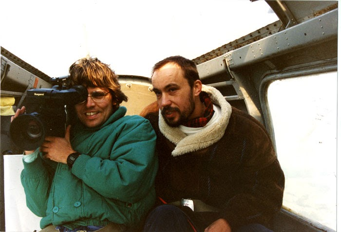

##

Inhaltsverzeichnis:

1.  [Die Geschichte des Heiligenbergs](heiligenberg/geschichte.html)

1.  [Der unheimliche Berg](heiligenberg/der-unheimliche-berg.html)
2.  [Unser Projekt](heiligenberg/projekt.html)
3.  Aufbau und Einsatzmöglichkeiten des Filmes

Ein Projekt der "Mobilen Pädagogen" (MOPÄD)

1985, Überarbeitet im Februar 1996

[MOPÄD - Mobile Pädagogen](heiligenberg/mopaed.html)

MOPÄD ist ein chamäleonartiges "Gebilde", das im Jahre 1985 über ein Videofilprojekt zum Heiligenberg bei Heidelberg entstanden ist und sich von Projekt zu Projekt ändert: Mal werden Schüler, Jugendliche und Lehrer in die Videofilmtechnik eingewiesen, um mit ihnen z.B. einen Film über eine Schulpartnerschaft drehen zu können...

Copyright © Detlef Zeiler
