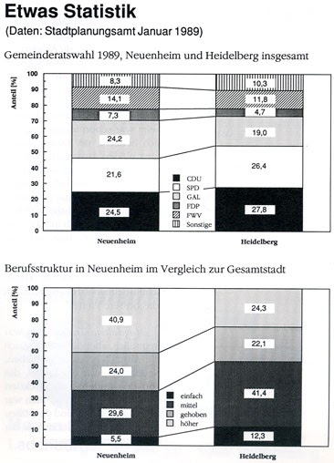

[Überblick](neuenheim/ueberblick.html)

Inhaltsverzeichnis:

1.  [Die Eingemeindung Neuenheims](neuenheim/eingemeindung.html)
    1.  Gisela Grenz befragt den Heidelberger Historiker Jochen Goetze
2.  [„Neuenheim ist halb Europa“](neuenheim/ist-halb-europa.html)
    1.  Auszüge aus einem Gespräch mit Magdalena Traber und Ella Haas.
3.  [Gespräch mit Otto Jäger und Ludwig Merz](neuenheim/otto-jaeger-ludwig-merz.html)
4.  [(Neuenheim wird Stadtteil von Heidelberg)](neuenheim/otto-jaeger-ludwig-merz.html)
5.  [Krieg der Knöpfe - Interview mit Helmut Krauch](neuenheim/interview-krauch.html)
6.  ["Und plötzlich war die Klasse judenfrei"](neuenheim/judenfrei.html)
7.  [Unser Projekt](neuenheim/projekt.html)
8.  Aufbau und Einsatzmöglichkeiten des Filmes
9.  [Gespräch mit Ludwig Merz. (Detlef Zeiler) Videoaufnahme](http://www.youtube.com/watch?v=3lI0piF0U7I).
10.  [Bootsfahrt mit Ludwig Merz auf dem Neckar.](http://www.youtube.com/watch?v=BpITRVlDHxM) Gespräch über Neuenheim, Bergheim und zwei Brücken.

_Statistik Neuenheim 1989_

Ein Projekt der ["Mobilen Pädagogen" (MOPÄD)](neuenheim/mopaed.html)

1990, Überarbeitet im Februar 1996
