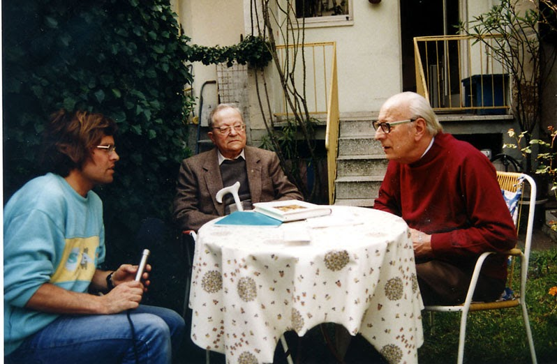
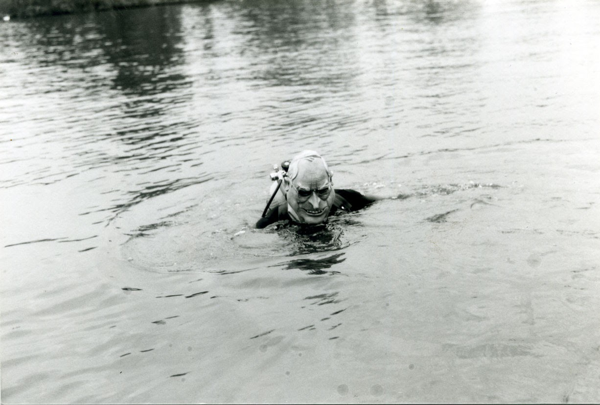
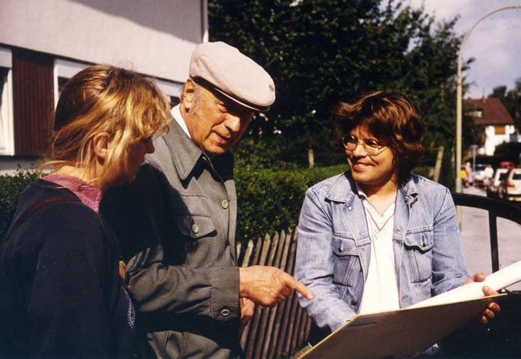

**Detlef Zeiler im Gespräch mit Otto Jäger und Ludwig Merz:**

_Sie kannten noch viele, die die Eingemeindung Neuenheims selbst miterlebt hatten. Waren die Neuenheimer damals glücklich, endlich nach Heidelberg einge­meindet zu sein?_

_Otto Jaeger:_

Im Grunde war es eine ungeheure Belastung für die Bevölkerung von Neuenheim, als Neuenheim noch ein Dorf war. Denn urplötzlich hat man Neuen­heim entdeckt, am Hang des Hei­ligenberges, aber auch in der Ebe­ne, gewissermaßen als Luftkur­ort, als Villenort auf der Nordseite von Heidelberg.

Der Hauptteil der Äcker war ja im Besitz vom Kloster Schönau. Und die waren dann willig, Bau­gelände abzugeben. Und so kam's dann allmählich, dass da ein Haus gebaut worden ist und dort. So ist die Gartenstraße entstanden, das ist die heutige Schröderstraße. Und so hat sich das dann ausgeweitet. Der Mönchhof hat sich nach Sü­den gewandt. Und Neuenheim hat dann Platz gewonnen nach Nord­en. In der Höhe der Rahmengasse und der Schröderstraße hat sich diese Bewegung getroffen. Da wurden die ersten großen Häuser hingestellt. Mein Haus in der Schrö­derstraße 11 ist 1891 gebaut wor­den von einer Freifrau. Deren Mann war Reichsrat - und war dann in Pension in Zürich. Die haben in Neuenheim ihr Haus gebaut. Das war an und für sich ein Villenvier­tel. Die Architekten waren scharf drauf, besonders die Schröders vom Mönchhof; das waren Archi­tekten, und die haben dann grö­ßere Objekte da hingestellt.

**Soziale Unterschiede.**

**Wir haben historischen Boden und wir sind was…**

Man hat unterschieden: Die einen waren 'Urneuemer'. Der Stamm der Bauern, die sind ein paar hundert Jahre zurückgegan­gen. Und die waren für sich ge­schlossen. Das hat da vielleicht an der Rahmengasse aufgehört. Die letzten Bauern waren dort noch: Christmann usw. Und die 'Neuemer' ware stolze Leut. Dass dort ein Kastell war von den Römern her, das hat man gewusst. "Mir habe da historischer Bode und mir sind was!" Und die Eingemeindung ist ja eigentlich nur vonstatten gegan­gen, weil Neuenheim durch die Bautätigkeit das Gas hat legen müssen und das Wasser, alle die Instrumente, die eben zum Haus­bau nötig waren. Und das hat man eben nicht mehr gekonnt. Die waren überschuldet. Und Heidel­berg hat schon immer darauf ge­lechzt, des 'Neiene' einzunehmen und über die Brücke zu kommen. _(lacht)_

Und da war ja 1877 die neue Brücke gebaut worden. Das war natürlich ein Riesenfortschritt für Neuenheim. Neuenheim, Hand­schuhsheim und die ganze Berg­straße hatten jahrelang drum ge­kämpft, dass diese Brücke gebaut worden ist, dass die 'B 3' verlängert wird auf dieser Seite. Und nach­dem die Brück gebaut war, hat eine rege Bautätigkeit stattgefun­den. Die Brückenstraße ist die Fort­setzung der 'B 3' von Basel nach Hamburg...

_Ludwig Merz:_

Die hat Format: Gastwirtschaften, Cafés, und vor allem Kaufhäuser. Das ist eine re­präsentative Straße.

_Otto Jaeger:_

Die Brücke war das Entscheidende!

_Was war davor?_

_Otto Jaeger:_

Da war eigentlich nichts. Es war noch nicht einmal eine Überfahrt dort.

_Was für Leute sind denn dann nach Neuenheim gezogen?_

_Otto Jaeger:_

Professoren haben ihre Häuser gebaut, und zwar die Neuenheimer Landstraße entlang sind die Häuser gebaut worden. Und dann war in der Bergstraße ein vornehmes Viertel: ein Notar hat dort gewohnt, Gerichtsbeamte usw. Das waren also die "besseren Leut". Und die haben dann auch meistens bei den Handwerkern in Neuenheim arbeiten lassen. Also Schuster und Schneider und dann vor allen Dingen Schlosser und Schreiner. In meiner Jugend gab es schon gute Schlossereibetriebe; die haben so sechs bis acht Gesel­len gehabt. Da war schon was los bei denen. Die haben dann gut leben können, die sind reich geworden dadurch, dass sie sich qualifiziert haben als gute Maurer oder Schreiner usw, was man eben gebraucht hat, um ein Haus zu bauen.

Wenn ich mich recht erinnere, ist in dieser Zeit das Lehrersemi­nar gebaut worden in der Keplerstraße. Die Blumenthalstraße ist da verlängert worden. Auf der an­deren Seite der Blumenthaistraße ist das Gelände mindestens 10 Meter abgefallen nach Hand­schuhsheim rüber.

_Ludwig Merz:_

Wir haben ja noch Aufnahmen, wo das Lehrersemi­nar weit draußen im Feld steht, ringsum noch Obstbäume, Wie­sen und Äcker. Und da war das Großherzogliche Lehrerseminar. Das ist heute das Hauptgebäude von unserer Pädagogischen Hoch­schule. Wir waren noch in der Lehrerbildungsanstalt, dann wur­de es das Pädagogische Institut und jetzt ist es die Pädagogische Hochschule."

_Otto Jaeger:_

Dann ist noch die Taubstummenanstalt da draußen gebaut worden - in Friedhofnähe. Auf der anderen Seite ist die Quinckestraße entstanden und besie­delt worden. Das ist alles immer weiter rausgedrückt worden. Die Leute haben ihre Äcker gut be­zahlt gekriegt. Die Jungen haben ein Handwerk gelernt oder sind in die Stadt, in die Realschule oder ins Gymnasium, sind dann Stu­denten geworden. Und die alten Leute haben dann die Kuh ver­kauft, haben sich das nimmer lei­sten können. Es waren aber doch ein paar da, die treue Landwirte waren, die dann auch mit Pferden geschafft haben und mit Trakto­ren. Da ist heute nichts mehr!

_Waren Sie durchgängig in Neu­enheim?_

_Otto Jaeger:_

Ich war immer in Neuenheim. Nur einmal, 'ne Zeit­lang war ich in der Fremde. Und dann bin ich wieder zurückge­kommen.

_Nach dem Zweiten Weltkrieg hat sich viel verändert. Was war das Einscheidendste?_

_Otto Jaeger._

Dass Neuenheim ein richtiggehend großer Ort gewor­den ist. Über die Keplerstraße raus, alles ist besiedelt worden. Früher war da noch der Friedhof, der Soldatenfriedhof draußen, der so­genannte neue Friedhof. Von da haben sie die Soldaten in der Hit­lerzeit auf den Ameisenbuckel verlegt, net wahr, die Leichen ausgegraben und dann oben den Ehrenfriedhof angelegt. - Ja, es sieht halt heute alles ganz anders aus!...

**Der Neckar.**

_OttoJaeger._

_Ja,_ wenn man von der neuen Brücke runter gekuckt hat in den Neckar, besonders im Sommer, wenn die Sonne ge­scheint hat, dann hat man da un­ten die Fische gesehen, die Steine und das Neckarbett!

_Ludwig Merz:_

Zur Verschmut­zung: Der Neckar war auch nicht immer klar. Je nach Regengüssen war er auch mal trüb. Aber das war nicht so ein Dreck wie heute.

Man muss ja denken, dass der Neckar noch nicht kanalisiert war. Und am Ufer wuchs noch Schilf. Und da haben wir wie die alten Ägypter Schilfschiffe gebaut: Also das Schilf oben und unten zusam­mengebunden - und sind dann oberhalb der alten Brücke runter auf unseren Schilfbooten bis nach Neuenheim und an Neuenheim vorbei.

Und dann sind ja noch die Schiffe runtergekommen mit ih­ren Anhängern. Also jedes Schiff hatte damals noch ein Boot an­hängen. Und da haben wir uns dann aufschleppen lassen - also neckaraufwärts ins Boot gestie­gen. Das hing an einem langen Seil. Infolgedessen konnte der Schiffer zwar schimpfen - und der Hund hat gebellt auf dem Schiff, aber es konnte niemand zu uns ran.

So ein Freund von mir, der war sehr geschickt. Der konnte auch Schweißerarbeiten machen. Der hat aus alten Ofenrohren ein Schiff­chen gemacht. Und mit dem sind wir dann aufs Wasser gegangen. Dazu hatten wir noch Paddel geschnitzt. Das war eine Sensa­tion, wie wir mit unseren schwim­menden Ofenrohren da auf dem Neckar rumkutschiert sind."

**Der amerikanische Salzsee.**

_Otto Jaeger:_

Auf der Höhe der Keplerstraße hat die Insel ange­fangen im Neckar; die hat sich dann so runter gezogen bis nach Wieblingen. Da waren auch Vö­gel, Wasservögel. Gegenüber war früher das Zementwerk gestan­den; das ist dann abgerissen wor­den. Und bei der Insel war noch ein großer See. Das war für uns Bube der 'amerikanische Salzsee1. In Amerika, da gibt’s doch den Salzsee. Und auf unserem Salzsee, da war ein Sprungbrett. Der 'Nikar' hat im Sommer drin gebadet, Übungen abgehalten - vom Sprungbrett runter.

_Ludwig Merz:_

Das war ein riesiger Baggersee, ziemlich tief. Ganz in der Nähe wurde ja die Thermalquelle gebohrt: Radiumsolbad. Und das hab ich noch als Erst­klässler erlebt, diesen Bohrturm, dort, wo heute ein Verwaltungs­bau der Stadt steht. Das Wasser war immer leicht salzig, ist nie zugefroren. Es hat nie festes Eis gebildet...

Und das war also die Indiane­rinsel, da konnte man alles trei­ben, was man wollte. Ja, da wurde auch gebadet, auch nachts geba­det, auch mit wenig Bekleidung.

Unter anderem war das Hei­delberger Stadttheater dort. Die haben einmal ausgemacht gehabt: Heut Abend gehen wir in den Salzsee baden. Und eine von unseren Primadonnen, die ist rein in den Salzsee und hat dann 'oben ohne' gebadet. Und wir Lausbuben hockten in den Gebüschen drin. Und wie die dann gebadet haben, sind wir natürlich rausgestürmt. Und unsere Primadonna, die ist dann bis zum Hals untergegan­gen. Die musste aber wieder rauf. Ich könnte die Namen noch nen­nen, will aber nicht. Der Helden­tenor - das war übrigens dessen Partnerin als Berthalda in Undine - der hat's gewagt und ist mit dem Mantel rein und hat im Wasser der Primadonna den Mantel umge­hängt. Und so ist sie dann wie eine Königin aus den Fluten gestiegen - und wir hatten das Nachsehen."

_Wie lange gab es den Salzsee und die Insel noch?_

_Ludwig Merz:_

So um die 30er Jahre ist der Neckar kanalisiert worden. Das musste ja stufenweise gehen, nicht auf einmal. Und damit ist natürlich auch eine gewisse Ro­mantik verschwunden. Es ist auch nicht mehr der so flott fließende Neckar gewesen; denn Neckar kommt ja aus dem Keltischen und heißt bekanntlich: "Der Zornige", "der Aufbrausende". Und der Wol­kenstein, der Dichter aus dem Mittelalter, der sagt noch: "Der Bach gemach nit floß zum Rhein!" Also er hat eine ziemliche Ge­schwindigkeit gehabt, stärker als der Rhein! Und das ist natürlich gebremst worden. Und dadurch hat es auch einen gewissen Reiz verloren, im Neckar zu schwim­men.

_Otto Jaeger:_

Da war auch eine Stei­naufschüttung bis an den Neckar rüber. Das war das sogenannte 'Wehrle1. Da ist der Neckar beson­ders stark geflossen, weil er bis auf 30, 40 Meter zusammenge­drückt war. Das war da unterhalb der Keplerstraße. Und unten, auf Wieblingen zu, ist er dann wieder breiter geworden.

_Ludwig Merz:_

Wir brauchten Wehre, also eine bis in die Mitte des Neckars ziehende 'Zeil', damit dann, wenn wenig Wasser war, das Wasser wenigstens hier noch direkt auf die Mühlräder gelenkt wurde. Dafür waren die Zeilen. Und die waren natürlich früher begehrt von den Anglern. Da saß einer neben dem anderen, denn da war ja die beste Möglichkeit, die Angel auszuwerfen. (Übrigens: Zeiler sorgten für die Zeil).

_Otto Jaeger:_

Das Neckarvorland war bis zum Ausgang des Jahr­hunderts ein Dreckloch! Das Hochwasser ist da stehengeblie­ben. Es war noch nicht das vor­nehme Neckarvorland wie heu­te. Nachdem die Brücke gebaut war, ist das aufgeschüttet wor­den mit Erde vom Bau der Berg­bahn auf dem Königstuhl. Das ist alles nach Neuenheim rüber ge­führt worden. Auf Jahre hinaus war das eine riesige Baustelle. Mit der Zeit ist eine Wiese draus entstanden.

**War Neuenheim ein Fischer­dorf?**

_Otto Jaeger:_

Der Pfarrer Schmidt, der hat eine Geschichte über Neuenheim geschrieben. Das ist ein ausgezeichnetes Geschichts­buch, in der man auch viel über die Pfälzer Geschichte findet. Mehr oder minder hat der Pfarrer Schmidt den Ausdruck 'Fischer­dorf geprägt.

Das war aber nicht so! Neuen­heim war ein Bauerndorf - oder ein Weingärtnerdorf. Es ist ungeheuer viel "Wein in Neuenheim angebaut worden. Auch da drau­ßen im Feld. Dort hat man diese Feldlauben gehabt. Die Fischer waren eigentlich in der Minder­heit. In meiner Jugend war das immer noch so, dass die meisten Fischer drüben von der Stadt kamen.

Die haben das sogenannte 'Kompaniefischen' gemacht. Da sind sie mit sechs, sieben Nachen den Neckar rauf gefahren und haben mit den Rudern aufs Was­ser geschlagen. Und oben waren große Garne gespannt. Und da haben sie die Fische rein getrieben. Meistens mit großem Erfolg. Ja, und dann sind sie auf den Stra­ßen von Neuenheim herum, mit zweirädrigen grünen Karren; grün war da maßgeblich. Ein großer, grüner Bottich, der war innen schön weiß gestrichen. Da waren dann die Neckarfische drin. Dann haben sie ausgerufen: 'Frische Fisch! Leit, kaaft frische Fisch!1 Da sind die Frauen rausgekommen, und je nachdem, hat man den Fisch genommen, auf den Kopf geschla­gen und ausgenommen. Und dann hat's freitags wieder Fisch gege­ben.

_Ludwig Merz:_

Die Studenten ha­ben das auch gewußt, dass es gute Fische gibt. Überhaupt war Neu­enheim beliebt bei den Studen­ten, weil es etwas abseits von Hei­delberg, der Univerwaltung und dem Rektor war. Wir kennen ja die Vorgänge von den frühen Stu­dentenunruhen. Wenn die Studen­ten sich zu beschweren hatten, dann kam die Universität 'in Ver­ruf. D.h. die haben ihr den guten Ruf abgesprochen nach irgend­welchen Zusammenstößen, oder wenn sie vom Militär bedrängt wurden, wenn es Schlägereien gegeben hat und sie haben nicht ihr Recht bekommen, oder auch weil sie keine Degen tragen durf­ten. Die haben dann hier in den Scheunen gelagert, gegessen, getrunken und auch gepennt, bis die dann wieder durch das Ein­greifen des Großherzogs bewegt wurden zurückzukehren.

Bei den großen Studentenfe­sten waren die Nachen der Fi­scher hier drüben natürlich sehr günstig, denn da fuhr man nicht auf großen Schiffen wie unsere 'weiße Flotte', sondern auf klei­nen Nachen, singend, mit der Klampfe, viele beisammen, alles lampionsgeschmückt. Und da brauchte man natürlich Ruderer dazu. Ab und zu sieht man noch alte Bilder von solchen Studente­nausflügen.

**Der Hookemann.**

_Ludwig Merz:_

Der Hooke­mann, ja, da steckt eine alte Sage dahinter. Ich hab's daheim noch mitgekriegt, dass der Hookemann in der G'hanstagsnacht, also das ist die Johannisnacht (in Neiene hat ma gsagt: De G'hanstag) aus dem Neckar steigt. Und wenn je­mand badet, zieht er ihn runter.

_Otto Jaeger:_

Der Johannistag, der ist in Neuenheim immer ziemlich gefeiert worden, weil die Dorfkirche eben die Johanniskirche war - die alte Kirch, wo die Reste noch stehen mit dem Turm.

_Hat Ihnen das imponiert als Kind?_

_Otto Jaeger:_

Nee, das kann man nicht sagen. Da waren die Wirt­schaften voll. Wir 'Sume' haben in den Wirtschaften nichts zu suchen gehabt. Wir sind dann 'nausgstaabt' worden (lacht). Na Gott, wenn der Vadder drin war, da hat man ein Stück Wurst kriegt, dann ist man wieder abgezogen.

_Im Bild: Ein Taucher simuliert einen "Hookemann" im Neckar...._

**Freizeit.**

_Otto Jaeger:_

Ja, das war je nach Besitz der Leute. Die Kinder von den Bauersleuten, die haben viel auf dem Feld schaffen müssen, die Mädle und die Bube. Wenn ich das heute betrachte, aus dieser Zeit, muss ich sagen: Meine Schul­kameraden, Volksschule, die haben schaffen müssen! Die sind morgens mit in den Stall, da ist der Stall ausgemistet worden. Und dann sind sie erst in die Schule gegangen. Das war für die Kinder eine Plage! Und wenn sie heimge­kommen sind, haben sie ein Stück Brot gekriegt - und dann ist es raus aufs Feld gegangen. Die haben schaffen müssen - grad in dem Alter ab 11 Jahren, da waren die schwer strapaziert. Und dann sind sie natürlich auch manchmal nicht mit dem Schulunterricht mitge­kommen. Da sind welche 'hocke geblieben' und mussten die Klasse nochmal machen.

Es gab auch Bauern, die haben Knechte und Mägde gehabt. Aber beim kleinen Bauern, da musste die ganze Familie raus aufs Feld, wenn z.B. Rübenernte war. Die sind dann daheim ins Bett gefal­len und morgens wieder raus gekrochen - und dann raus auf den Acker! Größere Bauern haben einen Gaul gehabt oder zwei. Aber die anderen sind alle mit Ochsen und Kühen gefahren. Die sind dann die Straße entlang gekrochen, die Kühe (lacht), die waren durch nichts in Schwung zu bringen. Es waren viele Leute, die haben noch eine kleine Landwirtschaft gehabt - oder Äcker, oder ein Wingert. Und die haben dann z.B. bei der Bahn gearbeitet, und dann war auch die Post bevorzugt. Postge­hilfe. Der erste Briefkasten in Neuenheim war so um die 50er Jahre. (Ich hab darüber mal einen Artikel geschrieben.) Der war auf dem Rathaus gehangen, in der Schulzengasse. So Leute wie Schuhmacher, die haben dann in die Stadt gehen müssen und Leder kaufen. Die sind dann über die alte Brücke und haben die Post mitgenommen. Dann hat's gehei­ßen: Der alte Plaumer geht mor­gen früh wieder rüber Leder holen - und der nimmt die Post mit. Dann hat der die Briefe mitgenommen. Die haben ja nicht so viel geschrie­ben, die waren nicht verrückt aufs Schreiben. Und Telefon war ja noch lang nicht da.

**Vereine.**

_Otto Jaeger:_

Früh schon, 1844 ist in Neuenheim ein Gesangverein ent­standen, der dann in der Revolu­tionszeit, 1848, verboten worden ist. Und dann, 1856/57 hat man sich wieder zusammengefunden. Der Verein existiert heut noch. Mein Großvater war da schon Mitglied, mein Vater. Da bin ich halt auch mit marschiert. Der Ver­ein war ein starker Verein. Er hat in der Zeit vor dem Weltkrieg das Badische Sängerfest in Freiburg mitgemacht. Da waren 140 Mann auf der Bühne.

In der Neuenheimer Landstraß, da war eine englische Schule - von dem Holzberg. Und der Dr. Ul­rich, der war in England und hat das Rugby rübergebracht. Von da an ist in Neuenheim Rugby ge­spielt worden. Der Ruderclub hatte schon - ich glaub - vor der Jahr­hundertwende Rugby gespielt. Dann haben die Neuenheimer einen stolzen Verein gehabt, mit mehreren deutschen Meisterschaf­ten; der existiert ja heut noch. Der Sportclub Neuenheim hat früher Fußballclub Neuenheim gehei­ßen. Auch des Rugby hat man früher Fußball genannt. Und die einen haben gesagt (lacht), das wären die 'Fußbube', weil die mit dem Fuß den Ball getreten haben, net wahr.

Ich hab Rugby gespielt. Aber zuerst war ich Turner, stolzer Turner. Da war ein alter Turnve­rein; 1878 glaub ich, ist der ge­gründet worden. Der Neuenheimer Turnverein hat sich später mit dem Turn- und Fechtclub und noch einem anderen Heidelber­ger Verein vereinigt - nach dem ersten Weltkrieg - und ist dann Großverein geworden, die soge­nannte "Turngemeinde". Ganz früher haben wir im Tanzsaal vom 'Deutschen Kaiser' geturnt, das war eine Wirtschaft in der Ladenbur­ger Straß; wir Buben waren dann die 'Zöglinge'. Und dann ist man ein Jungturner geworden, wenn man's noch ausgehalten hat und befähigt war. Da hat's Kerl gege­ben, das waren tollkühne Turner. Aber der Großteil ist wieder aus­einandergelaufen. Also, die Turner waren immer gut angesehen!

_Ludwig Merz:_

Also für uns, die wir noch nicht so ausgesprochene Sportler waren, wir haben gekickt, natürlich. Und wir haben Hockey gespielt. Aber wenn man gesagt hat: 'Das ist ein Sportler!' dann hat man - die waren vielleicht vier oder fünf Jahre älter als wir - dann haben wir zu denen immer aufge­sehen! Ein guter Rugby-Spieler oder ein Ruderer, die waren ange­sehen. Mein Vetter war ein Regat­taruderer, zu dem man aufsah!

_Otto Jaeger:_

Die Turnerwaren am meisten angesehen! Die haben auch Altersturner gehabt. Dann waren die mittleren Jahrgänge. Da war immer viel Betrieb. Da ist man aufs Gauturnfest gegangen. Und da sind immer Preise geholt wor­den. Dann ist man durch Neuen­heim gezogen, durch die Laden­burger Straß bis auf den Markt­platz. Dann hat man noch einmal 'Gutheil!' gekrischen - und dann ist alles auseinander. Vorneheraus war der 'Täfelesbu' gelaufen, und dann hat's geheißen: Turnverein Neuenheim. In meiner Jugend, da war ich noch Zögling, da war ein großes Gauturnfest in Schönau.

Wir haben uns gesammelt mit den Großen und sind dann über's Münchel nach Schönau gelaufen und haben am Turnfest teilgenom­men. (Lacht) Die älteren Turner, die haben uns 'ä Worscht oder ä Rippel' gestiftet. Wenn man einen Preis geholt hat, war man beson­ders angesehen. Da hat man ei­nen Kranz aufgesetzt. Abends ist dann die ganze Kavalkade wieder nach Neuenheim marschiert; über's Münchel zurück durch Zie­gelhausen. Dann sind wir erwar­tet worden. An der alten Brücke war die Kapelle Schäfer. Und die haben dann Musik gemacht und sind vorneraus marschiert. Und dann sind wir stolz durch die Brückenstraß, Ladenburgerstraß auf den Marktplatz gezogen. Ein letz­tes Hipp-Hipp-Hurra! Der alte Bai­mann hat gesprochen - und dann sind wir auseinander. Und daheim empfangen worden: Oh, du hast ein Kränzel! Ja, das ist dann an die Wand gehängt worden, da hing's dann eine Weile. Und dann hat's die Mutter geärgert, weil's dau­ernd staubig war. Und dann (lacht) - wenn man mal heim gekommen ist, war's nimmer da! Und dann der Vater: 'Turn anständig, dann kriegst wieder eins!' So war das.

Ich bin dann früh zu den Rugby-Spieler gegangen. Das war draus im Collegefeld. Das hat dem Holz­berg gehört. Es war ziemlich weit im Feld draus, in der Gegend vom Friedhof. Wir haben uns daheim umgezogen, haben den Sport angezogen und sind dann mitsamt den Fußballstiefeln rausgelaufen. Wer Besitzer eines Fahrrads war, der ist dann stolz da raus gefahren - und hat gekuckt, wie die ande­ren die Mönchhofstraße entlang klappern (lacht). Und wenn man dann Rugby gespielt hat und hat eine abgekriegt, dann hat man halt gehickelt und gehackelt. Mit den Leuten, die da zugekuckt haben, ist man später zurück nach 'Neue-me' gegangen. Zu meiner Zeit war das Hotel Kaiserhof Ecke Schrö­derstraße, Brückenstraße das Ver­einsheim vom Fußballclub 1902. Das ist dann später auch Sportklub Neuenheim geworden. Und wenn man so in der dritten Mann­schaft gespielt hat, dann hat man schon im Nebenzimmer einen Schoppen Bier trinken können. Da war man unter den Alten ge­sessen - und da ist es hoch her gegangen. Da ist gesungen wor­den. Die Turngemeinde war da­mals im 'Deutschen Kaiser'.

**Erste Liebe.**

_Otto Jaeger:_

Den Mädchen ist man 'zu Gefalle gelaufe1. Die hat man zuerst beim Turnen kennenge­lernt. Die haben manchmal mit uns zusammen Turnen gehabt. In der Mönchhofschule waren die Mädchen im dritten Stock und wir waren im 2. Stock. Dann hat man sich halt so angeschlichen (lacht). Dann ist man die Straß hin und her gelaufen, verstehst, dann hat man gemerkt, aha, die kuckt hinter'm Vorhängle vor. Da war die Sache schon komplett. Und wenn Ker-we war, im Deutschen Kaiser, der ganze Saal, da sind wir auch dort hingeschlichen. Dann hat man die Mädle dort angesehen, die haben das Tanzen betrachtet. Wir haben ja net tanzen können; dann sind wir im Tanzsaal rumgehüpft wie die Känguruh, von tanzen war da keine Spur! Hat eine tanzen kön­nen, hat sie uns junge Lümmel schon gar net genommen, weil sie gesehen hat (lacht), des war aus­sichtslos. Bis wir in Schwung gekommen sind, hat man einan­der ordentlich auf die Fuß getre­ten.

In der achten Klasse, da hat man schon angefangen zu pous­sieren. Die man gern gehabt hat, der hat man sich interessant ge­macht (lacht), hat der die aben­teuerlichsten Geschichten erzählt, was man schon alles gemacht hat. Meistens haben die des einem net geglaubt, haben über uns gelacht und gesagt: Guck mal her, der Simpel da! Guck nur her und hör ihn dir an! Dann hat's auch mal 'ne Schlägerei gegeben wegen einem Mädchen, im Tanzsaal. Daß einer zwei, drei Schoppen Bier getrun­ken hat und hat Feuer gesehen: Da hat er gemeint, sein Mädel kann bloß noch mit ihm tanzen. Da hat's schon mal geraucht.

Der Tanzsaal war früher in der "Pfalz" in der Rahmengasse, dann später unten in der Alten Krone. Dann war da noch die "Roos" Ecke Ladenburgerstraße, Lutherstraße, der Deutsche Kaiser ein Stück weiter in der Ladenburger Straße. In Neuenheim gab's viel Wirtschaf­ten, da war was los! Dann sind auch von der Stadt viele rübergekommen, wenn Kerwe war. Und in den Vereinen selbst ist viel ge­feiert worden. Die haben sich dann getroffen in der 'Krone', die Tur­ner im Deutsche Kaiser oder in der 'Roos'. Die 'Roos' ist ein Bet­saal geworden, und der Deutsche Kaiser ein großer Laden vom Tengelmann, so'n Einkaufszentrum. Und die 'Pfalz', die den Christ­manns gehört hat, die ist abgeris­sen worden; und da ist das große Haus in der Ecke Rahmengasse, Schulzegasse hingekommen.

_Ludwig Merz:_

Wir habe damals nicht gesagt "meine Freundin", sondern "mei Bopp" "Gehscht heit mit deiner Bopp aus?"

_Otto Jaeger:_

Nee, des hat man bei uns net! Des war schon städtisch! Wir haben eben gesagt: Die Min­na, oder die Luis.

**Geschichte**

_Otto Jaeger:_

Mein Vater war sehr stark an der Geschichte interes­siert. Ja, und der hat mir auch so manches daheim erzählt - von dieser und jener Familie, oder wie welche nach Amerika ausgewan­dert sind, weil sie keine Arbeit gehabt haben. In den 40er Jahren sind viele Neuenheimer nach Amerika ausgewandert, sehr gute Leut!

_Wie hat man die Arbeitslosigkeit hier erlebt_

_Otto Jaeger:_

Da ist auf einmal der arbeitslos gewesen und auf ein­mal der. Und da hat man gesagt: Der will nix schaffe! Diejenige, die arbeitslos waren, waren unzufrie­den, und die des gesehen haben, die haben gesagt: Die Kerle wolle nix schaffe! Das war missverstanden von der älteren Bevölkerung. Die ältere Bevölkerung hat ja gar nicht mitdenken können, dass der jetzt gekündigt kriegt hat und dass die Fabrik zumacht. "Des gibt's doch net!" Dem Radikalismus war dadurch in mancher Hinsicht Tür und Tor geöffnet.

_In welcher Form gab's hier denn Radikalismus?_

_Otto Jaeger:_

Es sind viele in der Partei gewesen. Aber in dieser bäuerlichen Bevölkerung, die waren eigentlich liberal! War da aber einer in der Sozialdemokrati­schen Partei, da hat's geheißen: Des is an Soz! Es hat Familie gege­ben, wo drei, vier Buben in der Partei oder der Gewerkschaft waren. Des waren "Soz". Man hat die nicht ästimiert, die waren net angesehen!

Auf jeden Fall hat man immer gewusst: Der ist Nazi oder der. Der ist in dieser Partei. Und dann ist es modern geworden, dass man ein­fach in der Partei war. Es sind vie­le mit geschwommen. Denn es war auch in staatlichen Betrieben so, dass mancher Amtmann oder Di­rektor eben drauf geguckt hat, dass seine Leute in der Partei waren. Und gute Leute, auch Handwer­ker, die aus Gewissensgründen oder sonstwie Sozialdemokraten waren, die waren so ein bisschen in die Ecke gedrückt. Hat's gehei­ßen: Des is an Soz. Und des war eben net recht. Es hat als auch mal 'ne Schlägerei gegeben in 'ner Wirtschaft.

**Heimatforschung**

_OttoJaeger:_

Mein Vater war Schnei­der. Der hat in der Kundschaft den Stadtschulrat Frey gehabt. Und der hat über Flurnamen von Hand­schuhsheim geschrieben. Und der Frey hat zu mir gesagt: Des kannst du auch machen! Ich hab mich ja schon immer für Geschichte inter­essiert. Bei Ausgrabungen damals hatte mich mein Vater mitgenom­men, rauf auf die Basilika (Michaelskloster auf dem Heiligen­berg), die damals, vor der dem Krieg '14 ausgegraben worden ist. Da haben wir mal gesehen, wie das Skelett von einem Mönch noch in einem Steinsarg lag, noch im Boden. Das haben die dann ge­zeigt. Und des ist einem dann so anheimlich geworden: Da war des und des früher. Und der Stadt­schulrat Frey hat mir später ge­sagt, da war ich schon verheiratet: Horch mal, ich hätt was mit dir zu besprechen. Er hat mir dann Anweisungen gegeben, wie ich das und das über Neuenheim fin­den kann. Ich war noch in Mann­heim in Arbeit. Und dann bin ich abends nach Hause gekommen und auch samstags hab ich noch in der Stadt rumhorchen müssen. Das ist dann anders geworden, als ich im Verein 'Badische Heimat1 war. Die haben einen guten Vor­sitzenden gehabt, der weite Tou­ren mit uns gemacht hat. Da hat man diese Kirche gesehen und jenen Baustil kennengelernt usw. Und da bin ich richtiggehend in die Sache rein gewoben worden. Dann hab ich mich in den Kram ein bisschen mehr rein geschlichen. Vor allem hab ich eine Kartei angelegt über alles, was in Neuenheim war an Häuser und Stra­ßen... Und was man gehört hat von Bauersleut: Des ist des Langgewann usw. Und die hat man auch gefragt: Horch mal, warum heißt denn das so? Zu dem Buch über die Straßen und Flurnamen von Neuenheim ist das erst so richtig gekommen, als ich in Ren­te gegangen bin. Ich bin dann sechs oder acht mal im Monat nach Karlsruhe ins Badische General­landesarchiv gefahren und hab mir dann Bücher über Neuenheim bestellt. Die Gemeinde Neuen­heim hat bei ihrer Auflösung die gesamten Bestände ins General­landesarchiv abgeliefert. Und die lagern dort, die alten Grundbü­cher, so 1870. Die hab ich mir dann kommen lassen - ich war da allmählich bekannt. Dann hab ich auch ein paar Lehrer kennenge­lernt aus dem Oberbadischen. Bücher zu schreiben, das war ja so die Aufgabe von den Lehrern der Ortschaften. Da waren so sechs oder sieben Lehrer - und wir ha­ben uns so bekannt gemacht. Die haben mir gesagt: Da kannst du das und das finden, da ist mir das schon mal über den Weg gelau­fen. Das alles hat mich viel Geld gekostet, immer die Fahrten nach Karlsruhe. In Karlsruhe hab ich auch gearbeitet, im großen Lese­saal. Da hab ich ein Stück Brot mit­genommen für mittags. Da ist man den Gang auf und ab gelaufen, hat eine Zigarette geraucht - und ist gleich wieder rein, damit man Zeit gewinnt. Das war ja bloß acht Stunden offen.

**Der Mönchhof.** _(Auf dem Umschlag des Buches von Otto Jaeger über Neuenheim ist der ehe­malige Mönchhof abgebildet)_

_Otto Jaeger:_

Das Bild vom Mönch­hof ist im Kurpfälzischen Museum. Da ist die alte Frau Voth zu sehen mit den Hühnern da. Auf alle Fälle erinnere ich mich noch an eine uralte Frau in dem Haus. In der Mitte der 20er Jahre sollte das Haus verschwinden. Und da hat man des Haus anbrennen wollen. Dann ist das net angegange! (lacht) Da war die Feuerwehr dort und wollt eine Übung machen - und das Haus is net angegangen. Benzin oder Petroleum haben sie da reineschüttet - und da hat es so ganz langsam angefangen. Und außen rum waren die Leute gestanden und haben gelacht! weil der Mönchhof net hat brennen wol­len. Und auf der andere Seite vom Mönchhof, da hat der 'Viehjud', der Marschall seine Pferde gehabt, seine Küh und des Vieh, was er gehandelt hat.

Also an das, was man auf dem Gemälde im Kurpfälzischen Mu­seum sieht, kann ich mich so knapp erinnern. Als kleiner Bub..., die Dragoner von Schwetzingen, die sind als durch Neuenheim ge­ritten, das war was ganz Tolles! Gelbe Dragoner, Badische. Das waren die 21er. Und das war für uns Bube was! Und die haben da draus die Gaul getränkt, da war eine Pferdetränke. Und dann haben sie einem genommen und auf den Gaul gesetzt! Das war was Tolles! Wenn die Pferdefuhrwer­ke Schotter von Dossenheim, oder Handschusheim, Schriesheim raufgefahren haben - in die Stadt rüber, da ist sowas wie 'ne verlän­gerte Deichsel vom Fuhrwerk hinten raus gestanden. Da haben wir uns drauf gehockt und sind durch die Brückenstraße gefah­ren. Und wenn ein Schutzmann da in der Gegend war, da hat der Kutscher mit seiner Peitsche zu­rückgeschlagen, und dann sind wir halt wieder ab, wenn die Peit­sche um die Ohren gefahren ist.

Früher war da noch in der Ecke Lutherstraße, wo heute der 'Adler' ist, eine kleine Brauerei. Da war ein Wirt drin, hinterm Büffet, der hat immer eine Kappe aufgehabt! Und des war der sogenannte 'Kap­peschild'; so hat man den gehei­ßen. Viele in meinem Alter wissen noch von dem Kappeschild. Der Vater hat mich als rübergeschickt, ein Krug Bier zum Nachtessen beim Kappeschild zu holen.

Im 'Adler' in der Lutherstraße haben die Pferdefuhrwerke dann gehalten, da wurden die Gäule gefüttert. Die haben ein Sack um­gehängt gekriegt mit Hafer drin. Und dann sind sie getränkt wor­den. Dann sind die Fuhrleute gegangen und haben Schnaps gesoffen! Und dann sind die drei­viertel 'gelade' auf den Bock geklettert und sind dann in die Stadt gefahren. Die sind später mit dem leeren Wagen auch wieder eingekehrt, waren also bis mittags zwei, drei Uhr dort gestanden!

**Die OEG.**

_Otto Jaeger._

_Ja,_ das war das 'Kläp­perle'! Die hat viele Namen ge­habt. Ich hab das in meinem Buch beschrieben: Das war das Kläp­perle, der Feurige Elias, der Ent­enmörder, der Judenschlitten; so Namen hat des gehabt. Wenn man gesagt hat, des Kläpperle ist jetzt durchgefahren, hat jeder gewusst, es ist die OEG. Und die hat vorne eine Lokomotive gehabt - und die hat dann 'gebembelt'. Deshalb auch der Name 'Bembel'.

_Ludwig Merz:_

_Wenn_ eine Kuh über den Weg ist z.B.

_Otto Jaeger._

Die ist vom Bismark­platz rübergefahren zur Haltestel­le in der Ladenburger Straße, dann war noch eine Station draußen am Mönchhof, an der Kirch, der Johanniskirch. Und so hat sie sich nach Weinheim runter geschlichen und wieder rauf gequält. Die war noch nicht so schnell wie die heutige. Man hat noch drauf sprin­gen können.

_Ludwig Merz:_

An Markttagen waren die Wägen restlos zuge­stellt mit Waren, Äpfel, Gemüse, was von der Bergstraße kam. An Markttagen hat man kaum einen Sitz gekriegt.

_Otto Jaeger:_

Und dann ist noch eine Bahn, die von der OEG be­trieben war, von Schriesheim aus quer durchs Neuenheimer Feld gefahren - und die ist dann am Güterbahnhof rausgekommen. Und da, wo der Kanal ist, war die OEG-Brücke. Die ist dann ver­schwunden.

_War in der OEG immer ein Schaff­ner dabei?_

_Otto Jaeger:_

Ja, der ist von Wagen zu Wagen geklettert, auch wäh­rend der Fahrt. Und dann ist des Billet geknipst worden. Das hat man auch im Wagen bekommen.

_Ludwig Merz:_ Man muss sich vor­stellen, dass in den Wagen ein Ofen war - mit einem Ofenrohr oben raus. Und der Schaffner musste von Zeit zu Zeit im Winter wie in ei­nem Zimmer heizen.

_Otto Jaeger:_

Um den Ofen rum hat alles geschwitzt (lacht), der war feurig, der Ofen. Und auf der andere Seite, die haben gefroren!

**Straßenverkehr:**

_Otto Jaeger:_

Ein Taxi-Mensch hat das erste Auto gehabt. Das war der Rammel, der hat in der Ladenbur­gerstraße gewohnt. Es kamen dann noch mehr Autos. Auf jeden Fall sind wir Kinder den Autos nach­gerannt. Das war was Besonde­res. Stell dir mal vor: ein Wage ohne Küh! ohne Küh! und ohne Ochsen! Und dann hat man immer fortfahren können. Allerdings: Manche Pferde, Ochse oder Küh haben immer genau gewusst, wo die Wirtschaften sind, wo z.B. der Kyffhäuser ist. Hat man gesagt: Dem soundso sein Gaul, wenn der ins Feld gefahren ist, dann hat der Gaul halt dort gehalten und ist nimmer weiter gelaufen. Dann hat der halt einen trinken müssen, erst dann ist der Gaul wieder weiter. Und wenn er mittags heim gefah­ren ist um halb zwölf, dann ist der Gaul wieder stehen geblieben. Dann hat's einen gegeben, der ist mit Ochsen gefahren, und dem sein Gespann ist in der Lutherstra­ße stehengeblieben (lacht), in der Weinwirtschaft. Die Ochse sind einfach nimmer weiter. Die war'n gescheiter als der Herr, hat unser Vater gesagt,_(lacht)_

_Wie war die Geruchsdimension in Neuenheim, als es noch Bau­ern und Zugtiere gegeben hat?_

_Otto Jaeger:_

Die war gut. Ja, ja. So um die neun Uhr, zehn Uhr ist der Talwind von oben runtergekom­men...

_Ludwig Merz:_

Weil wir ja hier den Talwind haben, den spüren wir hier links und rechts vom Neckar­tal, drum wird's hier auch von Zeit zu Zeit recht kühl. - Und der Mis­thaufe vor'm Haus, der war ei­gentlich ein Gradmesser für die Wohlhabenheit des Bauern: Je größer der Misthaufe, desto rei­cher der Bauer!

**Umgang mit der Vorge­schichte (Römer).**

_Otto Jaeger:_

Neuenheimer, die Äcker gehabt haben, wo der Ar­chäologe Heukemes die letzte großen Ausgrabungen gemacht hat, die waren davon nicht erbaut! Da hat einer in dieser Gegend ein Garten gehabt, der hat zwei Bäu­me gesetzt, so Pfirsich-Bäume. Und die sind einfach net losgegange. Da hat er nachgegraben -und da ist er auf eine Mauer ge­kommen. Und da haben sie dann angefangen zu buddeln. Das war in der Gegend der Quinckestraße da draußen.

_Ludwig Merz:_

Das war von den Bauten aus dem Kastell.

_Otto Jaeger:_ Ach ja, das war schon interessant für die Leute. Natür­lich, wo sie ihren Besitz gehabt haben, da wo gebuddelt worden ist, da wollten sie Geld haben. Des ist ja klar, weil die keine Ernte gehabt haben.

**NACHTRAG:**

_Ludwig Merz:_

Vergütungen wegen Verdien­stausfall wurden selbstverständ­lich bezahlt. Die Bodenfunde waren jedoch Eigentum des Staa­tes. Die durch Verlust ihres Nährgrundes (infolge des darunter lie­genden römischen Mauerwerks) eingegangenen Bäume wurden jedoch nicht vergütet.

Als vor mehr als 1200 Jahren Neuenheim durch fränkische An­siedler entstand, bauten diese ihr Dorf nicht in das Ruinengelände des römischen Kastells, sondern etwas östlich davon! Mit großer Wahrscheinlichkeit nutzten sie das noch aufgehende Mauerwerk als Steinbruch, um Baumaterial für ihre Häuser zu gewinnen.

Die Hauptstraße des alten Neuenheims, die heutige Ladenburger­straße und deren Fortsetzung, die Jahnstraße, führten durch das Kastell direkt in Richtung der Römerstadt Ladenburg!

Die heutige Gerhard-Haupt­mann Straße hieß als Feldweg früher "Der krumme Weg". Dieser Weg führte an der Nordseite des (ehemaligen) Kastells entlang, als dort noch Ruinenreste sichtbar waren - und bog dann in südöstli­cher Richtung ab, um in die La­denburgerstraße zu münden.

