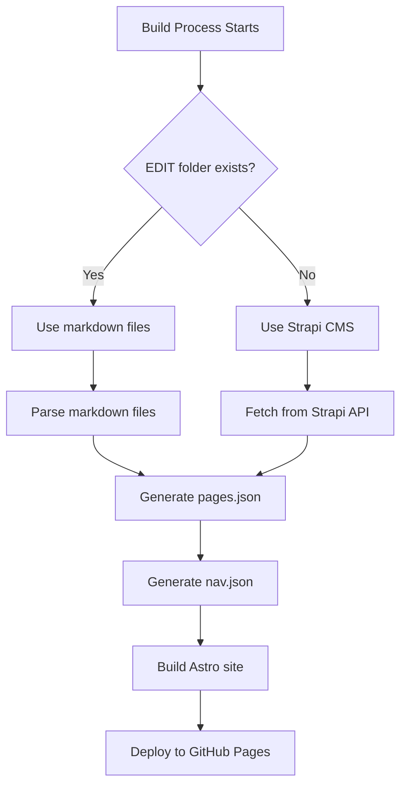
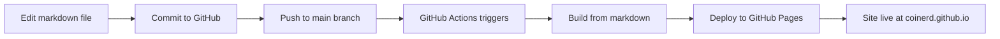

# Markdown-Based Editing System - Implementation Summary

## Overview

The markdown-based editing system has been successfully implemented for the zeiler_me_pages GitHub Pages site. This system allows editing content directly via markdown files stored in an `EDIT` folder, with automatic deployment via GitHub Actions.

## What Has Been Implemented

### 1. Core Scripts

#### [`frontend/scripts/parse-edit-folder.mjs`](frontend/scripts/parse-edit-folder.mjs)
- Parses markdown files from `EDIT` folder
- Extracts YAML frontmatter metadata
- Generates page data structure compatible with existing build system
- Builds navigation structure from file hierarchy
- Creates breadcrumb trails automatically
- Detects images in same directory as markdown files

#### [`frontend/scripts/convert-html-to-markdown.mjs`](frontend/scripts/convert-html-to-markdown.mjs)
- Converts existing HTML files to markdown format
- Extracts metadata (title, description, images)
- Uses Turndown library for HTML to markdown conversion
- Copies images from `frontend/public/` to `EDIT/` folder
- Preserves directory structure

#### [`frontend/scripts/build-data.mjs`](frontend/scripts/build-data.mjs) - Modified
- Added dual-source logic (EDIT folder vs Strapi)
- Automatically detects which source to use
- Maintains backward compatibility with Strapi
- Produces identical output structure regardless of source

### 2. GitHub Actions Workflow

#### [`.github/workflows/deploy-from-edit.yml`](.github/workflows/deploy-from-edit.yml)
- Triggers on changes to `EDIT/**` folder
- Builds site from markdown files
- Deploys to GitHub Pages automatically
- Supports manual workflow dispatch

### 3. Dependencies Added

Updated [`frontend/package.json`](frontend/package.json):
- `gray-matter` - For parsing YAML frontmatter
- `turndown` - For HTML to markdown conversion

### 4. Documentation

#### [`frontend/EDITING.md`](frontend/EDITING.md)
- Complete guide for editing content via markdown
- Frontmatter schema reference
- File structure to URL mapping
- Adding new pages
- Editing existing pages
- Markdown syntax guide
- Troubleshooting

#### [`frontend/DEPLOYMENT.md`](frontend/DEPLOYMENT.md) - Updated
- Added markdown-based editing section
- Updated deployment method comparison table
- Added troubleshooting for markdown editing

#### Design Documents

- [`plans/markdown-editing-system-design.md`](plans/markdown-editing-system-design.md) - Complete system design
- [`plans/markdown-editing-implementation-plan.md`](plans/markdown-editing-implementation-plan.md) - Detailed implementation plan

### 5. Example Files

Created example markdown files in [`EDIT/`](EDIT/) folder:
- `EDIT/index.md` - Homepage
- `EDIT/detlef/index.md` - Detlef section index
- `EDIT/detlef/deutsch.md` - Deutsch section page
- `EDIT/julian/index.md` - Julian section index

## How It Works

### Build Process Flow



### Editing Workflow



## File Structure

```
zeiler_me_new/
├── EDIT/                          # Markdown content files
│   ├── index.md                    # Homepage
│   ├── detlef/
│   │   ├── index.md                # Detlef section
│   │   ├── deutsch.md               # Deutsch section page
│   │   ├── deutsch/                # Deutsch subsections
│   │   ├── geschichte/              # Geschichte subsections
│   │   ├── medien/                 # Medien subsections
│   │   └── projekte/               # Projekte subsections
│   └── julian/
│       ├── index.md                # Julian section
│       ├── artikel.md               # Artikel section page
│       ├── artikel/                # Artikel subsections
│       ├── techzap/                # TechZap subsections
│       └── work/                   # Work subsections
├── frontend/
│   ├── scripts/
│   │   ├── build-data.mjs         # Modified for dual-source
│   │   ├── parse-edit-folder.mjs   # New: Parse markdown files
│   │   └── convert-html-to-markdown.mjs  # New: HTML to markdown
│   ├── package.json                # Updated with new dependencies
│   ├── EDITING.md                 # New: Editing guide
│   └── DEPLOYMENT.md              # Updated: Deployment guide
├── .github/
│   └── workflows/
│       ├── deploy.yml               # Existing: Strapi deployment
│       └── deploy-from-edit.yml     # New: Markdown deployment
└── plans/
    ├── markdown-editing-system-design.md        # System design
    └── markdown-editing-implementation-plan.md  # Implementation plan
```

## Frontmatter Schema

Each markdown file includes YAML frontmatter:

```yaml
---
title: Page Title                    # Required
summary: Brief summary               # Optional
publishedAt: 2024-01-15            # Optional (ISO format)
order: 10                            # Optional (lower = first)
section: deutsch                       # Optional (for grouping)
images:                               # Optional
  - url: path/to/image-1.jpg
    alt: Image description
    caption: Optional caption
  - url: path/to/image-2.jpg
    alt: Another image
---

# Markdown Content

Page content in GitHub Flavored Markdown (GFM).
```

## File to URL Mapping

The file structure directly determines URLs:

| File Path | URL |
|-----------|-----|
| `EDIT/index.md` | `/` |
| `EDIT/detlef/index.md` | `/detlef/` |
| `EDIT/detlef/deutsch.md` | `/detlef/deutsch/` |
| `EDIT/detlef/deutsch/essay-themen.md` | `/detlef/deutsch/essay-themen/` |
| `EDIT/detlef/deutsch/essay-themen/essay.md` | `/detlef/deutsch/essay-themen/essay/` |

## Usage

### Quick Start

1. **Create/Edit markdown files** in `EDIT/` folder
2. **Commit changes** to Git
3. **Push to GitHub** - deployment is automatic

### Local Development

```bash
# Edit markdown files
cd EDIT/detlef/deutsch
nano essay-themen.md

# Build locally to test
cd ../../frontend
npm run build

# Preview site
npm run preview
```

### GitHub Web Editing

1. Navigate to markdown file on GitHub
2. Click "Edit" button
3. Make changes
4. Commit changes
5. GitHub Actions automatically deploys

### Migrate Existing Content

```bash
cd frontend
node scripts/convert-html-to-markdown.mjs
```

This converts all HTML files in `frontend/public/` to markdown in `EDIT/`.

## Features

### Automatic Features

- **Path-based URLs**: File structure determines URLs automatically
- **Breadcrumbs**: Generated from file hierarchy
- **Navigation**: Built from directory structure
- **Image Detection**: Automatically finds images in same directory
- **Section Grouping**: Group pages by section field
- **Sort Order**: Control page order with `order` field

### Dual-Source Support

- **EDIT folder exists**: Uses markdown files
- **EDIT folder missing**: Falls back to Strapi CMS
- **Environment variable**: `USE_EDIT_FOLDER=true` forces markdown usage

### GitHub Actions

- **Automatic deployment** on push to `EDIT/**`
- **Manual trigger** via workflow dispatch
- **Fast builds** - no API calls to Strapi
- **Version control** - all changes in Git history

## Benefits

1. **Simple Editing**: Edit markdown directly in GitHub web interface
2. **No CMS Required**: No need to maintain Strapi instance
3. **Version Control**: All content changes tracked in Git
4. **Collaboration**: GitHub collaborators can edit content
5. **Fast Builds**: No API calls during build process
6. **Automatic Deployment**: Changes deploy automatically on push
7. **Backup Option**: Strapi remains available as fallback

## Next Steps

### To Start Using the System

1. **Install dependencies**:
   ```bash
   cd frontend
   npm install
   ```

2. **Create/Edit markdown files** in `EDIT/` folder

3. **Test locally**:
   ```bash
   cd frontend
   npm run build
   npm run preview
   ```

4. **Commit and push**:
   ```bash
   git add EDIT/
   git commit -m "Add markdown content"
   git push origin main
   ```

5. **Verify deployment** at https://coinerd.github.io/zeiler_me_pages/

### To Migrate Existing Content

1. **Run conversion script**:
   ```bash
   cd frontend
   node scripts/convert-html-to-markdown.mjs
   ```

2. **Review converted files** in `EDIT/` folder

3. **Test build**:
   ```bash
   npm run build
   ```

4. **Commit and push**:
   ```bash
   git add EDIT/
   git commit -m "Migrate content to markdown"
   git push origin main
   ```

## Troubleshooting

### Build Fails

Check:
- YAML frontmatter is valid (proper indentation)
- Required fields present (title)
- Markdown syntax is correct
- Image paths are valid

### Changes Not Appearing

Check:
- GitHub Actions workflow completed successfully
- Wait 1-3 minutes for deployment
- Clear browser cache

### Images Not Loading

Check:
- Image files exist in `EDIT/` folder
- Image paths in frontmatter are correct
- Images are in same directory as markdown file

### Navigation Not Updating

Check:
- File structure matches desired navigation
- `order` field is set correctly
- `section` field matches parent directory

## Documentation

- **Editing Guide**: [`frontend/EDITING.md`](frontend/EDITING.md)
- **Deployment Guide**: [`frontend/DEPLOYMENT.md`](frontend/DEPLOYMENT.md)
- **System Design**: [`plans/markdown-editing-system-design.md`](plans/markdown-editing-system-design.md)
- **Implementation Plan**: [`plans/markdown-editing-implementation-plan.md`](plans/markdown-editing-implementation-plan.md)

## Support

For issues or questions:
1. Check GitHub Actions logs for errors
2. Review documentation in `frontend/EDITING.md`
3. Open an issue on the repository

## Summary

The markdown-based editing system is now fully implemented and ready to use. Content can be edited directly via markdown files in the `EDIT` folder, with automatic deployment to GitHub Pages via GitHub Actions. The system maintains full backward compatibility with the existing Strapi CMS, which can be used as a backup or alternative content source.
