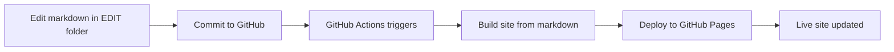
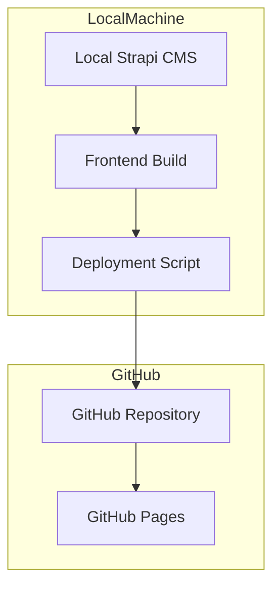

# GitHub Pages Deployment Guide

This guide explains how to deploy the Astro frontend to GitHub Pages. Choose the deployment method based on your content source:

| Content Source | Deployment Method | Section |
|---------------|-------------------|---------|
| Markdown Files (EDIT folder) | GitHub Actions (Automated) | [Markdown-Based Editing](#markdown-based-editing) |
| Strapi CMS (Cloud) | GitHub Actions (Automated) | [Automated Deployment](#automated-deployment) |
| Strapi CMS (Local) | Manual Build + Deploy | [Manual Deployment](#manual-deployment) |

---

## Markdown-Based Editing (Recommended)

Use this method to edit content directly in markdown files stored in the `EDIT` folder. This is the simplest way to manage content without needing a CMS.

### Prerequisites

1. A GitHub repository with this project
2. Markdown files in the `EDIT` folder at repository root
3. (Optional) Strapi CMS as backup

### Quick Start

#### 1. Create EDIT Folder Structure

The `EDIT` folder should mirror your desired site structure:

```
EDIT/
├── detlef/
│   ├── deutsch/
│   ├── geschichte/
│   ├── medien/
│   └── projekte/
├── julian/
│   ├── artikel/
│   ├── techzap/
│   └── work/
└── index.md
```

#### 2. Create Markdown Files

Each page is a `.md` file with YAML frontmatter:

```markdown
---
title: Page Title
summary: Brief summary
publishedAt: 2024-01-15
order: 10
section: deutsch
images:
  - url: image-1.jpg
    alt: Image description
---

# Page Content

Markdown content goes here...
```

#### 3. Edit and Deploy

**Via GitHub Web Interface:**
1. Navigate to the markdown file on GitHub
2. Click "Edit" button
3. Make changes
4. Commit changes
5. GitHub Actions automatically builds and deploys

**Via Local Editing:**
```bash
# Edit markdown files
cd EDIT/detlef/deutsch
nano essay-themen.md

# Build locally to test
cd ../../frontend
npm run build

# Commit and push
git add EDIT/
git commit -m "Update content"
git push origin main
```

### GitHub Actions Workflow

The `.github/workflows/deploy-from-edit.yml` workflow automatically:
1. Triggers on any changes to `EDIT` folder
2. Builds the site from markdown files
3. Deploys to GitHub Pages

### Deployment Workflow



### Benefits

- **Simple Editing**: Edit markdown files directly in GitHub
- **No CMS Required**: No need to maintain Strapi instance
- **Version Control**: All changes tracked in Git history
- **Collaboration**: GitHub collaborators can edit content
- **Fast Builds**: No API calls during build
- **Automatic Deployment**: Changes deploy automatically on push

### Migration from HTML

Convert existing HTML files to markdown:

```bash
cd frontend
node scripts/convert-html-to-markdown.mjs
```

This creates markdown files in `EDIT/` folder with extracted metadata.

### Documentation

See [`EDITING.md`](./EDITING.md) for detailed documentation on:
- Frontmatter schema
- File structure to URL mapping
- Adding new pages
- Editing existing pages
- Markdown syntax
- Troubleshooting

### Troubleshooting

#### Build fails with "EDIT folder not found"

**Solution**: Ensure `EDIT` folder exists at repository root with `.md` files.

#### Changes not appearing

**Solution**:
- Check GitHub Actions tab for workflow status
- Wait 1-3 minutes for deployment to complete
- Clear browser cache

#### Images not loading

**Solution**:
- Verify image files exist in `EDIT` folder
- Check image paths in frontmatter
- Ensure images are in same directory as markdown file

#### Navigation not updating

**Solution**:
- Verify file structure matches desired navigation
- Check `order` field in frontmatter
- Ensure `section` field matches parent directory


## Automated Deployment (Cloud Strapi)

Use this method if your Strapi CMS is hosted on a cloud service and publicly accessible.

### Prerequisites

1. A GitHub repository with this project
2. A cloud-hosted Strapi CMS instance (publicly accessible)
3. A read-only API token from Strapi

### Quick Start

#### 1. Configure GitHub Repository Settings

1. Go to your repository on GitHub
2. Navigate to **Settings** → **Pages**
3. Under **Build and deployment**, set **Source** to **GitHub Actions**
4. Save the settings

#### 2. Add GitHub Secrets

Go to **Settings** → **Secrets and variables** → **Actions** and add the following secrets:

| Secret Name | Description | Example |
|-------------|-------------|---------|
| `STRAPI_URL` | Your Strapi CMS URL | `https://your-strapi-instance.com` |
| `STRAPI_TOKEN_RO` | Read-only API token | `eyJhbGciOiJIUzI1NiIsInR5cCI6IkpXVCJ9...` |
| `SITE_URL` | Your GitHub Pages URL | `https://username.github.io/repo-name` |

#### 3. Generate Strapi API Token

1. Log in to your Strapi admin panel
2. Go to **Settings** → **API Tokens**
3. Click **Create new API Token**
4. Set the following:
   - **Name**: `GitHub Pages Read-Only`
   - **Token duration**: Unlimited (or as needed)
   - **Token type**: Read-only
5. Click **Save**
6. Copy the generated token and add it as `STRAPI_TOKEN_RO` in GitHub Secrets

#### 4. Configure Strapi CORS

1. In Strapi admin, go to **Settings** → **API** → **CORS**
2. Add your GitHub Pages URL to the allowed origins:
   - `https://username.github.io`
3. Save the settings

#### 5. Deploy

Push to the `main` branch to trigger the deployment:

```bash
git add .
git commit -m "Deploy to GitHub Pages"
git push origin main
```

The GitHub Actions workflow will automatically:
1. Build the frontend
2. Fetch data from Strapi
3. Deploy to GitHub Pages

### Deployment Workflow

The automated deployment process follows these steps:


---

## Manual Deployment (Local Strapi)

Use this method if your Strapi CMS is running locally on your laptop. Since GitHub Actions cannot access your local machine, you'll build the site locally and deploy it manually.

### Prerequisites

1. A GitHub repository with this project
2. Strapi CMS running locally on your laptop
3. GitHub CLI installed and authenticated
4. A read-only API token from Strapi

### Install GitHub CLI

```bash
# Windows (winget)
winget install --id GitHub.cli

# macOS (brew)
brew install gh

# Linux
# See https://cli.github.com/
```

### Authenticate GitHub CLI

```bash
gh auth login
```

Follow the prompts to authenticate with your GitHub account.

### Quick Start

#### 1. Start Strapi CMS

```bash
cd cms
npm run develop
```

Keep this terminal open - Strapi must be running during the build.

#### 2. Build the Frontend

In a new terminal:

```bash
cd frontend
npm install
npm run build
```

This will:
1. Fetch data from your local Strapi
2. Generate static HTML/CSS/JS files
3. Output to `frontend/dist/`

#### 3. Deploy to GitHub Pages

Using GitHub CLI (recommended):

```bash
cd frontend
gh repo deploy dist
```

Or with explicit repository:

```bash
gh repo deploy dist --repo username/repo-name
```

#### 4. Configure GitHub Pages

**Important**: For manual deployment using `gh repo deploy`, you must configure GitHub Pages to use "Deploy from a branch" as the source.

1. Go to your repository on GitHub
2. Navigate to **Settings** → **Pages**
3. Under **Build and deployment**, set **Source** to **Deploy from a branch**
4. Select **gh-pages** branch and **/ (root)** folder
5. Click **Save**

**Note**: Do **not** use "GitHub Actions" as the source when deploying manually with `gh repo deploy`. If GitHub Pages is configured to use GitHub Actions, deployments will remain in "Queued" status because no workflow is triggered.

Your site will be available at:
- `https://username.github.io/repo-name/`

### Deployment Workflow

The manual deployment process follows these steps:



### Alternative Deployment Methods

#### Using gh-pages Package

First, install the package:

```bash
cd frontend
npm install --save-dev gh-pages
```

Add this script to `frontend/package.json`:

```json
{
  "scripts": {
    "deploy": "gh-pages -d dist"
  }
}
```

Then deploy:

```bash
npm run deploy
```

#### Manual Git Operations

```bash
cd frontend

# Create a temporary branch
git checkout --orphan gh-pages-temp

# Move dist contents to root
git rm -rf .
cp -r dist/* .
cp -r dist/.* . 2>/dev/null || true
rm -rf dist

# Commit and push
git add .
git commit -m "Deploy to GitHub Pages"
git push origin gh-pages-temp:gh-pages --force

# Return to main branch
git checkout main
git branch -D gh-pages-temp
```

---

## Local Development

### Setup Environment Variables

Create a `.env` file in the `frontend/` directory:

**For local Strapi:**
```env
STRAPI_URL=http://localhost:1337
STRAPI_TOKEN_RO=your-read-only-token
SITE_URL=http://localhost:4321
BASE_PATH=/
```

**For cloud Strapi:**
```env
STRAPI_URL=https://your-strapi-instance.com
STRAPI_TOKEN_RO=your-read-only-token
SITE_URL=http://localhost:4321
BASE_PATH=/
```

**For GitHub Pages deployment (subdirectory):**
```env
STRAPI_URL=http://localhost:1337
STRAPI_TOKEN_RO=your-read-only-token
SITE_URL=https://coinerd.github.io/zeiler_me_pages
BASE_PATH=/zeiler_me_pages
```

### Run Development Server

```bash
cd frontend
npm install
npm run dev
```

The site will be available at `http://localhost:4321`

### Build Locally

```bash
cd frontend
npm run build
npm run preview
```

## Troubleshooting

### Automated Deployment (GitHub Actions)

#### Build fails with "STRAPI_URL is required"

**Solution**: Ensure the `STRAPI_URL` secret is set in GitHub repository settings.

#### 401/403 errors when fetching from Strapi

**Solution**: 
- Verify `STRAPI_TOKEN_RO` is valid
- Check that the token has read permissions
- Ensure the token hasn't expired

#### Images not loading on GitHub Pages

**Solution**:
- Ensure Strapi CORS allows GitHub Pages domain
- Check that media URLs are accessible
- Verify Strapi is publicly accessible (or use a reverse proxy)

#### Sitemap incorrect

**Solution**: Verify `SITE_URL` secret matches your GitHub Pages URL exactly.

#### Workflow not triggering

**Solution**:
- Ensure you're pushing to the `main` branch
- Check that GitHub Actions is enabled in repository settings
- Verify the workflow file is in `.github/workflows/deploy.yml`

### Manual Deployment (Local Strapi)

#### Strapi is not running

**Solution**: Start Strapi in a separate terminal:
```bash
cd cms
npm run develop
```

#### Build fails with connection error

**Solution**:
- Verify Strapi is running on port 1337
- Check `STRAPI_URL` in `.env` file
- Ensure API token is valid

#### GitHub CLI not installed

**Solution**: Install GitHub CLI:
```bash
# Windows
winget install --id GitHub.cli

# macOS
brew install gh

# Linux
# See https://cli.github.com/
```

#### GitHub CLI not authenticated

**Solution**: Authenticate with GitHub:
```bash
gh auth login
```

#### gh-pages branch not found

**Solution**: The first deployment will create the branch automatically. If it fails, use the Manual Git Operations method.

#### Deployment stuck in "Queued" status

**Solution**: This happens when GitHub Pages is configured to use "GitHub Actions" as the source, but you're deploying manually with `gh repo deploy`.

1. Go to **Settings** → **Pages**
2. Change **Source** from **GitHub Actions** to **Deploy from a branch**
3. Select **gh-pages** branch and **/ (root)** folder
4. Click **Save**

The deployment should start immediately.

#### Site not updating after deployment

**Solution**:
- Clear browser cache
- Check GitHub Pages deployment status in repository settings
- Verify the gh-pages branch was updated

#### Images not loading on GitHub Pages

**Solution**:
- Local Strapi uses localhost URLs which won't work on GitHub Pages
- Copy images to `frontend/public/` folder
- Or host Strapi on a cloud service for production

---

## Custom Domain

To use a custom domain with GitHub Pages (works with both deployment methods):

1. Add a `CNAME` file to `frontend/public/`:
   ```
   yourdomain.com
   ```

2. Configure your DNS settings:
   - Add a CNAME record pointing to `username.github.io`

3. Update the `SITE_URL` secret to your custom domain

## Monitoring Deployment

### Automated Deployment

1. Go to the **Actions** tab in your GitHub repository
2. Click on the latest workflow run
3. View the logs for each step

### Manual Deployment

1. Go to the **Actions** tab in your GitHub repository
2. Check the "Deployments" section
3. View the deployment status

## Production Considerations

### Local Strapi Limitations

| Issue | Impact | Solution |
|-------|--------|----------|
| Localhost URLs | Images won't load | Use cloud Strapi or copy images |
| Manual process | No auto-deploys | Consider cloud hosting |
| Strapi must be running | Can't build offline | Use cloud Strapi |
| No CI/CD | Manual updates only | Accept or migrate to cloud |

### Recommended Production Setup

For production, consider hosting Strapi on a cloud service:

1. **Render** - Free tier, easy setup
2. **Railway** - Free tier, good for small projects
3. **Vercel** - Free tier, excellent performance
4. **Heroku** - ~$5/month, reliable

Then you can use the [Automated Deployment](#automated-deployment) method instead of manual deployment.

## Security Best Practices

1. **Use read-only tokens**: Never use admin tokens for deployment
2. **Rotate tokens regularly**: Update API tokens periodically
3. **Restrict CORS**: Only allow necessary domains in Strapi CORS settings
4. **Monitor logs**: Check GitHub Actions logs for any errors or warnings

## Quick Reference

### Automated Deployment (Cloud Strapi)

```bash
# Configure GitHub Secrets in repository settings
# Push to main branch
git add .
git commit -m "Deploy to GitHub Pages"
git push origin main
```

### Manual Deployment (Local Strapi)

```bash
# Terminal 1: Start Strapi
cd cms && npm run develop

# Terminal 2: Build and deploy
cd frontend
npm run build
gh repo deploy dist
```

## Additional Resources

- [GitHub Pages Documentation](https://docs.github.com/en/pages)
- [GitHub Actions Documentation](https://docs.github.com/en/actions)
- [GitHub CLI Documentation](https://cli.github.com/)
- [Astro Deployment Guide](https://docs.astro.build/en/guides/deploy/github/)
- [Strapi API Documentation](https://docs.strapi.io/dev-docs/api)
- [Manual Deployment Plan](../plans/manual-deployment-plan.md) - Detailed guide for local Strapi
- [GitHub Actions Deployment Plan](../plans/github-pages-deployment-plan.md) - Detailed guide for cloud Strapi
