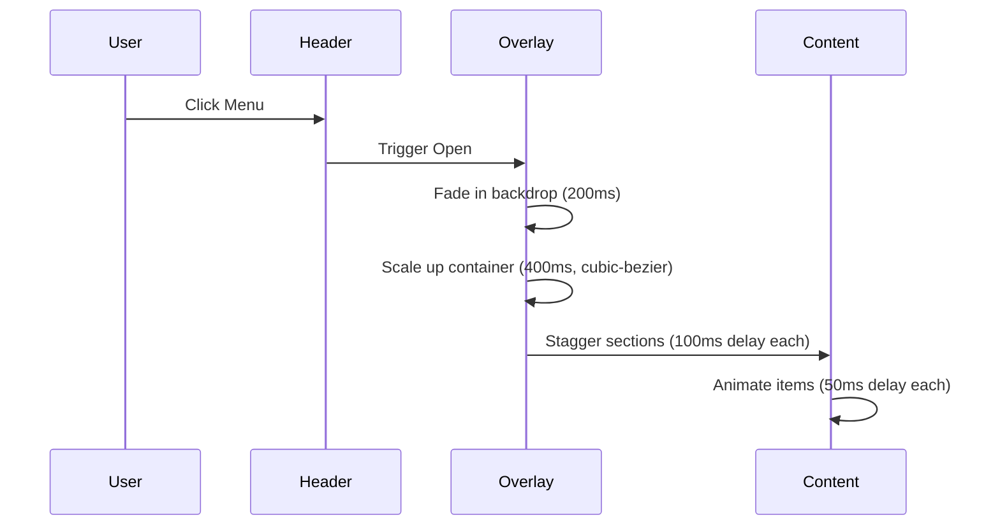

# Transformative Navigation Design Specification
## zeiler.me Editorial Magazine TOC Overlay

---

## Design Philosophy

The navigation is reimagined as a **magazine table of contents come to life**—a fullscreen editorial experience that transforms utility into discovery. Rather than a static menu, the navigation becomes a curated journey through the content archive, treating each section as a magazine feature with its own visual identity.

### Core Principles

1. **Editorial Authority**: Navigation feels like a premium publication's contents page
2. **Spatial Immersion**: Fullscreen overlay creates a dedicated browsing environment
3. **Typographic Choreography**: Typography leads the eye through content discovery
4. **Motion as Narrative**: Animations tell the story of opening a publication
5. **Intentional Restraint**: Every element serves the editorial aesthetic

---

## The Iconic Element: Magazine TOC Overlay

The signature experience is a **fullscreen overlay that unfolds like opening a magazine**. When triggered, the interface transforms into a beautifully laid-out contents page where:

- Sections appear as editorial features with large typography
- Navigation items are arranged in asymmetric grids
- Search becomes an editorial discovery tool
- Motion mimics the physical act of turning pages

This is not a menu—it's a content destination.

---

## User Context & Problem Definition

### Who Benefits

| User Type | Need | How Navigation Solves |
|-----------|------|----------------------|
| **Researchers** | Browse academic content systematically | Hierarchical sections with clear categorization |
| **Casual Readers** | Discover interesting content serendipitously | Editorial layouts highlight featured content |
| **Returning Visitors** | Quickly find previously viewed content | Visual memory aids through distinctive layouts |
| **Mobile Users** | Navigate complex archives comfortably | Touch-optimized fullscreen experience |

### The Problem Solved

The existing navigation is functional but forgettable—a standard sidebar that serves utility without delight. Users navigate because they must, not because the experience invites exploration. The new navigation transforms this obligation into an opportunity for content discovery.

---

## Aesthetic Direction: Editorial Magazine

### Visual Language

The navigation embodies **refined editorial sophistication**:

- **Typography**: Large, commanding display fonts that demand attention
- **Spacing**: Generous negative space creates breathing room
- **Grids**: Asymmetric layouts that break from rigid structures
- **Depth**: Layered transparencies create atmospheric dimension
- **Motion**: Fluid, choreographed animations that feel natural

### What We Reject

- ❌ Generic hamburger menus
- ❌ Standard dropdown patterns
- ❌ Cookie-cutter AI aesthetics
- ❌ White backgrounds with purple gradients
- ❌ System fonts (Arial, Inter, Roboto)
- ❌ Flat, solid backgrounds

---

## Typography System

### Font Families

| Role | Font | Weight | Usage |
|------|------|--------|-------|
| Display Overlay | Playfair Display | 400, 700, 900 | Section headers, hero text |
| Navigation Labels | Cormorant Garamond | 400, 500, 600 | Section titles, navigation items |
| Body Text | Crimson Pro | 400, 500 | Descriptions, summaries |
| Accent Text | Space Grotesk | 400, 600 | Section numbers, labels |
| Search Input | JetBrains Mono | 400 | Search placeholder, input |

### Typography Scale for Navigation

```css
/* Overlay Hero Typography */
--nav-hero-display: clamp(3rem, 8vw, 6rem);    /* 48px - 96px */
--nav-hero-subtitle: clamp(1.25rem, 3vw, 2rem); /* 20px - 32px */

/* Section Headers */
--nav-section-title: clamp(1.5rem, 4vw, 2.5rem); /* 24px - 40px */
--nav-section-number: clamp(1rem, 2vw, 1.5rem);   /* 16px - 24px */

/* Navigation Items */
--nav-item-title: clamp(1rem, 2.5vw, 1.25rem);  /* 16px - 20px */
--nav-item-desc: clamp(0.875rem, 1.5vw, 1rem);   /* 14px - 16px */

/* Search Typography */
--nav-search-label: 0.75rem;  /* 12px, uppercase */
--nav-search-input: 1.125rem; /* 18px */
```

### Typography Hierarchy

```
┌─────────────────────────────────────────────────────────────┐
│  [MENU]                              zeiler.me              │
├─────────────────────────────────────────────────────────────┤
│                                                             │
│  01                                                         │
│  DEUTSCH                                                    │
│  Sprachkunst und Textinterpretation                         │
│                                                             │
│  ┌──────────────┐  ┌──────────────┐  ┌──────────────┐      │
│  │ Erörterung   │  │ Essay-Themen │  │ Textinterpretation │
│  │              │  │              │  │                    │
│  │ 12 Artikel   │  │ 8 Artikel    │  │ 15 Artikel         │
│  └──────────────┘  └──────────────┘  └──────────────┘      │
│                                                             │
│  02                                                         │
│  GESCHICHTE                                                 │
│  Historische Perspektiven und Quellen                       │
│                                                             │
│  ┌──────────────┐  ┌──────────────┐                        │
│  │ Alexander    │  │ Tocqueville  │                        │
│  │ von Humboldt │  │              │                        │
│  │              │  │              │                        │
│  │ 1 Artikel    │  │ 2 Artikel    │                        │
│  └──────────────┘  └──────────────┘                        │
│                                                             │
└─────────────────────────────────────────────────────────────┘
```

---

## Color System

### Navigation State Colors

```css
/* Closed State - Header Only */
--nav-closed-bg: rgba(250, 248, 245, 0.95);
--nav-closed-border: #e5e0d8;
--nav-closed-text: #1a2332;
--nav-closed-accent: #d4a373;

/* Opening State - Transition */
--nav-opening-overlay: rgba(250, 248, 245, 0);
--nav-opening-content: rgba(250, 248, 245, 0);

/* Open State - Full Overlay */
--nav-open-bg: #faf8f5;
--nav-open-text-primary: #1a2332;
--nav-open-text-secondary: #7a6f60;
--nav-open-accent: #d4a373;
--nav-open-accent-dark: #b8895a;
--nav-open-border: #e5e0d8;
```

### Section Color Coding

```css
/* Editorial Section Accents */
--section-deutsch-accent: #c4785a;      /* Rust */
--section-geschichte-accent: #8b9a7d;    /* Sage */
--section-medien-accent: #d4a373;       /* Amber */
--section-projekte-accent: #2d3a4f;     /* Ink Light */
--section-techzap-accent: #5a5145;      /* Gray 700 */
```

### Dark Mode Adaptation

```css
--nav-open-bg-dark: #1a2332;
--nav-open-text-primary-dark: #faf8f5;
--nav-open-text-secondary-dark: #b8b0a4;
--nav-open-border-dark: #3d362e;
--nav-open-accent-dark: #d4a373; /* Unchanged */
```

---

## Motion System

### Overlay Entrance Sequence



### Animation Curves

```css
/* Editorial Easing - Smooth, sophisticated */
--ease-editorial: cubic-bezier(0.25, 0.46, 0.45, 0.94);

/* Page Turn - Mimics physical page flip */
--ease-page-turn: cubic-bezier(0.4, 0, 0.2, 1);

/* Reveal - Natural emergence */
--ease-reveal: cubic-bezier(0.16, 1, 0.3, 1);
```

### Animation Timing

| Phase | Duration | Easing | Description |
|-------|----------|--------|-------------|
| Backdrop Fade | 200ms | ease-editorial | Overlay background appears |
| Container Scale | 400ms | ease-page-turn | Main container expands |
| Section Stagger | 100ms | ease-reveal | Delay between sections |
| Item Reveal | 50ms | ease-reveal | Delay between items |
| Hover Response | 150ms | ease-editorial | Interactive feedback |

### Motion States

```css
/* Closed → Opening → Open → Closing → Closed */

/* Opening State */
.nav-overlay[data-state="opening"] {
  .nav-backdrop {
    opacity: 0;
    animation: fadeIn 200ms var(--ease-editorial) forwards;
  }
  .nav-container {
    opacity: 0;
    transform: scale(0.95) translateY(20px);
    animation: scaleUp 400ms var(--ease-page-turn) 100ms forwards;
  }
}

/* Open State */
.nav-overlay[data-state="open"] {
  .nav-section {
    opacity: 0;
    transform: translateY(30px);
    animation: slideUp 500ms var(--ease-reveal) forwards;
  }
}

/* Closing State */
.nav-overlay[data-state="closing"] {
  .nav-container {
    transform: scale(0.98) translateY(-10px);
    opacity: 0;
    transition: all 300ms var(--ease-page-turn);
  }
  .nav-backdrop {
    opacity: 0;
    transition: opacity 200ms var(--ease-editorial);
  }
}
```

---

## Spatial Layout System

### Grid Structure

The overlay uses a **12-column asymmetric grid** that varies per section:

```css
/* Desktop Grid (1024px+) */
.nav-grid {
  display: grid;
  grid-template-columns: repeat(12, 1fr);
  gap: clamp(1rem, 2vw, 2rem);
  padding: clamp(2rem, 5vw, 4rem);
}

/* Section Layout Variations */
.nav-section--featured {
  grid-column: span 12;
  display: grid;
  grid-template-columns: 3fr 9fr;
  gap: clamp(1.5rem, 3vw, 3rem);
}

.nav-section--standard {
  grid-column: span 6;
}

.nav-section--wide {
  grid-column: span 12;
  display: grid;
  grid-template-columns: repeat(3, 1fr);
}
```

### Layout Breakpoints

| Breakpoint | Columns | Section Span | Item Grid |
|------------|---------|--------------|-----------|
| Mobile (< 640px) | 1 | 1 | 1 column |
| Tablet (640px - 1024px) | 2 | 1-2 | 2 columns |
| Desktop (1024px+) | 12 | 4-12 | 3-4 columns |

### Visual Hierarchy Through Space

```css
/* Editorial Spacing Scale */
--nav-space-xs: 0.5rem;   /* 8px */
--nav-space-sm: 1rem;     /* 16px */
--nav-space-md: 1.5rem;   /* 24px */
--nav-space-lg: 2.5rem;   /* 40px */
--nav-space-xl: 4rem;     /* 64px */
--nav-space-2xl: 6rem;    /* 96px */
```

---

## Component Specifications

### Navigation Trigger (Header)

**Structure:**
- Fixed position header (72px height)
- Left: Logo/Brand
- Right: Menu trigger button

**Styling:**
```css
.nav-trigger {
  display: flex;
  align-items: center;
  gap: 1rem;
  padding: 0.75rem 1.25rem;
  background: transparent;
  border: 1px solid var(--nav-closed-border);
  border-radius: 9999px;
  cursor: pointer;
  transition: all 200ms var(--ease-editorial);
}

.nav-trigger:hover {
  background: var(--nav-closed-accent);
  border-color: var(--nav-closed-accent);
  color: var(--nav-closed-bg);
}

.nav-trigger-icon {
  width: 1.5rem;
  height: 1.5rem;
}

.nav-trigger-label {
  font-family: 'Space Grotesk', monospace;
  font-size: 0.75rem;
  letter-spacing: 0.1em;
  text-transform: uppercase;
}
```

**Animation:**
- Icon transforms to "×" when overlay opens
- Label changes from "MENU" to "CLOSE"

### Fullscreen Overlay Container

**Structure:**
```html
<div class="nav-overlay" data-state="closed" aria-hidden="true">
  <div class="nav-backdrop"></div>
  <div class="nav-container">
    <nav class="nav-grid">
      <!-- Sections render here -->
    </nav>
  </div>
</div>
```

**Styling:**
```css
.nav-overlay {
  position: fixed;
  inset: 0;
  z-index: 100;
  pointer-events: none;
}

.nav-overlay[data-state="open"],
.nav-overlay[data-state="opening"],
.nav-overlay[data-state="closing"] {
  pointer-events: auto;
}

.nav-backdrop {
  position: absolute;
  inset: 0;
  background: var(--nav-open-bg);
  opacity: 0;
}

.nav-container {
  position: relative;
  width: 100%;
  height: 100%;
  overflow-y: auto;
  overflow-x: hidden;
}
```

### Section Component

**Structure:**
```html
<section class="nav-section nav-section--featured" data-section="deutsch">
  <div class="nav-section-header">
    <span class="nav-section-number">01</span>
    <h2 class="nav-section-title">DEUTSCH</h2>
  </div>
  <p class="nav-section-intro">Sprachkunst und Textinterpretation</p>
  <div class="nav-section-grid">
    <!-- Navigation items -->
  </div>
</section>
```

**Styling:**
```css
.nav-section {
  padding: var(--nav-space-lg) 0;
  border-bottom: 1px solid var(--nav-open-border);
}

.nav-section-header {
  display: flex;
  align-items: baseline;
  gap: 1rem;
  margin-bottom: var(--nav-space-md);
}

.nav-section-number {
  font-family: 'Space Grotesk', monospace;
  font-size: var(--nav-section-number);
  font-weight: 600;
  color: var(--section-deutsch-accent);
}

.nav-section-title {
  font-family: 'Playfair Display', serif;
  font-size: var(--nav-section-title);
  font-weight: 700;
  color: var(--nav-open-text-primary);
  letter-spacing: -0.02em;
}

.nav-section-intro {
  font-family: 'Crimson Pro', serif;
  font-size: var(--nav-item-desc);
  color: var(--nav-open-text-secondary);
  max-width: 40ch;
  margin-bottom: var(--nav-space-lg);
  line-height: 1.6;
}
```

### Navigation Item Card

**Structure:**
```html
<a href="/detlef/deutsch/" class="nav-item-card">
  <div class="nav-item-content">
    <h3 class="nav-item-title">Erörterung</h3>
    <p class="nav-item-desc">Textanalyse und argumentative Strukturen</p>
    <span class="nav-item-count">12 Artikel</span>
  </div>
  <div class="nav-item-indicator"></div>
</a>
```

**Styling:**
```css
.nav-item-card {
  display: flex;
  flex-direction: column;
  position: relative;
  padding: var(--nav-space-md);
  background: transparent;
  border: 1px solid var(--nav-open-border);
  border-radius: 0.5rem;
  transition: all 250ms var(--ease-editorial);
  overflow: hidden;
}

.nav-item-card::before {
  content: '';
  position: absolute;
  inset: 0;
  background: var(--section-deutsch-accent);
  opacity: 0;
  transform: translateY(100%);
  transition: all 400ms var(--ease-page-turn);
}

.nav-item-card:hover {
  transform: translateY(-4px);
  box-shadow: 0 12px 40px rgba(26, 35, 50, 0.12);
  border-color: var(--section-deutsch-accent);
}

.nav-item-card:hover::before {
  opacity: 0.05;
  transform: translateY(0);
}

.nav-item-title {
  font-family: 'Cormorant Garamond', serif;
  font-size: var(--nav-item-title);
  font-weight: 600;
  color: var(--nav-open-text-primary);
  margin-bottom: 0.5rem;
  position: relative;
  z-index: 1;
}

.nav-item-desc {
  font-family: 'Crimson Pro', serif;
  font-size: var(--nav-item-desc);
  color: var(--nav-open-text-secondary);
  line-height: 1.5;
  position: relative;
  z-index: 1;
}

.nav-item-count {
  font-family: 'Space Grotesk', monospace;
  font-size: 0.6875rem;
  color: var(--section-deutsch-accent);
  margin-top: 1rem;
  position: relative;
  z-index: 1;
}
```

### Search Integration

**Structure:**
```html
<div class="nav-search">
  <label class="nav-search-label" for="nav-search-input">ARCHIV DURCHSUCHEN</label>
  <div class="nav-search-wrapper">
    <input
      id="nav-search-input"
      type="search"
      placeholder="Titel, Thema, Autor…"
      class="nav-search-input"
    />
    <svg class="nav-search-icon" aria-hidden="true">
      <!-- Search icon -->
    </svg>
  </div>
  <div class="nav-search-results">
    <!-- Search results -->
  </div>
</div>
```

**Styling:**
```css
.nav-search {
  padding: var(--nav-space-xl) 0;
  border-bottom: 2px solid var(--nav-open-border);
  margin-bottom: var(--nav-space-xl);
}

.nav-search-label {
  font-family: 'Space Grotesk', monospace;
  font-size: 0.75rem;
  letter-spacing: 0.15em;
  color: var(--nav-open-text-secondary);
  display: block;
  margin-bottom: 1rem;
}

.nav-search-wrapper {
  position: relative;
}

.nav-search-input {
  width: 100%;
  padding: 1.25rem 3.5rem 1.25rem 1.5rem;
  font-family: 'JetBrains Mono', monospace;
  font-size: var(--nav-search-input);
  color: var(--nav-open-text-primary);
  background: transparent;
  border: none;
  border-bottom: 2px solid var(--nav-open-border);
  transition: border-color 200ms var(--ease-editorial);
}

.nav-search-input:focus {
  outline: none;
  border-color: var(--nav-open-accent);
}

.nav-search-input::placeholder {
  color: var(--nav-open-text-secondary);
  opacity: 0.6;
}

.nav-search-icon {
  position: absolute;
  right: 1rem;
  top: 50%;
  transform: translateY(-50%);
  width: 1.25rem;
  height: 1.25rem;
  color: var(--nav-open-accent);
}
```

---

## Micro-Interactions

### Hover States

| Element | Hover Effect | Duration |
|---------|--------------|----------|
| Nav Trigger | Background fill, text invert | 200ms |
| Section Header | Underline animation | 300ms |
| Nav Item | Lift, shadow, accent reveal | 250ms |
| Search Input | Border accent | 200ms |

### Focus States

All interactive elements have:
- 2px outline with `--nav-open-accent`
- 4px outline offset
- Smooth transition (150ms)

### Active States

- Active section: Accent color on number and title
- Active item: Subtle background tint, accent border
- Active search: Results highlighted

---

## Background Effects

### Atmospheric Depth

```css
/* Subtle Noise Texture */
.nav-overlay::before {
  content: '';
  position: absolute;
  inset: 0;
  background-image: url("data:image/svg+xml,%3Csvg viewBox='0 0 200 200' xmlns='http://www.w3.org/2000/svg'%3E%3Cfilter id='noise'%3E%3CfeTurbulence type='fractalNoise' baseFrequency='0.65' numOctaves='3' stitchTiles='stitch'/%3E%3C/filter%3E%3Crect width='100%25' height='100%25' filter='url(%23noise)' opacity='0.03'/%3E%3C/svg%3E");
  pointer-events: none;
  z-index: 1;
}

/* Gradient Mesh Subtlety */
.nav-overlay::after {
  content: '';
  position: absolute;
  inset: 0;
  background: radial-gradient(
    ellipse at 20% 20%,
    rgba(212, 163, 115, 0.04) 0%,
    transparent 50%
  ),
  radial-gradient(
    ellipse at 80% 80%,
    rgba(139, 154, 125, 0.03) 0%,
    transparent 50%
  );
  pointer-events: none;
  z-index: 1;
}
```

---

## Responsive Behavior

### Mobile (< 640px)

- Trigger: Icon only (no label)
- Overlay: Fullscreen, single column
- Sections: Stacked vertically
- Items: Full-width cards
- Search: Compact, top of overlay

### Tablet (640px - 1024px)

- Trigger: Icon + label
- Overlay: Fullscreen, 2-column grid
- Sections: Alternating spans
- Items: 2-column grids
- Search: Full-width, prominent

### Desktop (1024px+)

- Full editorial layout
- Asymmetric grids
- Featured sections with special treatment
- Maximum visual impact

---

## Accessibility

### Keyboard Navigation

- Tab: Navigate through interactive elements
- Escape: Close overlay
- Arrow keys: Navigate within sections
- Enter/Space: Activate links

### Focus Management

- Focus moves to overlay when opened
- Focus returns to trigger when closed
- Focus trap within overlay
- Visible focus indicators

### ARIA Attributes

```html
<button
  id="nav-trigger"
  aria-expanded="false"
  aria-controls="nav-overlay"
  aria-label="Navigation öffnen"
>
  Menu
</button>

<div
  id="nav-overlay"
  class="nav-overlay"
  role="dialog"
  aria-modal="true"
  aria-labelledby="nav-overlay-title"
  aria-hidden="true"
>
  <h1 id="nav-overlay-title" class="sr-only">Navigation</h1>
  <!-- Content -->
</div>
```

### Screen Reader Support

- Proper heading hierarchy
- Descriptive link text
- Live regions for search results
- Announced state changes

---

## Performance Considerations

### CSS-First Approach

- All animations use CSS transforms and opacity
- GPU-accelerated properties only
- `will-change` hints for complex animations
- Respect `prefers-reduced-motion`

### JavaScript Optimization

- Intersection Observer for scroll animations
- RequestAnimationFrame for complex sequences
- Debounce search input (300ms)
- Lazy load section content

### Bundle Impact

- Font loading: `font-display: swap`
- Icon system: SVG inline or sprite
- No external animation libraries
- Minimal JS footprint

---

## Implementation Files

### New Files Required

```
frontend/src/
├── components/
│   ├── NavigationOverlay.tsx      # Main overlay component
│   ├── NavSection.tsx            # Section component
│   ├── NavItemCard.tsx           # Item card component
│   └── NavSearch.tsx             # Search integration
├── styles/
│   └── navigation.css            # Navigation-specific styles
```

### Files to Modify

```
frontend/
├── tailwind.config.cjs           # Add navigation tokens
├── src/
│   ├── components/Layout.astro    # Replace sidebar with trigger
│   └── styles/tailwind.css       # Add navigation styles
```

---

## Success Metrics

1. **Visual Distinctiveness**: Navigation is immediately recognizable as zeiler.me
2. **Content Discovery**: Users spend more time exploring navigation
3. **Task Completion**: Users find content faster than before
4. **Performance**: Animations maintain 60fps on target devices
5. **Accessibility**: WCAG AA compliant, keyboard fully functional
6. **Delight**: Users express positive feedback on the experience

---

## Design Tokens Reference

### Complete Token Set

```css
:root {
  /* Typography */
  --font-display-nav: 'Playfair Display', serif;
  --font-nav-label: 'Cormorant Garamond', serif;
  --font-nav-body: 'Crimson Pro', serif;
  --font-nav-accent: 'Space Grotesk', sans-serif;
  --font-nav-mono: 'JetBrains Mono', monospace;

  /* Colors */
  --nav-bg: #faf8f5;
  --nav-text-primary: #1a2332;
  --nav-text-secondary: #7a6f60;
  --nav-accent: #d4a373;
  --nav-accent-dark: #b8895a;
  --nav-border: #e5e0d8;

  /* Section Accents */
  --section-deutsch: #c4785a;
  --section-geschichte: #8b9a7d;
  --section-medien: #d4a373;
  --section-projekte: #2d3a4f;
  --section-techzap: #5a5145;

  /* Spacing */
  --nav-space-xs: 0.5rem;
  --nav-space-sm: 1rem;
  --nav-space-md: 1.5rem;
  --nav-space-lg: 2.5rem;
  --nav-space-xl: 4rem;
  --nav-space-2xl: 6rem;

  /* Easing */
  --ease-editorial: cubic-bezier(0.25, 0.46, 0.45, 0.94);
  --ease-page-turn: cubic-bezier(0.4, 0, 0.2, 1);
  --ease-reveal: cubic-bezier(0.16, 1, 0.3, 1);

  /* Transitions */
  --nav-transition-fast: 150ms var(--ease-editorial);
  --nav-transition-normal: 250ms var(--ease-editorial);
  --nav-transition-slow: 400ms var(--ease-page-turn);
}
```

---

## Next Steps

1. **Review and approve** this design specification
2. **Proceed to implementation** in Code mode
3. **Iterate based on** testing and feedback

The navigation is ready to become the signature experience of zeiler.me—a transformative interface that turns utility into discovery.
