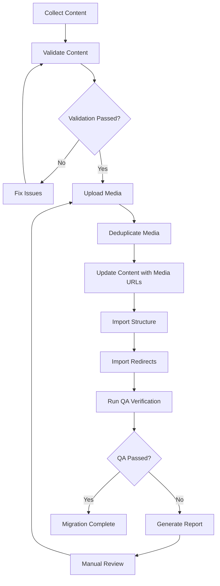

# Strapi CMS Design Improvement Plan

## Executive Summary

This document outlines a comprehensive plan to improve the Strapi headless CMS design for maximum robustness and accuracy in storing all content migrated from the old site at https://www.zeiler.me/. The focus is on preserving content exactly as it appears on the old site, including all images at their original locations.

## Current State Analysis

### Existing Content Types
- **Page**: title, slug, summary, body (markdown), order, route, tags, images (media), parent, children, section, author, externalId
- **Section**: title, slug, intro, order, externalId, pages
- **Author**: name, bio, contact, externalId, pages
- **Home** (Single): heroTitle, intro, highlights (component)
- **Settings** (Single): siteTitle, defaultDescription, social (component), ogImage (media)
- **Redirect**: from, to, httpCode, externalId

### Identified Issues

1. **Image Preservation**: No structured tracking of original image locations
2. **Content Integrity**: No validation for markdown image references
3. **Media Management**: Basic upload without deduplication or checksum verification
4. **Error Handling**: Retry logic exists but could be more robust
5. **Backup/Restore**: No comprehensive media backup mechanism
6. **Performance**: Sequential media uploads could be parallelized

---

## Proposed Improvements

### 1. Enhanced Image Metadata Schema

Create a new content type or component to track image metadata:

```typescript
// cms/src/components/content/image-metadata.json
{
  "collectionName": "components_content_image_metadata",
  "info": {
    "displayName": "Image Metadata",
    "description": "Tracks original image location and metadata for migration accuracy"
  },
  "attributes": {
    "originalUrl": {
      "type": "string",
      "required": true
    },
    "originalPath": {
      "type": "string",
      "required": true
    },
    "altText": {
      "type": "string"
    },
    "caption": {
      "type": "text"
    },
    "strapiMediaId": {
      "type": "integer"
    },
    "checksum": {
      "type": "string",
      "required": true
    },
    "fileSize": {
      "type": "biginteger"
    },
    "mimeType": {
      "type": "string"
    },
    "width": {
      "type": "integer"
    },
    "height": {
      "type": "integer"
    },
    "pageReference": {
      "type": "relation",
      "relation": "belongsTo",
      "target": "api::page.page"
    },
    "markdownPosition": {
      "type": "json",
      "description": "Position in markdown body for reconstruction"
    }
  }
}
```

### 2. Enhanced Page Schema

Update the Page content type to include better image tracking:

```json
{
  "kind": "collectionType",
  "collectionName": "pages",
  "attributes": {
    "title": { "type": "string", "required": true },
    "slug": { "type": "uid", "targetField": "title", "required": true },
    "summary": { "type": "text" },
    "body": { "type": "customField", "customField": "plugin::markdown-field.markdown", "required": true },
    "order": { "type": "integer", "default": 0 },
    "route": { "type": "string" },
    "tags": { "type": "json", "default": [] },
    
    // Enhanced images with metadata
    "images": {
      "type": "media",
      "multiple": true,
      "allowedTypes": ["images", "files"]
    },
    "imageMetadata": {
      "type": "component",
      "repeatable": true,
      "component": "content.image-metadata"
    },
    
    // Relationships
    "parent": { "type": "relation", "relation": "manyToOne", "target": "api::page.page", "inversedBy": "children" },
    "children": { "type": "relation", "relation": "oneToMany", "target": "api::page.page", "mappedBy": "parent" },
    "section": { "type": "relation", "relation": "manyToOne", "target": "api::section.section", "inversedBy": "pages" },
    "author": { "type": "relation", "relation": "manyToOne", "target": "api::author.author", "inversedBy": "pages" },
    
    // Migration tracking
    "externalId": { "type": "string", "unique": true },
    "originalSourcePath": { "type": "string" },
    "migrationChecksum": { "type": "string" },
    "lastMigratedAt": { "type": "datetime" }
  }
}
```

### 3. Media Management System

Create a dedicated media management API:

```javascript
// cms/src/api/media-relation/content-types/media-relation/schema.json
{
  "kind": "collectionType",
  "collectionName": "media_relations",
  "info": {
    "singularName": "media-relation",
    "pluralName": "media-relations",
    "displayName": "Media Relation",
    "description": "Tracks media files and their relationships to content"
  },
  "attributes": {
    "mediaFile": {
      "type": "media",
      "allowedTypes": ["images", "files"],
      "required": true
    },
    "originalUrl": { "type": "string", "required": true },
    "originalPath": { "type": "string", "required": true },
    "checksum": { "type": "string", "required": true },
    "fileSize": { "type": "biginteger" },
    "mimeType": { "type": "string" },
    "dimensions": { "type": "json" },
    "referencedIn": {
      "type": "relation",
      "relation": "oneToMany",
      "target": "api::page.page"
    },
    "externalId": { "type": "string", "unique": true }
  }
}
```

### 4. Content Validation System

Create validation scripts to ensure content integrity:

```javascript
// cms/validate-content.mjs
import fs from "fs-extra";
import path from "path";
import crypto from "crypto";

const VALIDATION_TYPES = {
  IMAGE_REFERENCES: "imageReferences",
  MARKDOWN_LINKS: "markdownLinks",
  INTERNAL_ROUTES: "internalRoutes",
  CHECKSUMS: "checksums",
  DUPLICATES: "duplicates",
  MISSING_MEDIA: "missingMedia"
};

async function validateImageReferences(content, mediaMap) {
  const issues = [];
  const mediaItems = new Set(mediaMap.items.map(m => m.externalId));
  
  for (const page of content.pages) {
    for (const img of page.images || []) {
      if (!mediaItems.has(img.externalId)) {
        issues.push({
          type: "missingImage",
          page: page.route,
          image: img.externalId,
          message: `Image reference ${img.externalId} not found in media map`
        });
      }
    }
    
    // Check markdown for inline images
    const markdownImages = page.body.match(/!\[([^\]]*)\]\(([^)]+)\)/g) || [];
    for (const match of markdownImages) {
      const urlMatch = match.match(/!\[([^\]]*)\]\(([^)]+)\)/);
      if (urlMatch) {
        const [, alt, url] = urlMatch;
        // Check if URL is local and should be in media map
        if (url.includes("localhost:1337/uploads")) {
          const filename = url.split("/").pop();
          // Validate against uploaded media
        }
      }
    }
  }
  
  return issues;
}

async function validateInternalRoutes(content) {
  const issues = [];
  const validRoutes = new Set(content.pages.map(p => p.route));
  validRoutes.add("/");
  
  for (const page of content.pages) {
    const links = page.body.match(/\[([^\]]+)\]\(([^)]+)\)/g) || [];
    for (const link of links) {
      const urlMatch = link.match(/\[([^\]]+)\]\(([^)]+)\)/);
      if (urlMatch) {
        const [, text, url] = urlMatch;
        if (url.startsWith("/") && !url.includes("#")) {
          // Check if internal route exists
          const route = url.replace(/\.html$/, "");
          if (!validRoutes.has(route) && route !== "/") {
            issues.push({
              type: "brokenInternalLink",
              page: page.route,
              link: url,
              message: `Internal link points to non-existent route: ${route}`
            });
          }
        }
      }
    }
  }
  
  return issues;
}

async function validateChecksums(content, mediaMap) {
  const issues = [];
  
  for (const page of content.pages) {
    if (page.migrationChecksum) {
      const expectedChecksum = page.migrationChecksum;
      // Recompute checksum from current state
      const currentChecksum = computeContentChecksum(page);
      if (currentChecksum !== expectedChecksum) {
        issues.push({
          type: "checksumMismatch",
          page: page.route,
          message: "Page content has been modified since migration"
        });
      }
    }
  }
  
  return issues;
}

export async function validateContent(contentPath, mediaMapPath) {
  const content = await fs.readJson(contentPath);
  const mediaMap = await fs.readJson(mediaMapPath);
  
  const results = {
    timestamp: new Date().toISOString(),
    valid: true,
    issues: {
      [VALIDATION_TYPES.IMAGE_REFERENCES]: await validateImageReferences(content, mediaMap),
      [VALIDATION_TYPES.INTERNAL_ROUTES]: await validateInternalRoutes(content),
      [VALIDATION_TYPES.CHECKSUMS]: await validateChecksums(content, mediaMap),
      [VALIDATION_TYPES.MISSING_MEDIA]: []
    },
    summary: {}
  };
  
  // Calculate summary
  let totalIssues = 0;
  for (const type of Object.values(results.issues)) {
    totalIssues += type.length;
  }
  results.summary.totalIssues = totalIssues;
  results.valid = totalIssues === 0;
  
  return results;
}
```

### 5. Enhanced Media Upload System

Create an improved media upload script with parallel processing:

```javascript
// migration/02-upload-media-enhanced.mjs
import fs from "fs-extra";
import path from "path";
import crypto from "crypto";
import axios from "axios";
import FormData from "form-data";
import pQueue from "p-queue";

const CONCURRENT_UPLOADS = 5;
const MAX_RETRIES = 3;
const RETRY_DELAY = 1000;

async function uploadMediaWithRetry(http, item, options = {}) {
  const { buffer, filename, contentType } = await readMediaBuffer(item);
  const hash = crypto.createHash("sha256").update(buffer).digest("hex");
  
  // Check for existing file by hash
  const existing = await fileExistsInStrapiByHash(http, hash);
  if (existing) {
    return {
      id: existing.id,
      url: existing.url,
      hash,
      name: existing.name || filename,
      skipped: true
    };
  }
  
  // Upload with retry
  for (let attempt = 1; attempt <= MAX_RETRIES; attempt++) {
    try {
      const form = new FormData();
      form.append("files", buffer, { filename, contentType });
      form.append("fileInfo", JSON.stringify({
        alternativeText: item.references?.[0]?.alt || "",
        caption: item.references?.map(r => r.alt).filter(Boolean).join(", ") || "",
        name: filename,
      }));
      
      const response = await http.post("/api/upload", form, {
        headers: form.getHeaders(),
        maxBodyLength: Infinity,
      });
      
      const uploaded = Array.isArray(response.data) ? response.data[0] : response.data;
      return {
        id: uploaded.id,
        url: uploaded.url,
        hash,
        name: uploaded.name || filename,
        skipped: false
      };
    } catch (error) {
      if (attempt === MAX_RETRIES) throw error;
      await new Promise(resolve => setTimeout(resolve, RETRY_DELAY * attempt));
    }
  }
}

async function uploadAllMedia(content, media, options = {}) {
  const strapiUrl = options.strapiUrl || "http://localhost:1337";
  const token = options.strapiToken;
  
  const http = axios.create({
    baseURL: strapiUrl.replace(/\/$/, ""),
    headers: { Authorization: `Bearer ${token}` },
  });
  
  const queue = new pQueue({ concurrency: CONCURRENT_UPLOADS });
  const results = [];
  const stats = { uploaded: 0, skipped: 0, failed: 0 };
  
  const pendingItems = media.items.filter(item => !item.strapi?.id);
  
  for (const item of pendingItems) {
    queue.add(async () => {
      try {
        const result = await uploadMediaWithRetry(http, item);
        item.strapi = result;
        if (result.skipped) {
          stats.skipped++;
        } else {
          stats.uploaded++;
        }
        results.push({ item, result });
      } catch (error) {
        stats.failed++;
        results.push({ item, error: error.message });
      }
    });
  }
  
  await queue.onIdle();
  
  return { results, stats };
}
```

### 6. Media Backup and Restore System

Create a comprehensive backup system for media:

```javascript
// migration/backup-media.mjs
import fs from "fs-extra";
import path from "path";
import axios from "axios";
import archiver from "archiver";
import { createHash } from "crypto";

async function backupMedia(strapiUrl, token, outputPath) {
  const http = axios.create({
    baseURL: strapiUrl.replace(/\/$/, ""),
    headers: { Authorization: `Bearer ${token}` },
  });
  
  // Get all media files
  const response = await http.get("/api/upload/files?populate=*");
  const files = response.data;
  
  const backup = {
    timestamp: new Date().toISOString(),
    version: "1.0",
    totalFiles: files.length,
    files: []
  };
  
  // Download each file
  for (const file of files) {
    const downloadUrl = `${strapiUrl}${file.url}`;
    const downloadResponse = await axios.get(downloadUrl, { responseType: "arraybuffer" });
    const buffer = Buffer.from(downloadResponse.data);
    const hash = createHash("sha256").update(buffer).digest("hex");
    
    backup.files.push({
      id: file.id,
      name: file.name,
      hash,
      size: buffer.length,
      mimeType: file.mime,
      url: file.url,
      alternativeText: file.alternativeText,
      caption: file.caption,
      createdAt: file.createdAt,
      updatedAt: file.updatedAt,
    });
    
    // Save file to backup directory
    const filePath = path.join(outputPath, file.hash);
    await fs.writeFile(filePath, buffer);
  }
  
  // Save metadata
  const metadataPath = path.join(outputPath, "backup.json");
  await fs.writeJson(metadataPath, backup, { spaces: 2 });
  
  // Create archive
  await createArchive(outputPath, outputPath + ".zip");
  
  return backup;
}

async function restoreMedia(strapiUrl, token, backupPath) {
  const http = axios.create({
    baseURL: strapiUrl.replace(/\/$/, ""),
    headers: { Authorization: `Bearer ${token}` },
  });
  
  const metadata = await fs.readJson(path.join(backupPath, "backup.json"));
  const results = { restored: 0, skipped: 0, failed: 0 };
  
  for (const file of metadata.files) {
    try {
      const filePath = path.join(backupPath, file.hash);
      if (!await fs.pathExists(filePath)) {
        results.failed++;
        continue;
      }
      
      const buffer = await fs.readFile(filePath);
      const hash = createHash("sha256").update(buffer).digest("hex");
      
      if (hash !== file.hash) {
        results.failed++;
        continue;
      }
      
      // Check if file already exists
      const existing = await fileExistsInStrapiByHash(http, hash);
      if (existing) {
        results.skipped++;
        continue;
      }
      
      // Upload file
      const form = new FormData();
      form.append("files", buffer, { filename: file.name });
      form.append("fileInfo", JSON.stringify({
        alternativeText: file.alternativeText || "",
        caption: file.caption || "",
        name: file.name,
      }));
      
      await http.post("/api/upload", form, { headers: form.getHeaders() });
      results.restored++;
    } catch (error) {
      results.failed++;
    }
  }
  
  return results;
}
```

### 7. Image Position Tracking for Markdown

To preserve exact image placement in markdown content:

```javascript
// migration/track-image-positions.mjs
function extractImagePositions(markdown) {
  const positions = [];
  const regex = /!\[([^\]]*)\]\(([^)]+)\)/g;
  let match;
  let index = 0;
  
  while ((match = regex.exec(markdown)) !== null) {
    positions.push({
      index,
      alt: match[1],
      url: match[2],
      position: match.index,
      length: match[0].length,
      markdown: match[0]
    });
    index++;
  }
  
  return positions;
}

function reconstructMarkdown(originalMarkdown, imageReplacements) {
  let result = originalMarkdown;
  // Sort by position in reverse order to replace from end to start
  const sorted = imageReplacements
    .filter(r => r.newUrl !== r.oldUrl)
    .sort((a, b) => b.position - a.position);
  
  for (const replacement of sorted) {
    const before = result.slice(0, replacement.position);
    const after = result.slice(replacement.position + replacement.length);
    result = before + replacement.newMarkdown + after;
  }
  
  return result;
}
```

### 8. Quality Assurance Scripts

Create comprehensive QA scripts:

```javascript
// migration/qa-verify.mjs
import fs from "fs-extra";
import path from "path";

async function runFullQA(contentPath, mediaMapPath, strapiUrl, token) {
  const checks = {
    contentComplete: await checkContentComplete(contentPath),
    imagesUploaded: await checkImagesUploaded(contentPath, mediaMapPath, strapiUrl, token),
    linksValid: await checkLinksValid(contentPath),
    structureIntact: await checkStructureIntact(contentPath),
    noOrphanedMedia: await checkNoOrphanedMedia(contentPath, mediaMapPath),
    redirectsConfigured: await checkRedirectsConfigured(contentPath),
  };
  
  const report = {
    timestamp: new Date().toISOString(),
    checks,
    overallStatus: Object.values(checks).every(c => c.passed) ? "PASS" : "FAIL",
    summary: Object.entries(checks).map(([name, result]) => ({
      check: name,
      passed: result.passed,
      issues: result.issues?.length || 0,
      details: result.details
    }))
  };
  
  return report;
}

async function checkContentComplete(contentPath) {
  const content = await fs.readJson(contentPath);
  const issues = [];
  
  // Check for pages without body
  for (const page of content.pages) {
    if (!page.body || page.body.trim().length === 0) {
      issues.push({ page: page.route, issue: "Empty body" });
    }
  }
  
  // Check for pages without title
  for (const page of content.pages) {
    if (!page.title || page.title.trim().length === 0) {
      issues.push({ page: page.route, issue: "Missing title" });
    }
  }
  
  return {
    passed: issues.length === 0,
    issues,
    details: { totalPages: content.pages.length, pagesWithIssues: issues.length }
  };
}

async function checkImagesUploaded(contentPath, mediaMapPath, strapiUrl, token) {
  const content = await fs.readJson(contentPath);
  const mediaMap = await fs.readJson(mediaMapPath);
  const issues = [];
  
  for (const page of content.pages) {
    for (const img of page.images || []) {
      if (!img.strapiId) {
        const mediaItem = mediaMap.items.find(m => m.externalId === img.externalId);
        if (mediaItem && !mediaItem.strapi?.id) {
          issues.push({
            page: page.route,
            image: img.externalId,
            issue: "Image not uploaded to Strapi"
          });
        }
      }
    }
  }
  
  return {
    passed: issues.length === 0,
    issues,
    details: { totalReferencedImages: content.pages.reduce((sum, p) => sum + (p.images?.length || 0), 0) }
  };
}

export async function generateQAReport(contentPath, mediaMapPath, strapiUrl, token) {
  const report = await runFullQA(contentPath, mediaMapPath, strapiUrl, token);
  const reportPath = path.join(path.dirname(contentPath), "qa-report.json");
  await fs.writeJson(reportPath, report, { spaces: 2 });
  return report;
}
```

---

## Migration Pipeline Improvements

### New Script Sequence



---

## Implementation Tasks

### Priority 1: Core Schema Changes
1. Add Image Metadata component
2. Update Page schema with image tracking fields
3. Create Media Relation content type

### Priority 2: Migration Script Improvements
1. Enhance 02-upload-media.mjs with parallel uploads
2. Add checksum verification to uploads
3. Implement media deduplication

### Priority 3: Validation and QA
1. Create validate-content.mjs
2. Create qa-verify.mjs
3. Create backup-media.mjs

### Priority 4: Documentation
1. Update MIGRATION.md
2. Document new validation commands
3. Create troubleshooting guide

---

## Backward Compatibility

All changes maintain backward compatibility:
- Existing Page fields remain unchanged
- New fields are optional
- Migration scripts can run on existing content
- Old scripts continue to work alongside new ones

---

## Testing Strategy

1. **Unit Tests**: Test individual functions (checksum, validation)
2. **Integration Tests**: Test full migration pipeline
3. **Visual Regression Tests**: Compare old site with new frontend output
4. **Content Comparison**: Automated diff between old and new content

---

## Rollback Plan

1. All scripts backup before modifications
2. Media backup before upload
3. Content JSON backup before structure import
4. Database snapshots before major changes
