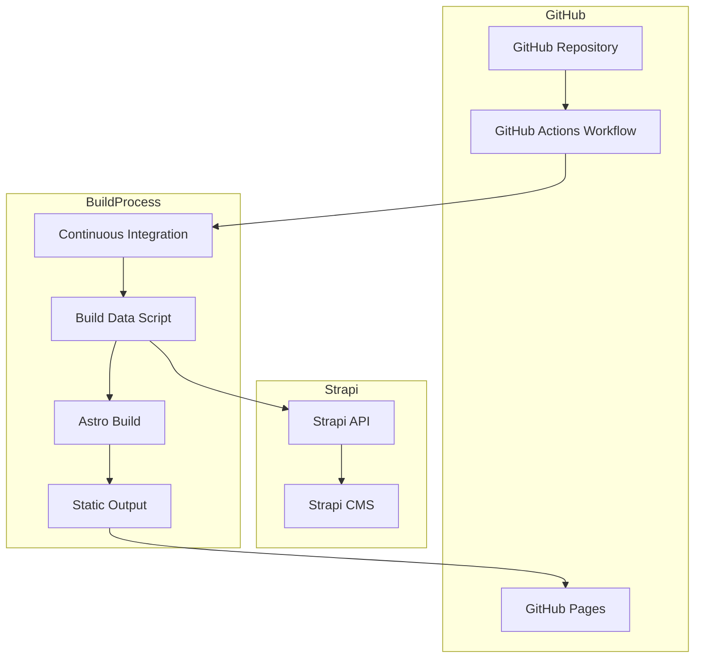
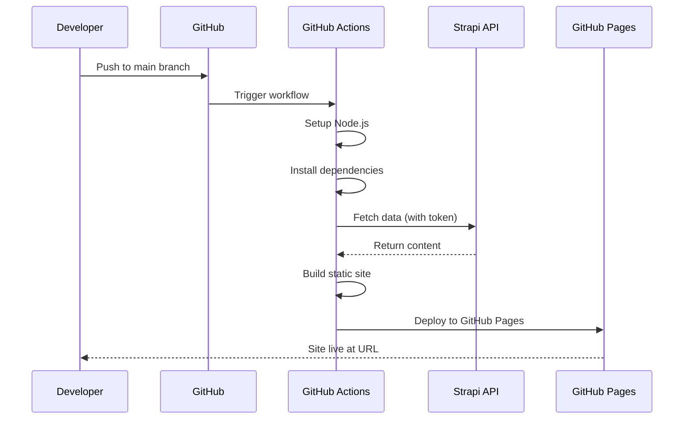

# GitHub Pages Deployment Plan for Strapi Frontend

## Overview

This plan describes how to deploy the Astro frontend that fetches content from a Strapi headless CMS to GitHub Pages. The deployment will be automated using GitHub Actions.

## Architecture Diagram



## Current Project Structure

```
zeiler_me_new/
├── cms/                    # Strapi CMS
│   ├── .env               # Strapi environment variables
│   └── package.json
├── frontend/              # Astro frontend
│   ├── .env.example       # Environment template
│   ├── astro.config.mjs   # Astro configuration
│   ├── package.json       # Frontend dependencies
│   ├── scripts/
│   │   └── build-data.mjs # Fetches data from Strapi
│   ├── src/
│   │   └── lib/
│   │       ├── env.js     # Environment configuration
│   │       └── strapi.js  # Strapi API client
│   └── public/            # Static assets
└── package.json           # Root package.json
```

## Required Environment Variables

| Variable | Description | Required | Example |
|----------|-------------|----------|---------|
| `STRAPI_URL` | URL of the Strapi CMS instance | Yes | `https://your-strapi-instance.com` |
| `STRAPI_TOKEN_RO` | Read-only API token for Strapi | Yes | `eyJhbGciOiJIUzI1NiIsInR5cCI6IkpXVCJ9...` |
| `SITE_URL` | Production site URL for sitemap | Yes | `https://username.github.io/repo-name` |

## Deployment Steps

### Step 1: Configure GitHub Repository Settings

1. Enable GitHub Pages in repository settings
2. Set source to "GitHub Actions"
3. Configure the repository name for the deployment URL

### Step 2: Create GitHub Actions Workflow

Create `.github/workflows/deploy.yml` with the following configuration:

```yaml
name: Deploy to GitHub Pages

on:
  push:
    branches: [main]
  workflow_dispatch:

permissions:
  contents: read
  pages: write
  id-token: write

concurrency:
  group: pages
  cancel-in-progress: false

jobs:
  build:
    runs-on: ubuntu-latest
    steps:
      - name: Checkout
        uses: actions/checkout@v4

      - name: Setup Node.js
        uses: actions/setup-node@v4
        with:
          node-version: '20'
          cache: 'npm'
          cache-dependency-path: frontend/package-lock.json

      - name: Install dependencies
        working-directory: ./frontend
        run: npm ci

      - name: Build data from Strapi
        working-directory: ./frontend
        env:
          STRAPI_URL: ${{ secrets.STRAPI_URL }}
          STRAPI_TOKEN_RO: ${{ secrets.STRAPI_TOKEN_RO }}
          SITE_URL: ${{ secrets.SITE_URL }}
        run: npm run build

      - name: Upload artifact
        uses: actions/upload-pages-artifact@v3
        with:
          path: ./frontend/dist

  deploy:
    environment:
      name: github-pages
      url: ${{ steps.deployment.outputs.page_url }}
    runs-on: ubuntu-latest
    needs: build
    steps:
      - name: Deploy to GitHub Pages
        id: deployment
        uses: actions/deploy-pages@v4
```

### Step 3: Configure GitHub Secrets

Add the following secrets in GitHub repository settings (Settings → Secrets and variables → Actions):

| Secret Name | Value |
|-------------|-------|
| `STRAPI_URL` | Your Strapi CMS URL (e.g., `https://your-strapi-instance.com`) |
| `STRAPI_TOKEN_RO` | Read-only API token from Strapi |
| `SITE_URL` | Your GitHub Pages URL (e.g., `https://username.github.io/repo-name`) |

### Step 4: Update Astro Configuration (Optional)

If needed, update `frontend/astro.config.mjs` to ensure proper base path for GitHub Pages:

```javascript
const site = process.env.SITE_URL && process.env.SITE_URL.trim().length > 0
  ? process.env.SITE_URL.trim().replace(/\/$/, '')
  : 'http://localhost:4321';

const base = process.env.BASE_PATH || '/';

export default defineConfig({
  site,
  base,
  // ... rest of config
});
```

### Step 5: Create Local .env File (Optional)

For local development, create `frontend/.env`:

```env
STRAPI_URL=https://your-strapi-instance.com
STRAPI_TOKEN_RO=your-read-only-token
SITE_URL=http://localhost:4321
```

## Deployment Workflow



## Files to Create

| File | Purpose |
|------|---------|
| `.github/workflows/deploy.yml` | GitHub Actions workflow for deployment |
| `frontend/.env` | Local development environment (gitignored) |

## Files to Modify

| File | Changes |
|------|---------|
| `frontend/astro.config.mjs` | Optional: Add base path support |
| `frontend/.gitignore` | Ensure `.env` is ignored |

## Strapi Configuration Requirements

1. **API Token**: Generate a read-only API token in Strapi:
   - Go to Settings → API Tokens
   - Create new token with read permissions
   - Copy token to GitHub Secrets

2. **CORS Configuration**: Ensure Strapi allows requests from GitHub:
   - Go to Settings → API → CORS
   - Add GitHub Pages URL to allowed origins

3. **Content Publication**: Ensure all content is published (not draft)

## Troubleshooting

### Issue: Build fails with "STRAPI_URL is required"
- **Solution**: Ensure `STRAPI_URL` secret is set in GitHub repository settings

### Issue: 401/403 errors when fetching from Strapi
- **Solution**: Verify `STRAPI_TOKEN_RO` is valid and has read permissions

### Issue: Images not loading on GitHub Pages
- **Solution**: Ensure Strapi CORS allows GitHub Pages domain, or use absolute URLs for media

### Issue: Sitemap incorrect
- **Solution**: Verify `SITE_URL` secret matches your GitHub Pages URL exactly

## Alternative Deployment Options

### Option A: Manual Deployment
```bash
cd frontend
npm ci
npm run build
# Upload dist/ folder to GitHub Pages manually
```

### Option B: Custom Domain
1. Add `CNAME` file to `frontend/public/`
2. Configure DNS settings
3. Update `SITE_URL` to custom domain

### Option C: Preview Deployments
Add pull request trigger to workflow for preview deployments:
```yaml
on:
  push:
    branches: [main]
  pull_request:
    branches: [main]
```

## Security Considerations

1. **API Token**: Use read-only token, never use admin tokens
2. **Secrets**: Never commit secrets to repository
3. **CORS**: Restrict Strapi CORS to specific domains
4. **Rate Limiting**: Consider Strapi API rate limits for large sites

## Post-Deployment Checklist

- [ ] Verify site loads at GitHub Pages URL
- [ ] Check all pages render correctly
- [ ] Verify images and media load
- [ ] Test navigation and links
- [ ] Check sitemap is accessible at `/sitemap-index.xml`
- [ ] Verify robots.txt is accessible
- [ ] Test search functionality
- [ ] Check for console errors in browser

## Maintenance

- Update dependencies regularly
- Monitor Strapi API token expiration
- Review GitHub Actions logs for errors
- Keep Strapi CORS settings updated