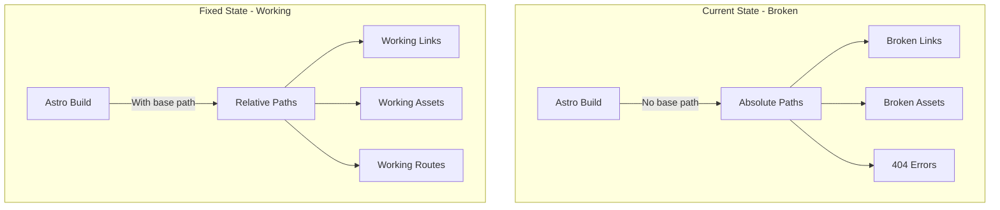

# GitHub Pages Subdirectory Deployment Fix Plan

## Problem Analysis

The deployed site at `https://coinerd.github.io/zeiler_me_pages/` is not displaying correctly because:

### Root Cause

The site is deployed to a **subdirectory** on GitHub Pages (`/zeiler_me_pages/`), but the Astro configuration doesn't have a `base` path set. This causes:

| Issue | Description | Impact |
|-------|-------------|--------|
| **Broken Links** | All links use absolute paths (`href="/"`) instead of relative to base (`href="/zeiler_me_pages/"`) | Navigation doesn't work |
| **Broken Assets** | Favicon and other assets referenced with absolute paths (`href="/favicon.svg"`) | Assets don't load |
| **Broken Scripts** | JavaScript files referenced with absolute paths | Interactive features fail |
| **Broken Styles** | CSS files referenced with absolute paths | Styling doesn't apply |
| **404 Errors** | All routes return 404 because they're looking at root instead of subdirectory | Site is unusable |

### Current Configuration

```javascript
// frontend/astro.config.mjs
export default defineConfig({
  site: 'https://coinerd.github.io/zeiler_me_pages',
  // Missing: base: '/zeiler_me_pages'
});
```

### Expected Configuration

```javascript
// frontend/astro.config.mjs
export default defineConfig({
  site: 'https://coinerd.github.io/zeiler_me_pages',
  base: '/zeiler_me_pages',
});
```

## Solution Architecture



## Implementation Plan

### Step 1: Update Astro Configuration

Add `base` configuration to [`frontend/astro.config.mjs`](frontend/astro.config.mjs):

```javascript
const site = process.env.SITE_URL && process.env.SITE_URL.trim().length > 0
  ? process.env.SITE_URL.trim().replace(/\/$/, '')
  : 'http://localhost:4321';

// Extract base path from SITE_URL for GitHub Pages subdirectory
const base = process.env.BASE_PATH || '/';

export default defineConfig({
  site,
  base,
  integrations: [
    tailwind({
      applyBaseStyles: false,
    }),
    react(),
    sitemap(),
  ],
});
```

### Step 2: Update Environment Variables

Add `BASE_PATH` to environment configuration:

**For local development (`frontend/.env`):**
```env
STRAPI_URL=http://localhost:1337
STRAPI_TOKEN_RO=your-read-only-token
SITE_URL=http://localhost:4321
BASE_PATH=/
```

**For GitHub Pages deployment:**
```env
STRAPI_URL=https://your-strapi-instance.com
STRAPI_TOKEN_RO=your-read-only-token
SITE_URL=https://coinerd.github.io/zeiler_me_pages
BASE_PATH=/zeiler_me_pages
```

### Step 3: Update Deployment Scripts

Modify [`deploy.sh`](deploy.sh) and [`deploy.cmd`](deploy.cmd) to set `BASE_PATH` during build:

**deploy.sh:**
```bash
# Build the frontend with correct BASE_PATH
echo -e "${YELLOW}📦 Building frontend...${CD}"
cd frontend

# Set BASE_PATH for GitHub Pages
export BASE_PATH=/zeiler_me_pages
export SITE_URL=https://coinerd.github.io/zeiler_me_pages

npm run build
```

**deploy.cmd:**
```batch
REM Build the frontend with correct BASE_PATH
echo [3/4] Building frontend...
cd frontend

REM Set BASE_PATH for GitHub Pages
set BASE_PATH=/zeiler_me_pages
set SITE_URL=https://coinerd.github.io/zeiler_me_pages

call npm run build
```

### Step 4: Update .env.example

Add `BASE_PATH` to [`frontend/.env.example`](frontend/.env.example):

```env
STRAPI_URL=
STRAPI_TOKEN_RO=
SITE_URL=
BASE_PATH=
```

### Step 5: Verify Link References

Check that all internal links use Astro's `<a>` component or relative paths. The `base` configuration will automatically prefix all absolute paths starting with `/`.

### Step 6: Test Locally

Test the build locally with the base path:

```bash
cd frontend
BASE_PATH=/zeiler_me_pages SITE_URL=https://coinerd.github.io/zeiler_me_pages npm run build
npm run preview
```

Then access at `http://localhost:4321/zeiler_me_pages/`

### Step 7: Rebuild and Deploy

Run the deployment script with the updated configuration:

```bash
deploy.cmd
```

## Files to Modify

| File | Changes |
|------|---------|
| `frontend/astro.config.mjs` | Add `base` configuration |
| `frontend/.env.example` | Add `BASE_PATH` variable |
| `deploy.sh` | Set `BASE_PATH` environment variable during build |
| `deploy.cmd` | Set `BASE_PATH` environment variable during build |

## Verification Checklist

After implementing the fix:

- [ ] Local build with `BASE_PATH=/zeiler_me_pages` succeeds
- [ ] Local preview at `http://localhost:4321/zeiler_me_pages/` works
- [ ] All links navigate correctly
- [ ] All assets (favicon, images) load
- [ ] JavaScript functionality works
- [ ] CSS styling applies correctly
- [ ] Deployment to GitHub Pages succeeds
- [ ] Deployed site at `https://coinerd.github.io/zeiler_me_pages/` works
- [ ] All pages render correctly
- [ ] No 404 errors on navigation

## Alternative Solutions

### Option A: Use Project Pages (Not Recommended)

Rename the repository to `coinerd.github.io` to use project pages at root level. This would eliminate the need for a base path but:
- Requires renaming the repository
- Changes the deployment URL
- Not ideal for this use case

### Option B: Use Custom Domain

Set up a custom domain that points to the repository. This would:
- Allow using root-level paths
- Require DNS configuration
- Add complexity

### Option C: Use Relative Paths Throughout

Manually update all links to use relative paths. This would:
- Be error-prone
- Require extensive code changes
- Not be maintainable

**Recommended**: Use Option 1 (Add `base` configuration) as it's the cleanest and most maintainable solution.

## Technical Details

### How Astro's `base` Configuration Works

When `base: '/zeiler_me_pages'` is set:

1. **Asset URLs**: All asset references starting with `/` are prefixed with `/zeiler_me_pages`
   - `/favicon.svg` → `/zeiler_me_pages/favicon.svg`
   - `/_astro/...` → `/zeiler_me_pages/_astro/...`

2. **Link URLs**: All `<a>` tags with `href` starting with `/` are prefixed
   - `<a href="/">` → `<a href="/zeiler_me_pages/">`
   - `<a href="/page">` → `<a href="/zeiler_me_pages/page">`

3. **Route Generation**: All routes are generated under the base path
   - `/` → `/zeiler_me_pages/`
   - `/page` → `/zeiler_me_pages/page`

4. **Sitemap**: Sitemap URLs include the base path
   - `https://coinerd.github.io/zeiler_me_pages/sitemap-index.xml`

### Environment Variable Priority

The `BASE_PATH` environment variable allows different configurations for:
- **Local development**: `BASE_PATH=/` (root)
- **GitHub Pages**: `BASE_PATH=/zeiler_me_pages` (subdirectory)
- **Custom domain**: `BASE_PATH=/` (root)

## Troubleshooting

### Issue: Links still broken after adding base path

**Solution**: 
- Clear browser cache
- Hard refresh (Ctrl+Shift+R)
- Check that `BASE_PATH` is set correctly during build

### Issue: Assets not loading

**Solution**:
- Verify assets are in `frontend/public/` directory
- Check browser console for 404 errors
- Ensure `base` is set in `astro.config.mjs`

### Issue: Build fails with base path

**Solution**:
- Check that `BASE_PATH` starts with `/`
- Ensure `BASE_PATH` doesn't end with `/` (except for root `/`)
- Verify environment variable is set before build

### Issue: Local preview doesn't work with base path

**Solution**:
- Access at `http://localhost:4321/zeiler_me_pages/` instead of `http://localhost:4321/`
- Or set `BASE_PATH=/` for local development

## Post-Implementation

After implementing the fix:

1. **Monitor**: Check the deployed site for any remaining issues
2. **Test**: Test all navigation paths and interactive features
3. **Document**: Update deployment documentation with base path requirements
4. **Automate**: Ensure deployment scripts set `BASE_PATH` automatically
