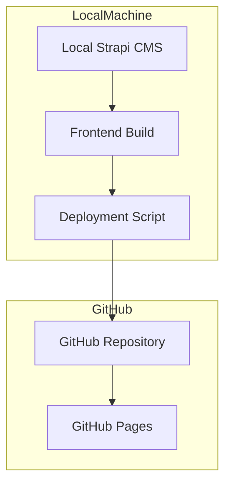
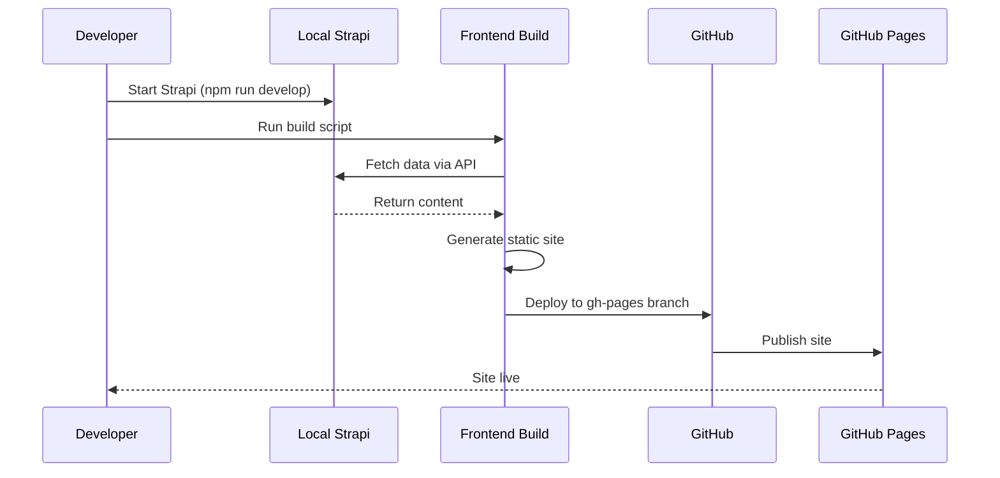

# Manual Deployment Plan for Local Strapi to GitHub Pages

## Overview

This plan describes how to manually deploy the Astro frontend to GitHub Pages when Strapi CMS is running locally on your laptop. Since GitHub Actions cannot access your local Strapi instance, you'll build the site locally and deploy it manually.

## Architecture Diagram



## Deployment Workflow



## Prerequisites

1. **GitHub CLI** installed and authenticated
2. **Strapi CMS** running locally
3. **Node.js** installed (version 20+)
4. **Git** configured

### Install GitHub CLI

```bash
# Windows (winget)
winget install --id GitHub.cli

# macOS (brew)
brew install gh

# Linux
# See https://cli.github.com/
```

### Authenticate GitHub CLI

```bash
gh auth login
```

Follow the prompts to authenticate with your GitHub account.

## Deployment Methods

### Method 1: Using GitHub CLI (Recommended)

The easiest method using the official GitHub CLI tool.

### Method 2: Using gh-pages npm package

Alternative method using the `gh-pages` package.

### Method 3: Manual Git Operations

Manual git commands for full control.

## Environment Setup

### Create .env File

Create `frontend/.env` with your local Strapi configuration:

```env
STRAPI_URL=http://localhost:1337
STRAPI_TOKEN_RO=your-read-only-token
SITE_URL=https://username.github.io/repo-name
```

### Generate Strapi API Token

1. Start Strapi locally: `cd cms && npm run develop`
2. Go to `http://localhost:1337/admin`
3. Navigate to **Settings** → **API Tokens**
4. Click **Create new API Token**
5. Set:
   - **Name**: `Local Deployment`
   - **Token duration**: Unlimited
   - **Token type**: Read-only
6. Save and copy the token
7. Add to `frontend/.env`

## Deployment Steps

### Step 1: Start Strapi CMS

```bash
cd cms
npm run develop
```

Keep this terminal open - Strapi must be running during the build.

### Step 2: Build the Frontend

In a new terminal:

```bash
cd frontend
npm install
npm run build
```

This will:
1. Fetch data from your local Strapi
2. Generate static HTML/CSS/JS files
3. Output to `frontend/dist/`

### Step 3: Deploy to GitHub Pages

Choose one of the methods below.

#### Method 1: GitHub CLI (Recommended)

```bash
cd frontend
gh repo deploy dist
```

Or with explicit repository:

```bash
gh repo deploy dist --repo username/repo-name
```

#### Method 2: gh-pages Package

First, install the package:

```bash
cd frontend
npm install --save-dev gh-pages
```

Then deploy:

```bash
npm run deploy
```

Add this script to `frontend/package.json`:

```json
{
  "scripts": {
    "deploy": "gh-pages -d dist"
  }
}
```

#### Method 3: Manual Git Operations

```bash
cd frontend

# Create a temporary branch
git checkout --orphan gh-pages-temp

# Move dist contents to root
git rm -rf .
cp -r dist/* .
cp -r dist/.* . 2>/dev/null || true
rm -rf dist

# Commit and push
git add .
git commit -m "Deploy to GitHub Pages"
git push origin gh-pages-temp:gh-pages --force

# Return to main branch
git checkout main
git branch -D gh-pages-temp
```

## Configure GitHub Pages

1. Go to your repository on GitHub
2. Navigate to **Settings** → **Pages**
3. Under **Source**, select **Deploy from a branch**
4. Select **gh-pages** branch and **/ (root)** folder
5. Click **Save**

Your site will be available at:
- `https://username.github.io/repo-name/`

## Automation Script

Create a deployment script to automate the process:

```bash
#!/bin/bash
# deploy.sh - Deploy frontend to GitHub Pages

set -e

echo "🚀 Starting deployment..."

# Check if Strapi is running
if ! curl -s http://localhost:1337 > /dev/null; then
    echo "❌ Strapi is not running. Please start it first:"
    echo "   cd cms && npm run develop"
    exit 1
fi

echo "✅ Strapi is running"

# Build the frontend
echo "📦 Building frontend..."
cd frontend
npm run build

echo "✅ Build complete"

# Deploy to GitHub Pages
echo "📤 Deploying to GitHub Pages..."
gh repo deploy dist

echo "✅ Deployment complete!"
echo "🌐 Your site is available at: https://username.github.io/repo-name/"
```

Make it executable:

```bash
chmod +x deploy.sh
```

Usage:

```bash
./deploy.sh
```

## Troubleshooting

### Issue: "Strapi is not running"

**Solution**: Start Strapi in a separate terminal:
```bash
cd cms
npm run develop
```

### Issue: Build fails with connection error

**Solution**: 
- Verify Strapi is running on port 1337
- Check `STRAPI_URL` in `.env` file
- Ensure API token is valid

### Issue: gh-pages branch not found

**Solution**: The first deployment will create the branch automatically. If it fails, use Method 3 (Manual Git Operations) to create it.

### Issue: Site not updating after deployment

**Solution**:
- Clear browser cache
- Check GitHub Pages deployment status in repository settings
- Verify the gh-pages branch was updated

### Issue: Images not loading

**Solution**: 
- Ensure Strapi is publicly accessible (not localhost)
- Consider using a cloud-hosted Strapi for production
- Or copy images to `frontend/public/` folder

## Production Considerations

### Limitations of Local Strapi Deployment

| Issue | Impact | Solution |
|-------|--------|----------|
| Localhost URLs | Images won't load | Use cloud Strapi or copy images |
| Manual process | No auto-deploys | Consider cloud hosting |
| Strapi must be running | Can't build offline | Use cloud Strapi |
| No CI/CD | Manual updates only | Accept or migrate to cloud |

### Recommended Production Setup

For production, consider hosting Strapi on a cloud service:

1. **Render** - Free tier, easy setup
2. **Railway** - Free tier, good for small projects
3. **Vercel** - Free tier, excellent performance
4. **Heroku** - ~$5/month, reliable

Then you can use the GitHub Actions workflow instead of manual deployment.

## Files to Create

| File | Purpose |
|------|---------|
| `deploy.sh` | Automated deployment script |
| `frontend/.env` | Local environment variables |

## Files to Modify

| File | Changes |
|------|---------|
| `frontend/package.json` | Add deploy script (optional) |

## Quick Reference

```bash
# Start Strapi
cd cms && npm run develop

# Build and deploy (in new terminal)
cd frontend
npm run build
gh repo deploy dist

# Or use the script
./deploy.sh
```

## Post-Deployment Checklist

- [ ] Strapi is running locally
- [ ] Build completed successfully
- [ ] gh-pages branch was created/updated
- [ ] GitHub Pages is configured to use gh-pages branch
- [ ] Site loads at GitHub Pages URL
- [ ] All pages render correctly
- [ ] Images and media load (if applicable)
- [ ] Navigation and links work
- [ ] No console errors in browser
