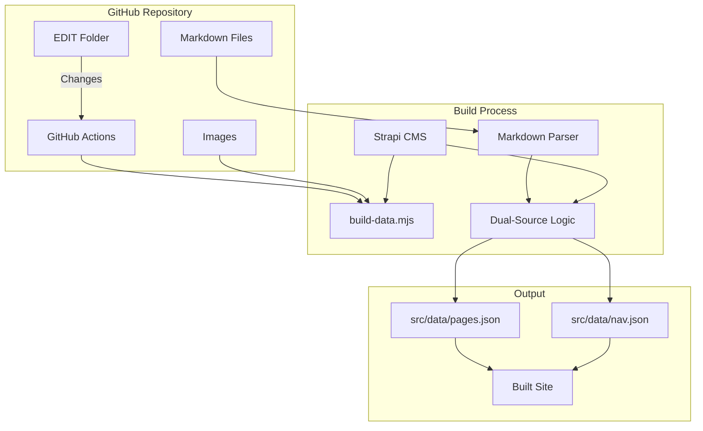
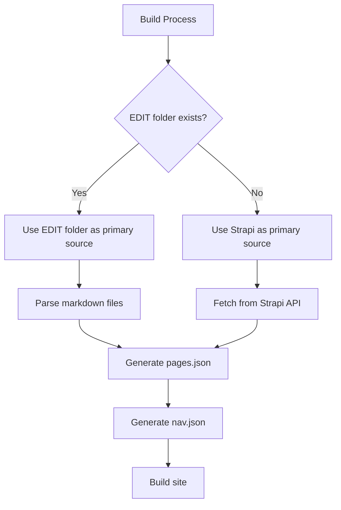

# Markdown-Based Editing System Design

## Overview

This document outlines a system to make the GitHub Pages site at https://coinerd.github.io/zeiler_me_pages/ editable via markdown content stored in an `EDIT` folder, while maintaining Strapi as a backup option.

## Architecture



## EDIT Folder Structure

The `EDIT` folder will be created at the root of the repository with the following structure:

```
EDIT/
├── detlef/
│   ├── deutsch/
│   │   ├── essay-themen/
│   │   │   └── essay.md
│   │   ├── fremdenfeindlichkeit/
│   │   │   └── armer-und-reicher-teufel.md
│   │   ├── needful-things---in-einer-kleinen-stadt/
│   │   │   ├── in-einer-kleinen-stadt.md
│   │   │   └── in-einer-kleinen-stadt-1.jpg
│   │   ├── essay-themen.md
│   │   ├── fremdenfeindlichkeit.md
│   │   ├── homo-faber.md
│   │   ├── nayirah.md
│   │   ├── needful-things---in-einer-kleinen-stadt.md
│   │   ├── texterrterung.md
│   │   ├── texterrterung-1.jpg
│   │   ├── texterrterung-2.jpg
│   │   ├── textinterpretation-1.md
│   │   ├── textinterpretation.md
│   │   ├── versuch-einer-beschreibung-menschlicher-moral.md
│   │   ├── versuch-einer-beschreibung-menschlicher-moral-1.jpg
│   │   ├── versuch-einer-kurzen-beschreibung-einer-menschlichen-moral.md
│   │   └── vom-text-zum-schaubild.md
│   ├── geschichte/
│   │   ├── alexander-von-humboldts-sdamerikareise.md
│   │   ├── alexis-de-tocqueville-ber-grausamkeit-in-einer-unglcklichen-zeit.md
│   │   ├── alexis-de-tocqueville-ber-grausamkeit-in-einer-unglcklichen-zeit-1.jpg
│   │   ├── ber-die-grausamkeit.md
│   │   ├── ber-die-pltzliche-grausamkeit-in-einer-unglcklichen-zeit.md
│   │   ├── ber-die-pltzliche-grausamkeit-in-einer-unglcklichen-zeit-1.jpg
│   │   ├── berichte-aus-einer-deutschen-diktatur.md
│   │   ├── berichte-aus-einer-deutschen-diktatur-1.jpg
│   │   ├── berthold-von-rohrbach.md
│   │   ├── berthold-von-rohrbach-1.jpg
│   │   ├── besuch-in-simferopol-2018.md
│   │   ├── besuch-in-simferopol-2018-1.png
│   │   ├── besuch-in-simferopol-2018-2.png
│   │   ├── besuch-in-simferopol-2018-3.png
│   │   ├── besuch-in-simferopol-2018-4.jpg
│   │   ├── ceausescu/
│   │   │   ├── idylle-und-realitt-unter-ceaucescu.md
│   │   │   ├── idylle-und-realitt-unter-ceaucescu-1.jpg
│   │   │   └── idylle-und-realitt-unter-ceaucescu-2.jpg
│   │   ├── ceausescu.md
│   │   ├── das-eiserne-kreuz.md
│   │   ├── die-mittelschicht-diskussionsthemen.md
│   │   ├── faschismus-als-massenbewegung-2.md
│   │   ├── faschismus-als-massenbewegung-2-1.jpg
│   │   ├── faschismus-als-massenbewegung-2-2.jpg
│   │   ├── faschismus-als-massenbewegung.md
│   │   ├── faschismus-als-massenbewegung/
│   │   │   └── gerusch.md
│   │   ├── gerchte.md
│   │   ├── gerchte-1.jpg
│   │   ├── geschichte-des-neckars-und-des-philosophenwegs-ludwig-merzotto-jger.md
│   │   ├── grenzen-ii.md
│   │   ├── grenzen-iii.md
│   │   ├── grenzen.md
│   │   ├── hooligans---angry-young-men.md
│   │   ├── integration.md
│   │   ├── integration-1.jpg
│   │   ├── integration-2.jpg
│   │   ├── jeremia.md
│   │   ├── knstliche-feindschaften.md
│   │   ├── kontrollsysteme.md
│   │   ├── mein--onkel-emil.md
│   │   ├── mein--onkel-emil-1.jpg
│   │   └── mein-grovater-rudolf-zeiler/
│   │       └── rudolf-zeiler.md
│   ├── medien/
│   │   ├── geruechte-rumores-drehbuch.md
│   │   ├── geruechte-rumores-drehbuch-1.jpg
│   │   ├── geruechte-rumores-drehbuch-2.jpg
│   │   ├── geruechte-rumores-drehbuch-3.jpg
│   │   ├── geruechte-rumores-drehbuch-4.jpg
│   │   ├── geruechte-rumores-drehbuch-5.jpg
│   │   ├── geruechte-rumores-drehbuch-6.jpg
│   │   ├── medienerziehung.md
│   │   └── medienerziehung/
│   │       ├── altersgemaesse-schwerpunktsetzungen.md
│   │       ├── aufgabenbereiche-und-zielsetzungen.md
│   │       ├── erlebnis-und-handlungsorientierung-als-prinzipien.md
│   │       ├── gestaltung-von-audiovisuellen-medien.md
│   │       ├── leseerziehung-und-hoererziehung.md
│   │       ├── medienerziehung-als-gesamtgesellschaftliche-aufgabe.md
│   │       ├── medienerziehung-im-bereich-von-computerspielen-und-interaktiven-medien.md
│   │       ├── medienerziehung-im-erziehungs-und-bildungszusammenhang.md
│   │       ├── medienkompetenz-vorbemerkung.md
│   │       ├── schuelerzeitschriften.md
│   │       ├── spielfilme.md
│   │       ├── veraenderung-der-bildungs-und-erziehungssituation.md
│   │       ├── verankerung-in-den-lehrplaenen.md
│   │       ├── zukuenftige-ansatzpunkte.md
│   │       └── zum-begriff-medienkultur.md
│   ├── projekte/
│   │   ├── die-elsenz-und-der-kraichgau.md
│   │   ├── dritte-gewalt-strafvollzug.md
│   │   ├── dritte-gewalt-strafvollzug-1.jpg
│   │   ├── dritte-gewalt-strafvollzug/
│   │   │   ├── anmerkungen.md
│   │   │   ├── beispiel-fuer-ein-projekt.md
│   │   │   ├── gymnasium.md
│   │   │   ├── hauptschule.md
│   │   │   ├── medienforum-heidelberg-ev.md
│   │   │   └── realschule.md
│   │   ├── heidelberg-im-mittelalter.md
│   │   ├── heidelberger-schulgeschichten.md
│   │   ├── heiligenberg.md
│   │   ├── heiligenberg-1.jpg
│   │   ├── heiligenberg-2.gif
│   │   ├── neuenheim.md
│   │   ├── neuenheim-1.jpg
│   │   ├── neuenheim-2.gif
│   │   ├── old-providence-die-insel-providencia.md
│   │   ├── old-providence-die-insel-providencia-1.jpg
│   │   ├── heidelberg-im-mittelalter/
│   │   │   ├── armenpflege-und-soziale-einrichtungen.md
│   │   │   ├── das-aelteste-gewerbe.md
│   │   │   ├── dr-jochen-goetze.md
│   │   │   ├── freizeit.md
│   │   │   ├── hexenglauben-und-hexenprozesse.md
│   │   │   ├── hexenglauben-und-hexenprozesse-1.gif
│   │   │   ├── juden.md
│   │   │   ├── literaturverzeichnis.md
│   │   │   ├── mopaed.md
│   │   │   ├── praktische-heimatkunde.md
│   │   │   ├── praktische-heimatkunde-1.jpg
│   │   │   ├── praktische-heimatkunde-2.jpg
│   │   │   ├── praktische-heimatkunde-3.jpg
│   │   │   ├── praktische-heimatkunde-4.jpg
│   │   │   ├── praktische-heimatkunde-5.jpg
│   │   │   ├── praktische-heimatkunde-6.jpg
│   │   │   ├── praktische-heimatkunde-7.jpg
│   │   │   ├── praktische-heimatkunde-8.jpg
│   │   │   ├── praktische-heimatkunde-9.jpg
│   │   │   ├── sittenstrafordnung-fuer-dirnen.md
│   │   │   ├── stadtgruendung-stadtentwicklung.md
│   │   │   ├── strafrecht-und-strafvollzug.md
│   │   │   ├── strafrecht-und-strafvollzug-1.gif
│   │   │   ├── universitaet-und-studenten.md
│   │   │   ├── universitaet-und-studenten-1.gif
│   │   │   ├── juden/
│   │   │   │   ├── phase-relativer-toleranz.md
│   │   │   │   └── spielball-fremder-interessen.md
│   │   │   ├── stadtgruendung-stadtentwicklung/
│   │   │   │   ├── entstehung-und-namensgebung.md
│   │   │   │   ├── stadtaufbau.md
│   │   │   │   └── stadtverfassung.md
│   │   │   ├── strafrecht-und-strafvollzug/
│   │   │   │   ├── anmerkungen.md
│   │   │   │   ├── constitutio-criminalis-carolina.md
│   │   │   │   ├── richtstaetten-und-gefaengnisse.md
│   │   │   │   ├── strafordnung.md
│   │   │   │   ├── triumph-des-guten.md
│   │   │   │   ├── verbrechen-und-strafen.md
│   │   │   │   └── verbrechen-und-strafen-1.gif
│   │   │   └── universitaet-und-studenten/
│   │   │       ├── ausbau-der-universitaet-und-rueckschlaege.md
│   │   │       ├── ausbau-und-finanzierung.md
│   │   │       ├── die-anfaenge-stadt-hof-und-universitaet.md
│   │   │       ├── die-universitaet-zwischen-mittelalter-und-neuzeit.md
│   │   │       ├── einleitung.md
│   │   │       ├── konflikte-mit-hofbediensteten-buergern-und-juden.md
│   │   │       ├── motive-fuer-den-aufbau-einer-universitaet.md
│   │   │       └── studentenunruhen.md
│   │   ├── heidelberger-schulgeschichten/
│   │   │   ├── anfaenge.md
│   │   │   ├── anfaenge-1.jpg
│   │   │   ├── buerger-und-bauern.md
│   │   │   ├── buerger-und-bauern-1.jpg
│   │   │   ├── das-18te-jahrhundert.md
│   │   │   ├── das-19te-jahrhundert.md
│   │   │   ├── das-19te-jahrhundert-1.jpg
│   │   │   ├── das-20te-jahrhundert.md
│   │   │   ├── das-20te-jahrhundert-1.jpg
│   │   │   ├── lehrerschaft-kfg-3tes-reich.md
│   │   │   ├── lehrerschaft-kfg-3tes-reich-1.jpg
│   │   │   ├── lehrerschaft-kfg-3tes-reich-2.jpg
│   │   │   └── schuelerunruhen-am-kfg.md
│   │   │       ├── schuelerunruhen-am-kfg-1.jpg
│   │   │       ├── schuelerunruhen-am-kfg-2.jpg
│   │   │       └── schuelerunruhen-am-kfg-3.jpg
│   │   ├── heiligenberg/
│   │   │   ├── der-unheimliche-berg.md
│   │   │   ├── der-unheimliche-berg-1.jpg
│   │   │   ├── der-unheimliche-berg-2.jpg
│   │   │   ├── der-unheimliche-berg-3.jpg
│   │   │   ├── der-unheimliche-berg-4.jpg
│   │   │   ├── geschichte.md
│   │   │   ├── geschichte-1.jpg
│   │   │   ├── geschichte-2.jpg
│   │   │   ├── geschichte-3.jpg
│   │   │   ├── geschichte-4.jpg
│   │   │   ├── geschichte-5.jpg
│   │   │   ├── geschichte-6.jpg
│   │   │   ├── geschichte-7.jpg
│   │   │   ├── geschichte-8.jpg
│   │   │   ├── geschichte-9.jpg
│   │   │   ├── geschichte-10.jpg
│   │   │   ├── mopaed.md
│   │   │   └── projekt.md
│   │   │       └── projekt-1.jpg
│   │   └── old-providence-die-insel-providencia/
│   │       ├── 1817-1821-die-korsaren.md
│   │       ├── aktuell-1903-heute.md
│   │       ├── jahr-1629.md
│   │       ├── jahr-1641.md
│   │       ├── jahr-1666-1670.md
│   │       ├── jahr-1666-piraterie.md
│   │       └── jahr-1670-1767.md
│   ├── deutsch.md
│   ├── geschichte.md
│   ├── impressum.md
│   ├── jeremia.md
│   ├── medien.md
│   └── projekte.md
├── julian/
│   ├── artikel/
│   │   ├── agile-methoden-in-der-softwareentwicklung.md
│   │   ├── auswirkungen-von-ideologien-der-open-source-lizenzen.md
│   │   └── was-ist-das-web-20.md
│   ├── techzap/
│   │   ├── programmierung/
│   │   │   ├── einfuehrung-in-das-programmieren.md
│   │   │   ├── einfuehrung-in-das-programmieren/
│   │   │   │   └── grundlagen-variablen-operatoren-funktionen.md
│   │   │   └── perl.md
│   │   │       └── perl-einzeiler-suchen-und-ersetzen-in-dateien.md
│   │   ├── server/
│   │   │   ├── unix-linux.md
│   │   │   └── windows.md
│   │   ├── technik/
│   │   │   └── vmware.md
│   │   │       └── strg-alt-f1-bzw-ctrl-alt-f1-an-vmware-senden.md
│   │   ├── programmierung.md
│   │   ├── server.md
│   │   └── technik.md
│   ├── work/
│   │   ├── projects.md
│   │   └── selfmade.md
│   ├── artikel.md
│   ├── contact.md
│   ├── techzap.md
│   └── work.md
└── index.md
```

## Frontmatter Schema

Each markdown file will include YAML frontmatter with metadata:

```yaml
---
title: Page Title
summary: Brief summary of the page content
publishedAt: 2024-01-15
order: 10
section: deutsch
images:
  - url: path/to/image-1.jpg
    alt: Image description
    caption: Optional caption
  - url: path/to/image-2.jpg
    alt: Another image
---

# Page Content

Markdown content goes here...
```

### Frontmatter Fields

| Field | Type | Required | Description |
|-------|------|----------|-------------|
| `title` | string | Yes | Page title |
| `summary` | string | No | Brief summary for SEO and navigation |
| `publishedAt` | date | No | Publication date (ISO format) |
| `order` | number | No | Sort order within section (default: MAX_SAFE_INTEGER) |
| `section` | string | No | Section slug (e.g., deutsch, geschichte) |
| `images` | array | No | Array of image objects with `url`, `alt`, and optional `caption` |

## File Structure to URL Mapping

The file structure directly maps to URLs:

- `EDIT/index.md` → `/`
- `EDIT/detlef/deutsch.md` → `/detlef/deutsch/`
- `EDIT/detlef/deutsch/essay-themen.md` → `/detlef/deutsch/essay-themen/`
- `EDIT/detlef/deutsch/essay-themen/essay.md` → `/detlef/deutsch/essay-themen/essay/`
- `EDIT/julian/artikel.md` → `/julian/artikel/`

## Dual-Source Build Logic

The build process will support both markdown files and Strapi:



### Priority Logic

1. **EDIT folder exists**: Use markdown files as primary source
2. **EDIT folder missing**: Fall back to Strapi CMS
3. **Environment variable**: `USE_STRAPI=true` forces Strapi usage even if EDIT exists

## GitHub Actions Workflow

A new workflow will trigger on changes to the `EDIT` folder:

```yaml
name: Deploy from EDIT Folder

on:
  push:
    branches: [main]
    paths:
      - 'EDIT/**'
  workflow_dispatch:

permissions:
  contents: read
  pages: write
  id-token: write

concurrency:
  group: pages
  cancel-in-progress: false

jobs:
  build-and-deploy:
    runs-on: ubuntu-latest
    steps:
      - name: Checkout
        uses: actions/checkout@v4
      
      - name: Setup Node.js
        uses: actions/setup-node@v4
        with:
          node-version: '20'
          cache: 'npm'
          cache-dependency-path: frontend/package-lock.json
      
      - name: Install dependencies
        working-directory: ./frontend
        run: npm ci
      
      - name: Build from EDIT folder
        working-directory: ./frontend
        env:
          SITE_URL: https://coinerd.github.io/zeiler_me_pages
          BASE_PATH: /zeiler_me_pages
          USE_EDIT_FOLDER: true
        run: npm run build
      
      - name: Upload artifact
        uses: actions/upload-pages-artifact@v3
        with:
          path: ./frontend/dist
      
      - name: Deploy to GitHub Pages
        id: deployment
        uses: actions/deploy-pages@v4
```

## Migration Script

A script will be created to convert existing HTML files to markdown:

```javascript
// scripts/convert-html-to-markdown.mjs
// Converts HTML files in frontend/public to markdown in EDIT folder
```

### Conversion Process

1. Read HTML files from `frontend/public/`
2. Extract metadata (title, summary, images)
3. Convert HTML body to markdown using `turndown` or similar
4. Create frontmatter with extracted metadata
5. Write markdown files to `EDIT/` folder preserving directory structure
6. Copy images to corresponding locations in `EDIT/`

## Modified build-data.mjs

The existing [`build-data.mjs`](../frontend/scripts/build-data.mjs) will be enhanced to:

1. Check for `EDIT` folder existence
2. If exists, parse markdown files instead of fetching from Strapi
3. Generate the same `pages.json` and `nav.json` structure
4. Maintain backward compatibility with Strapi

### New Functions

```javascript
// Parse markdown files from EDIT folder
async function parseEditFolder()

// Extract frontmatter from markdown
function extractFrontmatter(content)

// Build page structure from markdown files
function buildPagesFromMarkdown(files)

// Generate navigation from file structure
function buildNavFromMarkdown(files)
```

## Benefits

1. **Simple Editing**: Edit markdown files directly in GitHub web interface
2. **No CMS Required**: No need to maintain Strapi instance
3. **Version Control**: All changes tracked in Git history
4. **Collaboration**: GitHub collaborators can edit content
5. **Fast Builds**: No API calls to Strapi during build
6. **Backup Option**: Strapi remains available if needed
7. **Local Development**: Can edit markdown locally and test builds

## Workflow

### Editing Content

1. Navigate to the repository on GitHub
2. Go to the `EDIT` folder
3. Find the markdown file to edit
4. Click "Edit" button
5. Make changes to markdown content
6. Commit changes
7. GitHub Action automatically builds and deploys

### Adding New Content

1. Create new markdown file in appropriate `EDIT/` subfolder
2. Add frontmatter with metadata
3. Add markdown content
4. Add images to same folder if needed
5. Commit changes
6. GitHub Action automatically builds and deploys

### Local Development

```bash
# Make changes to EDIT folder
cd EDIT/detlef/deutsch
nano essay-themen.md

# Build locally to test
cd ../..
cd frontend
npm run build
npm run preview
```

## Implementation Steps

1. Create EDIT folder structure
2. Develop markdown-to-JSON conversion script
3. Modify build-data.mjs to support dual-source
4. Create GitHub Actions workflow
5. Develop HTML-to-markdown migration script
6. Migrate existing content to markdown
7. Test build process with EDIT folder
8. Update documentation
9. Deploy and verify

## Testing Checklist

- [ ] Build from EDIT folder produces correct pages.json
- [ ] Build from EDIT folder produces correct nav.json
- [ ] GitHub Action triggers on EDIT folder changes
- [ ] GitHub Action successfully deploys to GitHub Pages
- [ ] Images load correctly from EDIT folder
- [ ] Navigation structure matches file hierarchy
- [ ] Breadcrumbs work correctly
- [ ] Search index includes markdown content
- [ ] Strapi fallback works when EDIT folder is missing
- [ ] Local development works with EDIT folder

## Future Enhancements

- Add markdown preview in GitHub using `.md` files directly
- Implement content validation (check frontmatter completeness)
- Add automated testing for markdown syntax
- Create content templates for common page types
- Add image optimization pipeline
- Implement content versioning
- Add multi-language support
