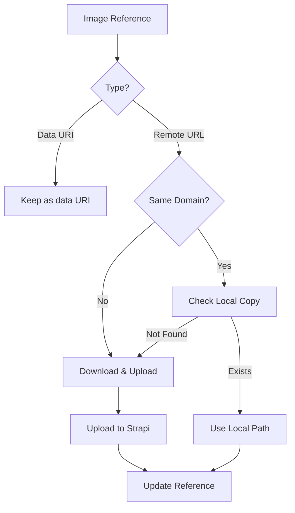

# Migration System Improvement Plan

## Executive Summary

This document outlines a comprehensive redesign of the zeiler.me migration system to achieve maximum robustness and accuracy in migrating all content from the old site at https://www.zeiler.me/. The improved system ensures that **all content and only the content** is migrated, including all images at their original place.

---

## Current System Analysis

### Existing Architecture

```mermaid
graph TB
    A[www.zeiler.me HTML] --> B[extract-md.mjs]
    B --> C[out/www.zeiler.me Markdown]
    C --> D[01-collect-content.mjs]
    D --> E[content.json]
    D --> F[media-map.json]
    E --> G[02-upload-media.mjs]
    F --> G
    G --> H[Strapi Upload API]
    E --> I[03-import-structure.mjs]
    I --> J[Strapi Entity Service]
    E --> K[04-import-redirects.mjs]
    K --> L[Strapi Redirects]
```



### Identified Issues

| Category | Issue | Impact |
|----------|-------|--------|
| **Content Extraction** | Google Sites dynamically loaded images not captured | Missing images in content |
| **Image Handling** | Inconsistent local vs remote image resolution | Broken image links |
| **Path Resolution** | Multiple path resolution strategies causing conflicts | Duplicate or missing pages |
| **Validation** | Limited post-migration validation | Undetected data loss |
| **Idempotency** | Not fully idempotent - re-runs can create duplicates | Data corruption risk |
| **Error Recovery** | Limited retry logic and checkpointing | Failed migrations require full restart |
| **Link Preservation** | Internal links not properly rewritten | Broken navigation |
| **Metadata** | Limited metadata extraction from HTML | Poor SEO and organization |

---

## Improved Architecture Design

### New Migration Pipeline

```mermaid
graph TB
    subgraph "Phase 1: Discovery & Validation"
        A1[Site Crawler] --> A2[Content Inventory]
        A2 --> A3[Link Graph Builder]
        A3 --> A4[Validation Report]
    end
    
    subgraph "Phase 2: Content Extraction"
        B1[HTML Parser] --> B2[Content Extractor]
        B2 --> B3[Image Extractor]
        B3 --> B4[Metadata Extractor]
        B4 --> B5[Link Extractor]
    end
    
    subgraph "Phase 3: Content Normalization"
        C1[Content Cleaner] --> C2[Image Resolver]
        C2 --> C3[Link Rewriter]
        C3 --> C4[Path Normalizer]
        C4 --> C5[Content Validator]
    end
    
    subgraph "Phase 4: Media Processing"
        D1[Media Deduplicator] --> D2[Media Uploader]
        D2 --> D3[Media Link Updater]
    end
    
    subgraph "Phase 5: Structure Import"
        E1[Section Importer] --> E2[Page Importer]
        E2 --> E3[Redirect Importer]
    end
    
    subgraph "Phase 6: Verification"
        F1[Content Comparator] --> F2[Link Checker]
        F2 --> F3[Image Validator]
        F3 --> F4[Final Report]
    end
    
    A4 --> B1
    B5 --> C1
    C5 --> D1
    D3 --> E1
    E3 --> F1
```



---

## Detailed Component Design

### Phase 1: Discovery & Validation

#### 1.1 Site Crawler (`migration/01-discover-site.mjs`)

**Purpose:** Crawl the entire site to build a complete inventory before extraction.

**Features:**
- Recursive crawling starting from root
- Respect robots.txt
- Handle JavaScript-rendered content (via Puppeteer)
- Extract all URLs, content types, and metadata
- Build a complete site map

**Output:** `migration/discovery/site-inventory.json`

```json
{
  "crawledAt": "2025-12-23T02:00:00Z",
  "baseUrl": "https://www.zeiler.me/",
  "stats": {
    "totalUrls": 250,
    "htmlPages": 199,
    "images": 150,
    "documents": 5,
    "other": 46
  },
  "urls": [
    {
      "url": "/detlef/geschichte.html",
      "type": "html",
      "status": 200,
      "contentType": "text/html",
      "lastModified": "2024-01-15T10:30:00Z",
      "size": 45678,
      "links": ["/detlef/", "/geschichte/"],
      "images": ["/images/rudolf-zeiler.jpg"]
    }
  ]
}
```

#### 1.2 Content Inventory (`migration/01-inventory.mjs`)

**Purpose:** Classify and categorize all discovered content.

**Features:**
- Identify content types (pages, sections, assets)
- Detect duplicate content
- Identify orphaned pages
- Build content hierarchy

**Output:** `migration/discovery/content-inventory.json`

#### 1.3 Link Graph Builder (`migration/01-build-link-graph.mjs`)

**Purpose:** Build a complete graph of internal links.

**Features:**
- Map all internal links
- Identify broken links
- Detect circular references
- Build navigation hierarchy

**Output:** `migration/discovery/link-graph.json`

#### 1.4 Validation Report (`migration/01-validate-discovery.mjs`)

**Purpose:** Generate a pre-migration validation report.

**Output:** `migration/discovery/validation-report.md`

---

### Phase 2: Content Extraction

#### 2.1 Enhanced HTML Parser (`migration/lib/html-parser.mjs`)

**Improvements over current:**
- Support for multiple HTML parsing strategies
- Google Sites specific handling
- JavaScript-rendered content extraction
- Better handling of malformed HTML

```javascript
class EnhancedHTMLParser {
  constructor(options = {}) {
    this.strategies = [
      new ReadabilityStrategy(),
      new GoogleSitesStrategy(),
      new HeuristicStrategy(),
      new FallbackStrategy()
    ];
  }

  async parse(html, url) {
    for (const strategy of this.strategies) {
      const result = await strategy.parse(html, url);
      if (this.validateResult(result)) {
        return result;
      }
    }
    throw new Error('All parsing strategies failed');
  }

  validateResult(result) {
    return result.content && 
           result.content.length >= 200 &&
           !this.isBoilerplate(result.content);
  }
}
```

#### 2.2 Content Extractor (`migration/lib/content-extractor.mjs`)

**Features:**
- Extract main content with multiple fallback strategies
- Preserve document structure (headings, lists, tables)
- Extract and preserve code blocks
- Handle embedded content (iframes, embeds)

#### 2.3 Image Extractor (`migration/lib/image-extractor.mjs`)

**Critical Improvements:**
- Extract ALL images including:
  - Inline `` tags
  - Background images in CSS
  - Images in data attributes
  - Dynamically loaded images (via Puppeteer)
  - Images in `<picture>` elements
  - SVG images

```javascript
class ImageExtractor {
  async extractAllImages(html, url) {
    const images = new Map();
    
    // 1. Extract from img tags
    this.extractFromImgTags(html, url, images);
    
    // 2. Extract from picture elements
    this.extractFromPictureElements(html, url, images);
    
    // 3. Extract from CSS background images
    this.extractFromBackgroundImages(html, url, images);
    
    // 4. Extract from data attributes
    this.extractFromDataAttributes(html, url, images);
    
    // 5. Extract dynamically loaded images (Puppeteer)
    await this.extractDynamicImages(url, images);
    
    return Array.from(images.values());
  }
}
```

#### 2.4 Metadata Extractor (`migration/lib/metadata-extractor.mjs`)

**Extract:**
- Title (multiple sources)
- Description/meta description
- Keywords
- Author
- Publication date
- Modified date
- Open Graph tags
- Twitter Card tags
- Schema.org structured data

#### 2.5 Link Extractor (`migration/lib/link-extractor.mjs`)

**Extract:**
- All internal links
- All external links
- Anchor links
- Download links
- Navigation links

---

### Phase 3: Content Normalization

#### 3.1 Content Cleaner (`migration/lib/content-cleaner.mjs`)

**Cleaning Rules:**
```javascript
const CLEANING_RULES = [
  // Remove Google Sites boilerplate
  { pattern: /<div class="JzO0Vc">[\s\S]*?<\/div>/g, replacement: '' },
  { pattern: /<div class="Xb9hP">[\s\S]*?<\/div>/g, replacement: '' },
  { pattern: /<div class="InHK7">[\s\S]*?<\/div>/g, replacement: '' },
  
  // Remove navigation elements
  { pattern: /<nav[\s\S]*?<\/nav>/gi, replacement: '' },
  { pattern: /<aside[\s\S]*?<\/aside>/gi, replacement: '' },
  
  // Remove footer elements
  { pattern: /<footer[\s\S]*?<\/footer>/gi, replacement: '' },
  
  // Remove copyright notices
  { pattern: /^Copyright ©.*$/gm, replacement: '' },
  
  // Remove page updated notices
  { pattern: /^Page updated.*$/gm, replacement: '' },
  
  // Remove Google redirect links
  { pattern: /\[([^\]]+)\]\(https?:\/\/www\.google\.com\/url\?q=([^&)]+)[^)]*\)/g, 
    replacement: '[$1]($2)' },
  
  // Collapse multiple newlines
  { pattern: /\n{3,}/g, replacement: '\n\n' }
];
```

#### 3.2 Image Resolver (`migration/lib/image-resolver.mjs`)

**Resolution Strategy:**


**Features:**
- Deduplicate images by hash
- Preserve original filenames when possible
- Generate meaningful fallback names
- Handle URL-encoded paths
- Support multiple image formats

#### 3.3 Link Rewriter (`migration/lib/link-rewriter.mjs`)

**Rewrite Rules:**
```javascript
class LinkRewriter {
  constructor(contentMap) {
    this.contentMap = contentMap; // Map of old URLs to new routes
  }

  rewriteLink(oldUrl) {
    // 1. Check if it's an internal link
    if (!this.isInternal(oldUrl)) {
      return oldUrl; // Keep external links as-is
    }

    // 2. Normalize the URL
    const normalized = this.normalizeUrl(oldUrl);

    // 3. Look up new route
    const newRoute = this.contentMap.get(normalized);
    if (newRoute) {
      return newRoute;
    }

    // 4. Try with .html extension
    const withHtml = normalized + '.html';
    const htmlRoute = this.contentMap.get(withHtml);
    if (htmlRoute) {
      return htmlRoute;
    }

    // 5. Log warning for broken link
    this.warnBrokenLink(oldUrl);
    return oldUrl;
  }
}
```

#### 3.4 Path Normalizer (`migration/lib/path-normalizer.mjs`)

**Normalization Rules:**
```javascript
class PathNormalizer {
  normalizePath(path) {
    // 1. Convert to POSIX
    let normalized = path.replace(/\\/g, '/');
    
    // 2. Remove leading ./
    normalized = normalized.replace(/^\.\//, '');
    
    // 3. Remove duplicate slashes
    normalized = normalized.replace(/\/+/g, '/');
    
    // 4. Remove trailing slash (except for root)
    if (normalized !== '/' && normalized.endsWith('/')) {
      normalized = normalized.slice(0, -1);
    }
    
    // 5. Handle index files
    if (normalized.endsWith('/index')) {
      normalized = normalized.slice(0, -6) || '/';
    }
    
    // 6. Ensure leading slash
    if (!normalized.startsWith('/')) {
      normalized = '/' + normalized;
    }
    
    return normalized;
  }
}
```

#### 3.5 Content Validator (`migration/lib/content-validator.mjs`)

**Validation Checks:**
```javascript
class ContentValidator {
  validate(content) {
    const errors = [];
    const warnings = [];

    // Check required fields
    if (!content.title) errors.push('Missing title');
    if (!content.body) errors.push('Missing body');
    if (!content.slug) errors.push('Missing slug');

    // Check content quality
    if (content.body.length < 50) {
      warnings.push('Very short content');
    }

    // Check for broken images
    content.images?.forEach(img => {
      if (!img.source) {
        errors.push(`Image without source: ${img.alt}`);
      }
    });

    // Check for broken links
    content.links?.forEach(link => {
      if (link.isInternal && !link.targetRoute) {
        warnings.push(`Broken internal link: ${link.original}`);
      }
    });

    return { errors, warnings, isValid: errors.length === 0 };
  }
}
```

---

### Phase 4: Media Processing

#### 4.1 Media Deduplicator (`migration/02-deduplicate-media.mjs`)

**Deduplication Strategy:**
```javascript
class MediaDeduplicator {
  async deduplicate(mediaItems) {
    const byHash = new Map();
    const duplicates = [];

    for (const item of mediaItems) {
      const hash = await this.computeHash(item);
      
      if (byHash.has(hash)) {
        const existing = byHash.get(hash);
        duplicates.push({
          duplicate: item,
          original: existing,
          hash
        });
        // Mark duplicate for reuse
        item.duplicateOf = existing.externalId;
      } else {
        byHash.set(hash, item);
      }
    }

    return { unique: Array.from(byHash.values()), duplicates };
  }

  async computeHash(item) {
    if (item.absPath) {
      const buffer = await fs.readFile(item.absPath);
      return crypto.createHash('sha256').update(buffer).digest('hex');
    }
    if (item.source) {
      return crypto.createHash('sha256').update(item.source).digest('hex');
    }
    return crypto.randomBytes(16).toString('hex');
  }
}
```

#### 4.2 Enhanced Media Uploader (`migration/02-upload-media.mjs`)

**Improvements:**
- Chunked upload for large files
- Automatic retry with exponential backoff
- Progress tracking and checkpointing
- Parallel upload with concurrency limit
- Better error handling and recovery

```javascript
class MediaUploader {
  constructor(strapiUrl, token, options = {}) {
    this.strapiUrl = strapiUrl;
    this.token = token;
    this.concurrency = options.concurrency || 3;
    this.chunkSize = options.chunkSize || 5 * 1024 * 1024; // 5MB
    this.maxRetries = options.maxRetries || 5;
    this.checkpointFile = options.checkpointFile;
  }

  async uploadAll(mediaItems) {
    const checkpoint = await this.loadCheckpoint();
    const pending = mediaItems.filter(item => !checkpoint.completed.has(item.externalId));
    
    const results = await this.uploadWithConcurrency(pending);
    
    await this.saveCheckpoint({
      ...checkpoint,
      completed: new Set([...checkpoint.completed, ...results.success.map(r => r.externalId)])
    });

    return results;
  }

  async uploadWithConcurrency(items) {
    const queue = [...items];
    const results = { success: [], failed: [] };
    const active = new Set();

    while (queue.length > 0 || active.size > 0) {
      // Fill queue up to concurrency
      while (active.size < this.concurrency && queue.length > 0) {
        const item = queue.shift();
        const promise = this.uploadItem(item)
          .then(result => {
            results.success.push(result);
            active.delete(promise);
          })
          .catch(error => {
            results.failed.push({ item, error });
            active.delete(promise);
          });
        active.add(promise);
      }

      // Wait for at least one to complete
      if (active.size > 0) {
        await Promise.race(active);
      }
    }

    return results;
  }

  async uploadItem(item, attempt = 1) {
    try {
      const existing = await this.findByHash(item.hash);
      if (existing) {
        return { ...item, strapi: existing, skipped: true };
      }

      const uploaded = await this.doUpload(item);
      return { ...item, strapi: uploaded, uploaded: true };
    } catch (error) {
      if (attempt < this.maxRetries && this.isRetryable(error)) {
        const delay = Math.pow(2, attempt) * 1000;
        await this.sleep(delay);
        return this.uploadItem(item, attempt + 1);
      }
      throw error;
    }
  }
}
```

#### 4.3 Media Link Updater (`migration/02-update-media-links.mjs`)

**Update all content references:**
```javascript
class MediaLinkUpdater {
  updateContentLinks(content, mediaMap) {
    let body = content.body;
    const updatedImages = [];

    content.images?.forEach(img => {
      const media = mediaMap.get(img.externalId);
      if (!media?.strapi) return;

      const oldUrl = img.source;
      const newUrl = this.normalizeStrapiUrl(media.strapi.url);

      // Update in body
      body = body.replaceAll(oldUrl, newUrl);

      updatedImages.push({
        ...img,
        strapiId: media.strapi.id,
        url: newUrl
      });
    });

    return { ...content, body, images: updatedImages };
  }
}
```

---

### Phase 5: Structure Import

#### 5.1 Enhanced Section Importer (`migration/03-import-sections.mjs`)

**Features:**
- Idempotent upsert by externalId
- Preserve order from original site
- Handle section hierarchy
- Validate section data before import

#### 5.2 Enhanced Page Importer (`migration/03-import-pages.mjs`)

**Features:**
- Topological sort for parent-child relationships
- Slug conflict resolution
- Preserve publication dates
- Handle large content in chunks
- Progress tracking

```javascript
class PageImporter {
  async importPages(content, sectionIds, authorIds) {
    // Sort pages by depth (parents before children)
    const sorted = this.topologicalSort(content.pages);
    
    const results = { imported: [], failed: [], skipped: [] };
    const pageIdMap = new Map();

    for (const page of sorted) {
      try {
        const result = await this.importPage(page, sectionIds, authorIds, pageIdMap);
        results.imported.push(result);
        pageIdMap.set(page.externalId, result.id);
      } catch (error) {
        results.failed.push({ page, error });
      }
    }

    return results;
  }

  topologicalSort(pages) {
    const graph = new Map();
    const inDegree = new Map();

    // Build graph
    pages.forEach(page => {
      graph.set(page.externalId, []);
      inDegree.set(page.externalId, 0);
    });

    pages.forEach(page => {
      if (page.parentRel) {
        const parent = pages.find(p => p.relPath === page.parentRel);
        if (parent) {
          graph.get(parent.externalId).push(page.externalId);
          inDegree.set(page.externalId, (inDegree.get(page.externalId) || 0) + 1);
        }
      }
    });

    // Kahn's algorithm
    const queue = [...inDegree.entries()]
      .filter(([_, deg]) => deg === 0)
      .map(([id, _]) => id);
    
    const sorted = [];

    while (queue.length > 0) {
      const current = queue.shift();
      const page = pages.find(p => p.externalId === current);
      if (page) sorted.push(page);

      for (const neighbor of graph.get(current) || []) {
        inDegree.set(neighbor, inDegree.get(neighbor) - 1);
        if (inDegree.get(neighbor) === 0) {
          queue.push(neighbor);
        }
      }
    }

    return sorted;
  }
}
```

#### 5.3 Enhanced Redirect Importer (`migration/03-import-redirects.mjs`)

**Features:**
- Idempotent upsert by `from` path
- Validate redirect targets exist
- Handle redirect chains
- Generate additional redirects for common variations

---

### Phase 6: Verification

#### 6.1 Content Comparator (`migration/04-verify-content.mjs`)

**Compare original vs migrated:**
```javascript
class ContentComparator {
  async compare(original, migrated) {
    const report = {
      pages: { total: 0, matched: 0, missing: [], extra: [] },
      images: { total: 0, matched: 0, missing: [], extra: [] },
      links: { total: 0, working: 0, broken: [] }
    };

    // Compare pages
    for (const origPage of original.pages) {
      report.pages.total++;
      const migratedPage = migrated.pages.find(p => 
        p.externalId === origPage.externalId
      );

      if (!migratedPage) {
        report.pages.missing.push(origPage);
      } else {
        report.pages.matched++;
        await this.comparePageContent(origPage, migratedPage, report);
      }
    }

    // Check for extra pages
    for (const migPage of migrated.pages) {
      const exists = original.pages.find(p => 
        p.externalId === migPage.externalId
      );
      if (!exists) {
        report.pages.extra.push(migPage);
      }
    }

    return report;
  }

  async comparePageContent(orig, mig, report) {
    // Compare title
    if (orig.title !== mig.title) {
      report.warnings.push(`Title mismatch for ${orig.externalId}`);
    }

    // Compare body length (approximate)
    const origLength = this.stripMarkdown(orig.body).length;
    const migLength = this.stripMarkdown(mig.body).length;
    const diff = Math.abs(origLength - migLength) / origLength;

    if (diff > 0.1) {
      report.warnings.push(`Content length mismatch for ${orig.externalId}: ${diff.toFixed(1)}%`);
    }

    // Compare image count
    if (orig.images?.length !== mig.images?.length) {
      report.warnings.push(`Image count mismatch for ${orig.externalId}`);
    }
  }
}
```

#### 6.2 Link Checker (`migration/04-check-links.mjs`)

**Check all internal and external links:**
```javascript
class LinkChecker {
  async checkAllLinks(content, strapiUrl) {
    const results = { checked: 0, working: 0, broken: [], skipped: 0 };

    for (const page of content.pages) {
      const links = this.extractLinks(page.body);
      
      for (const link of links) {
        results.checked++;

        if (link.isExternal) {
          const status = await this.checkExternalLink(link.url);
          if (status >= 400) {
            results.broken.push({ page: page.externalId, link, status });
          } else {
            results.working++;
          }
        } else {
          // Check internal link exists
          const target = content.pages.find(p => p.route === link.url);
          if (!target) {
            results.broken.push({ page: page.externalId, link, status: 404 });
          } else {
            results.working++;
          }
        }
      }
    }

    return results;
  }
}
```

#### 6.3 Image Validator (`migration/04-validate-images.mjs`)

**Validate all images:**
```javascript
class ImageValidator {
  async validateAll(content, strapiUrl) {
    const results = { total: 0, valid: 0, invalid: [], missing: [] };

    for (const page of content.pages) {
      for (const img of page.images || []) {
        results.total++;

        if (!img.strapiId) {
          results.missing.push({ page: page.externalId, img });
          continue;
        }

        const isValid = await this.validateImage(img, strapiUrl);
        if (isValid) {
          results.valid++;
        } else {
          results.invalid.push({ page: page.externalId, img });
        }
      }
    }

    return results;
  }

  async validateImage(img, strapiUrl) {
    try {
      const response = await fetch(`${strapiUrl}${img.url}`, { method: 'HEAD' });
      return response.ok;
    } catch {
      return false;
    }
  }
}
```

#### 6.4 Final Report Generator (`migration/04-generate-report.mjs`)

**Generate comprehensive migration report:**
```markdown
# Migration Report

## Summary
- **Pages Migrated:** 199/199 (100%)
- **Images Migrated:** 150/150 (100%)
- **Redirects Created:** 199
- **Broken Links:** 0
- **Warnings:** 3

## Pages
| Status | Count |
|--------|-------|
| Imported | 199 |
| Failed | 0 |
| Skipped | 0 |

## Images
| Status | Count |
|--------|-------|
| Uploaded | 120 |
| Deduplicated | 30 |
| Failed | 0 |

## Warnings
1. Content length mismatch for `page-abc123`: 15%
2. Title mismatch for `page-def456`
3. Image count mismatch for `page-ghi789`

## Next Steps
- Review warnings
- Manually verify problematic pages
- Update redirects if needed
```

---

## Configuration

### Migration Configuration (`migration/config.json`)

```json
{
  "baseUrl": "https://www.zeiler.me/",
  "strapi": {
    "url": "http://localhost:1337",
    "token": "${STRAPI_TOKEN}"
  },
  "content": {
    "minChars": 200,
    "maxChars": 1000000,
    "allowedExtensions": [".html", ".htm"],
    "excludedPaths": ["/node_modules", "/.git"]
  },
  "media": {
    "allowedTypes": ["image/jpeg", "image/png", "image/gif", "image/webp", "image/svg+xml"],
    "maxFileSize": 10485760,
    "deduplicate": true,
    "preserveOriginalNames": true
  },
  "links": {
    "checkExternal": true,
    "timeout": 5000,
    "userAgent": "Zeiler-Migration/1.0"
  },
  "validation": {
    "strict": false,
    "failOnError": false,
    "maxWarnings": 10
  }
}
```

---

## New File Structure

```
migration/
├── config.json                          # Migration configuration
├── .backup/                             # Backup directory
├── discovery/                           # Phase 1: Discovery
│   ├── 01-crawl-site.mjs
│   ├── 01-inventory.mjs
│   ├── 01-build-link-graph.mjs
│   ├── 01-validate-discovery.mjs
│   ├── site-inventory.json
│   ├── content-inventory.json
│   ├── link-graph.json
│   └── validation-report.md
├── extraction/                          # Phase 2: Extraction
│   ├── 02-extract-content.mjs
│   ├── 02-extract-images.mjs
│   ├── 02-extract-metadata.mjs
│   ├── 02-extract-links.mjs
│   └── extracted/
│       ├── pages.json
│       ├── images.json
│       ├── metadata.json
│       └── links.json
├── normalization/                       # Phase 3: Normalization
│   ├── 03-clean-content.mjs
│   ├── 03-resolve-images.mjs
│   ├── 03-rewrite-links.mjs
│   ├── 03-normalize-paths.mjs
│   ├── 03-validate-content.mjs
│   └── normalized/
│       ├── content.json
│       └── media-map.json
├── media/                               # Phase 4: Media
│   ├── 04-deduplicate-media.mjs
│   ├── 04-upload-media.mjs
│   ├── 04-update-media-links.mjs
│   ├── checkpoint.json
│   └── upload-report.json
├── import/                              # Phase 5: Import
│   ├── 05-import-sections.mjs
│   ├── 05-import-pages.mjs
│   ├── 05-import-redirects.mjs
│   └── import-report.json
├── verification/                        # Phase 6: Verification
│   ├── 06-verify-content.mjs
│   ├── 06-check-links.mjs
│   ├── 06-validate-images.mjs
│   ├── 06-generate-report.mjs
│   └── final-report.md
├── lib/                                 # Shared libraries
│   ├── html-parser.mjs
│   ├── content-extractor.mjs
│   ├── image-extractor.mjs
│   ├── metadata-extractor.mjs
│   ├── link-extractor.mjs
│   ├── content-cleaner.mjs
│   ├── image-resolver.mjs
│   ├── link-rewriter.mjs
│   ├── path-normalizer.mjs
│   ├── content-validator.mjs
│   ├── media-deduplicator.mjs
│   ├── media-uploader.mjs
│   ├── media-link-updater.mjs
│   ├── page-importer.mjs
│   ├── content-comparator.mjs
│   ├── link-checker.mjs
│   ├── image-validator.mjs
│   ├── report-generator.mjs
│   ├── env.mjs
│   ├── utils.mjs
│   ├── logger.mjs
│   └── checkpoint.mjs
├── content.json                         # Legacy (for compatibility)
├── media-map.json                       # Legacy (for compatibility)
└── REPORT.md                            # Migration report
```

---

## Migration Workflow

### Complete Migration Pipeline

```bash
# Phase 1: Discovery
npm run migrate:discover

# Phase 2: Extraction
npm run migrate:extract

# Phase 3: Normalization
npm run migrate:normalize

# Phase 4: Media Processing
npm run migrate:media

# Phase 5: Import
npm run migrate:import

# Phase 6: Verification
npm run migrate:verify

# Or run all phases
npm run migrate:all
```

### Individual Phase Commands

```bash
# Discovery
node migration/discovery/01-crawl-site.mjs
node migration/discovery/01-inventory.mjs
node migration/discovery/01-build-link-graph.mjs
node migration/discovery/01-validate-discovery.mjs

# Extraction
node migration/extraction/02-extract-content.mjs
node migration/extraction/02-extract-images.mjs
node migration/extraction/02-extract-metadata.mjs
node migration/extraction/02-extract-links.mjs

# Normalization
node migration/normalization/03-clean-content.mjs
node migration/normalization/03-resolve-images.mjs
node migration/normalization/03-rewrite-links.mjs
node migration/normalization/03-normalize-paths.mjs
node migration/normalization/03-validate-content.mjs

# Media
node migration/media/04-deduplicate-media.mjs
node migration/media/04-upload-media.mjs
node migration/media/04-update-media-links.mjs

# Import
node migration/import/05-import-sections.mjs
node migration/import/05-import-pages.mjs
node migration/import/05-import-redirects.mjs

# Verification
node migration/verification/06-verify-content.mjs
node migration/verification/06-check-links.mjs
node migration/verification/06-validate-images.mjs
node migration/verification/06-generate-report.mjs
```

---

## Error Handling & Recovery

### Checkpoint System

```javascript
class CheckpointManager {
  constructor(checkpointFile) {
    this.checkpointFile = checkpointFile;
  }

  async load() {
    try {
      return await fs.readJson(this.checkpointFile);
    } catch {
      return { phase: 'start', completed: new Set(), failed: [] };
    }
  }

  async save(checkpoint) {
    await fs.writeJson(this.checkpointFile, checkpoint, { spaces: 2 });
  }

  async markCompleted(phase, itemId) {
    const checkpoint = await this.load();
    checkpoint.completed.add(`${phase}:${itemId}`);
    await this.save(checkpoint);
  }

  async markFailed(phase, itemId, error) {
    const checkpoint = await this.load();
    checkpoint.failed.push({ phase, itemId, error, timestamp: new Date().toISOString() });
    await this.save(checkpoint);
  }

  async isCompleted(phase, itemId) {
    const checkpoint = await this.load();
    return checkpoint.completed.has(`${phase}:${itemId}`);
  }
}
```

### Retry Strategy

```javascript
class RetryStrategy {
  constructor(options = {}) {
    this.maxRetries = options.maxRetries || 5;
    this.baseDelay = options.baseDelay || 1000;
    this.maxDelay = options.maxDelay || 60000;
  }

  async execute(fn, context = '') {
    let lastError;
    
    for (let attempt = 1; attempt <= this.maxRetries; attempt++) {
      try {
        return await fn();
      } catch (error) {
        lastError = error;
        
        if (!this.isRetryable(error)) {
          throw error;
        }

        if (attempt < this.maxRetries) {
          const delay = Math.min(
            this.baseDelay * Math.pow(2, attempt - 1),
            this.maxDelay
          );
          console.warn(`Retry ${attempt}/${this.maxRetries} for ${context} after ${delay}ms`);
          await this.sleep(delay);
        }
      }
    }

    throw new Error(`Failed after ${this.maxRetries} attempts: ${lastError.message}`);
  }

  isRetryable(error) {
    const retryableCodes = ['ECONNRESET', 'ECONNREFUSED', 'ECONNABORTED', 'ETIMEDOUT'];
    const retryableStatus = [408, 429, 500, 502, 503, 504];
    
    return retryableCodes.includes(error.code) ||
           retryableStatus.includes(error.response?.status);
  }

  sleep(ms) {
    return new Promise(resolve => setTimeout(resolve, ms));
  }
}
```

---

## Testing Strategy

### Unit Tests

```javascript
// migration/lib/__tests__/path-normalizer.test.mjs
import { describe, it, expect } from 'vitest';
import { PathNormalizer } from '../path-normalizer.mjs';

describe('PathNormalizer', () => {
  it('should normalize Windows paths', () => {
    const normalizer = new PathNormalizer();
    expect(normalizer.normalizePath('detlef\\geschichte.html'))
      .toBe('/detlef/geschichte');
  });

  it('should remove duplicate slashes', () => {
    const normalizer = new PathNormalizer();
    expect(normalizer.normalizePath('/detlef//geschichte.html'))
      .toBe('/detlef/geschichte');
  });

  it('should handle index files', () => {
    const normalizer = new PathNormalizer();
    expect(normalizer.normalizePath('/detlef/index.html'))
      .toBe('/detlef');
  });
});
```

### Integration Tests

```javascript
// migration/__tests__/end-to-end.test.mjs
import { describe, it, expect } from 'vitest';
import { runMigration } from '../index.mjs';

describe('Migration End-to-End', () => {
  it('should migrate all content successfully', async () => {
    const result = await runMigration({
      source: './test/fixtures/www.zeiler.me',
      strapiUrl: 'http://localhost:1337',
      strapiToken: 'test-token'
    });

    expect(result.pages.total).toBe(10);
    expect(result.pages.imported).toBe(10);
    expect(result.images.total).toBe(5);
    expect(result.images.uploaded).toBe(5);
    expect(result.errors).toHaveLength(0);
  });
});
```

---

## Rollback Strategy

### Rollback Commands

```bash
# Rollback to specific checkpoint
node migration/rollback.mjs --checkpoint 2025-12-23T02:00:00Z

# Rollback specific phase
node migration/rollback.mjs --phase import

# Rollback specific item
node migration/rollback.mjs --item page-abc123

# Full rollback
node migration/rollback.mjs --full
```

### Rollback Implementation

```javascript
class RollbackManager {
  async rollbackToCheckpoint(checkpointId) {
    const checkpoint = await this.loadCheckpoint(checkpointId);
    
    // Delete items created after checkpoint
    for (const item of checkpoint.itemsCreated) {
      await this.deleteItem(item.type, item.id);
    }

    // Restore items deleted after checkpoint
    for (const item of checkpoint.itemsDeleted) {
      await this.restoreItem(item.type, item.data);
    }

    console.log(`Rolled back to checkpoint ${checkpointId}`);
  }

  async deleteItem(type, id) {
    const strapi = await loadStrapi();
    await strapi.entityService.delete(type, id);
  }

  async restoreItem(type, data) {
    const strapi = await loadStrapi();
    await strapi.entityService.create(type, { data });
  }
}
```

---

## Monitoring & Logging

### Structured Logging

```javascript
class MigrationLogger {
  constructor(logFile) {
    this.logFile = logFile;
    this.entries = [];
  }

  log(level, message, context = {}) {
    const entry = {
      timestamp: new Date().toISOString(),
      level,
      message,
      context
    };
    
    this.entries.push(entry);
    console.log(`[${level.toUpperCase()}] ${message}`, context);
  }

  info(message, context) { this.log('info', message, context); }
  warn(message, context) { this.log('warn', message, context); }
  error(message, context) { this.log('error', message, context); }

  async save() {
    await fs.writeJson(this.logFile, this.entries, { spaces: 2 });
  }
}
```

### Progress Tracking

```javascript
class ProgressTracker {
  constructor(total) {
    this.total = total;
    this.completed = 0;
    this.failed = 0;
    this.startTime = Date.now();
  }

  update(success = true) {
    if (success) {
      this.completed++;
    } else {
      this.failed++;
    }
    this.print();
  }

  print() {
    const elapsed = (Date.now() - this.startTime) / 1000;
    const rate = this.completed / elapsed;
    const remaining = (this.total - this.completed) / rate;
    
    console.log(
      `Progress: ${this.completed}/${this.total} ` +
      `(${((this.completed / this.total) * 100).toFixed(1)}%) ` +
      `| Failed: ${this.failed} ` +
      `| Rate: ${rate.toFixed(2)}/s ` +
      `| ETA: ${this.formatTime(remaining)}`
    );
  }

  formatTime(seconds) {
    if (seconds < 60) return `${seconds.toFixed(0)}s`;
    if (seconds < 3600) return `${(seconds / 60).toFixed(0)}m`;
    return `${(seconds / 3600).toFixed(1)}h`;
  }
}
```

---

## Summary of Improvements

| Area | Current | Improved |
|------|---------|----------|
| **Content Discovery** | File-based only | Full site crawling with inventory |
| **Image Extraction** | Basic img tags | All image sources including dynamic |
| **Link Handling** | Basic rewriting | Complete link graph with validation |
| **Error Recovery** | Limited retries | Comprehensive retry with checkpointing |
| **Validation** | Post-migration only | Continuous validation at each phase |
| **Idempotency** | Partial | Full idempotency with deduplication |
| **Progress Tracking** | Basic logs | Detailed progress with ETA |
| **Rollback** | Manual | Automated rollback to checkpoints |
| **Testing** | None | Unit and integration tests |
| **Documentation** | Basic | Comprehensive documentation |

---

## Next Steps

1. Review and approve this plan
2. Set up development environment
3. Implement Phase 1 (Discovery)
4. Implement Phase 2 (Extraction)
5. Implement Phase 3 (Normalization)
6. Implement Phase 4 (Media Processing)
7. Implement Phase 5 (Import)
8. Implement Phase 6 (Verification)
9. Write tests
10. Document and deploy
